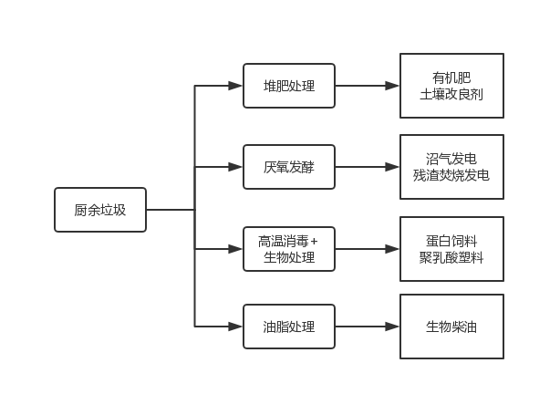

# 餐厨垃圾的流向

自从2019年7月1日上海实施强制垃圾分类以来，很多小伙伴都知道大骨头属于其他垃圾。有一次，朋友吃完酱骨架之后问我：“这骨头属于其他垃圾吧？” 我回答说：“这不算很大可以归为餐厨垃圾一起处理”，朋友一脸惊悚看着我说：“这么大块骨头，猪也能啃？”

看来很多人对餐厨垃圾存在误解！

---

## 餐厨垃圾是危险而宝贵的资源

据重庆、宁波、西宁、苏州等开展城市餐厨垃圾无害化处理较早的几个城市介绍，其城市餐厨垃圾日均产生量一般为城市生活垃圾的 37-65% 左右。[^1]

### 我国餐厨垃圾的特点

- 油水含量重
- 腐烂变质速度快

## 餐厨垃圾的资源化利用

## “干湿分离” 是垃圾分类的重要一步

---

## 参考

### 深圳餐厨垃圾日均产生量约1800吨 处理率仅为3%

昨天，深圳市人大常委会组成人员和部分市人大代表对《深圳市食用农产品安全条例》执行情况进行视察，检查人员分三组分别对海吉星农产品物流园、市农产品质量安全检验检测中心、深圳大学食堂等视察。

昨日，部分市人大代表对深圳的餐厨垃圾收集、处理情况及有关企业的运营情况进行了现场视察。深圳市腾浪再生资源有限公司，是深圳市首家餐厨房垃圾及生活垃圾焚烧炉渣处理厂，已建成日处理量为200吨餐厨垃圾处理自动生产线和日处理30吨的潲水油处理线，也是代表们昨日视察餐厨垃圾处理情况的首站。

记者在跟随采访中了解到，目前深圳获证餐饮服务单位有53600间，餐厨垃圾(包括厨房垃圾和废弃食用油脂)日均产生量约为1800吨，其中废弃食用油脂(包括地沟油、老火油和潲水油)约为150吨。但至今全市日规范收运处理餐厨垃圾仅35~55吨，废弃食用油脂15吨左右，按55吨满打满算，也只有3%。

市人大代表孙小荔提议，政府要倡导规范收运处理餐厨垃圾，并给予政策扶持，“有没有餐厨垃圾处理设施及规范的处理地点”要作为必要条件审查，要达标了才允许开张营业。“只有这样，才能真正从源头上抓好餐厨垃圾的管理。”

---

[^ 1]: 估算城市餐厨垃圾日均产量的方法及建议