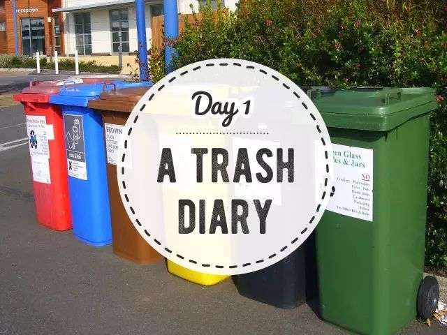
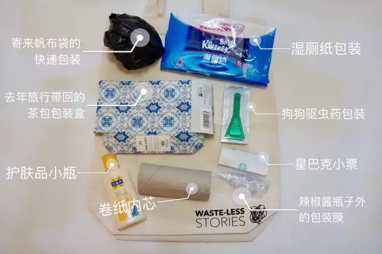
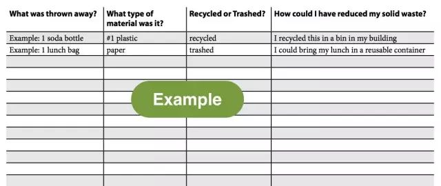

Day1 - 写一篇“垃圾日记”
===========================================

Why - 为什么？
----------------

你知道每一天你会扔掉多少垃圾吗？

在中国，我们每天每人平均会产生1.1KG的生活垃圾。在北京，每天2万吨的垃圾可以排满三环一圈。

可是，大部分人在扔垃圾的时候都是无意识的状态，也不清楚每天的垃圾里到底都有些什么。

所以，踏上零垃圾之旅的第一天，我想请你记录下自己的垃圾。

How - 怎么做？
----------------

有两种记录方式可供选择：

1、准备一个袋子，把今天所有的干垃圾（食物和厕所的垃圾除外）都放进袋子里，一天结束后，把所有垃圾拿出来拍张照。

2、如果不方便把垃圾背着走，那就在每次扔垃圾的时候，都用纸或手机记录下来。

只有直面垃圾，我们才能看清到底哪些生活习惯或消费行为是最大的垃圾来源，然后有针对性地作出改变。

----

.. image:: images/gozerowaste_footer.jpg
   :align: center
   :width: 400

.. note:: 本文来自公众号「GoZeroWaste」