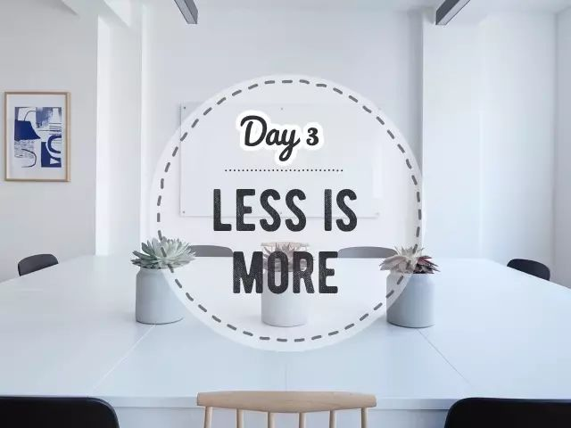
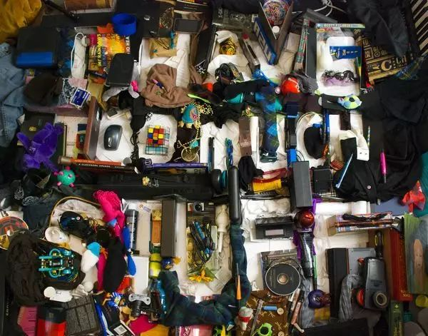
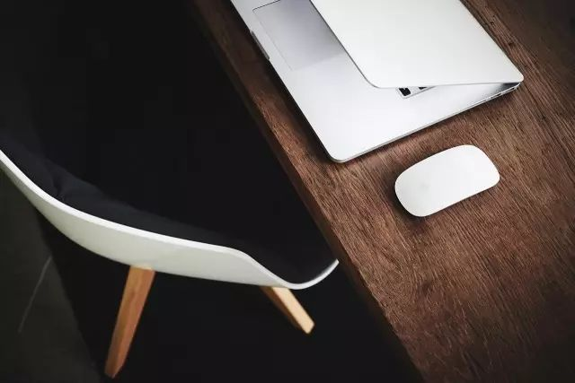
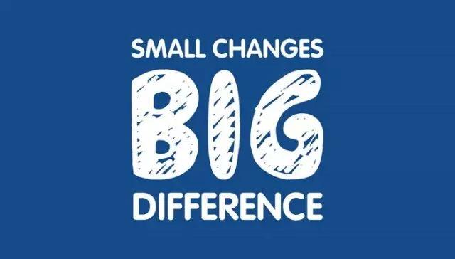
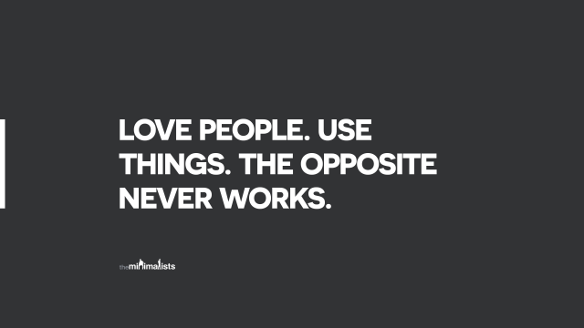

Day3 - 十分钟快手断舍离
===========================================

看看你的周围，是不是充满了各种各样的物品？

去年双11囤的洗发水用完了吗？

过年时买的新裙子，是不是还在等你瘦下来？

还有那些长年积灰的杂物们，除了还没被扔进垃圾桶外，它们跟垃圾其实并无二致。

而这些物品，占据着房屋的空间（几万块一平的房子买来放不用的垃圾是不是太浪费了），每次清扫也要耗费很多时间和精力。**从某种意义上说，不是我们拥有物品，而是物品占有了我们。**

是时候做减法了！

开始零垃圾生活之后，我才发现，零垃圾、极简、断舍离这三者的终极奥义出奇一致：**回归简单的生活、摆脱物质的束缚。**

我们并不反对消费，也不一味追求数量的精减，只是，如果围绕身边的每件物品都是自己喜爱、日常会使用、而且能给生活带来愉悦的，那不是很美好？

Why - 为什么？
----------------

有些整理秘笈会告诉你：把家里所有东西都拿出来、堆在地上，一口气来做个了断吧！

事实是，光是想想这样的巨型工程就已经把人吓跑了：“起码得花上整整一个周末吧？我可没那么多时间！”于是，打着没时间的旗号，继续对杂物视而不见。

要给物品做减法，可不是一朝一夕就能完成的。但你总得找个地方下手，不如就趁现在，花上10分钟，来个快手断舍离吧！

How - 怎么做？
----------------

**1 - 先问问自己：我希望居住在一个怎样的空间里？什么样的物品会让我心情愉悦？**

**2 - 从小处入手，只花10分钟**

只整理一个角落，可以是：冰箱、放调料的橱柜、药箱、水槽下面的柜子、放化妆品的抽屉、书柜....任何一个你觉得需要整理但又迟迟没行动的地方。

设置好10分钟的定时闹钟，开始动手吧！

那些过期的酱料、无效的药物、过去一年都没用过的眼线笔（相信我，未来你也不会用的）、上上个手机的充电器、写不出水的笔等等，把它们都清理出来。

**闹钟响了就停。** 虽然10分钟不会把你家变成极简风，但也是个值得庆祝的开始！然后，明天再花10分钟。后天再花10分钟。改变不就是这样一步步发生的吗？

**3 - 看着这些被清出来物品，问问自己：**

* 它们是什么时候被我带回家的？
* 当时为什么会买？
* 用了几次？
* 为什么不用？
* 这些物品从原料采购到生产到运输到消费，至到今天的丢弃，是否都消耗了资源？

**4 - 为以后的”买买买“定下游戏规则：**

* 1进1出或1进N出：物品总量只能减少或持平
* 选择更持久的优质产品
* 敢不敢玩30天不入实物

|

这一年的零垃圾生活，让我明白了一个道理：**快不快乐与拥有多少物品一点关系也没有。**

生活远比物质本身更丰盛美好。**脱离物质的束缚，才能感受真正的自由。**

----

.. image:: images/gozerowaste_footer.jpg
   :align: center
   :width: 400

.. note:: 本文来自公众号「GoZeroWaste」