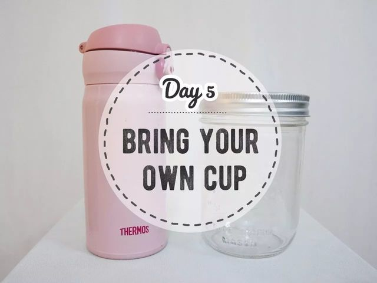
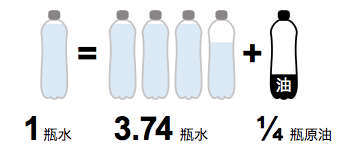
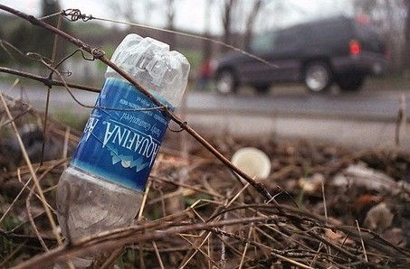
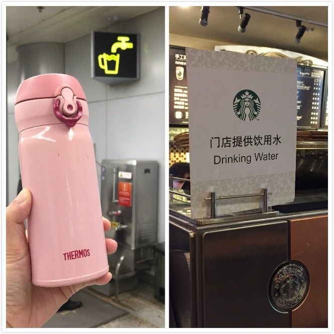

Day5 - 带上自己的杯子
===========================================

人体体重的70%是水。活着离不开水。

从1996年的第一瓶娃哈哈到有点甜的农夫山泉，再到洋气的依云水、巴黎水，国人对于瓶装水的消耗越来越大。2013年，中国的瓶装水消费量占全球的15%，超越美国成为全球最大的瓶装水消费国。

中国人均年瓶装水消费量为30升，按500ml/瓶换算则相当于60个瓶子，每年全国需要生产780亿只饮料瓶。

一位名为南瓜大仙的 zero waster 曾经说过：「每次看到瓶装水，第一反应是这是“塑料”，然后才会想到“水”。」

装在塑料瓶里的纯净水，真的像广告语标榜的那样“干净”“纯净”“自然”吗？

纯净水并不纯净
------------------------

1. 在唯美的纯净水广告背后，是不容忽视的水足迹和能源足迹。每生产1L瓶装水，需要消耗3.74L水和1/4L原油。

2. 几乎所有的瓶装水都是一次性消耗，喝完一瓶水只需几分钟，随手一扔，便是一件塑料垃圾。2012年，有160万吨左右的塑料原料经由瓶装水生产和消费，变为固体废弃物，体积相当于420米高的上海金茂大厦。

3. 你可能会说，瓶子上不都印着“可回收”吗，这哪能算垃圾？事实是，《`自诞生以来，地球上的塑料只被回收了9% <https://mp.weixin.qq.com/s?__biz=MzIzMDI1MDY4Mw==&mid=2651695089&idx=1&sn=5dbdc99c11cbdac30b28547258bd36d6&chksm=f34f4625c438cf330e8e4fa64072bc2acff88ea4f8a8f9bb804da2c44d5343d4cab1da72bb40&scene=21#wechat_redirect>`_》。大部分的塑料瓶要么与其他垃圾一起进入填埋场或焚烧炉，要么被随意遗弃。即使是真正进入回收体系的塑料瓶，也只能进行降级回收，将塑料瓶分解、切割、造粒，再制成新的产品，这个过程也不可避免会造成原料的浪费和能源的消耗。

带上自己的杯子吧
------------------------

无论你是泡茶、冲咖啡，还是像摇滚老炮儿们一样独爱枸杞养生茶，都可以！用自己的杯子，既健康又环保，还能彰显自己的独特品味（买那么多杯子不带出去显摆多浪费），何乐而不为？

出门旅行时，在机场、车站都能轻松找到饮水处。很多餐厅和咖啡厅（如星巴克）也可以提供饮用水，只要礼貌地把杯子递过去就OK啦！如果要买咖啡，在星巴克使用自带杯可享立减3元优惠！

----

.. image:: images/gozerowaste_footer.jpg
   :align: center
   :width: 400

.. note:: 本文来自公众号「GoZeroWaste」