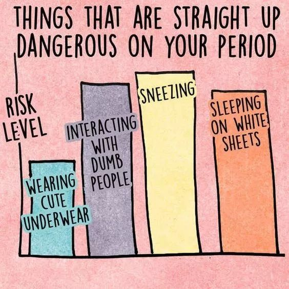
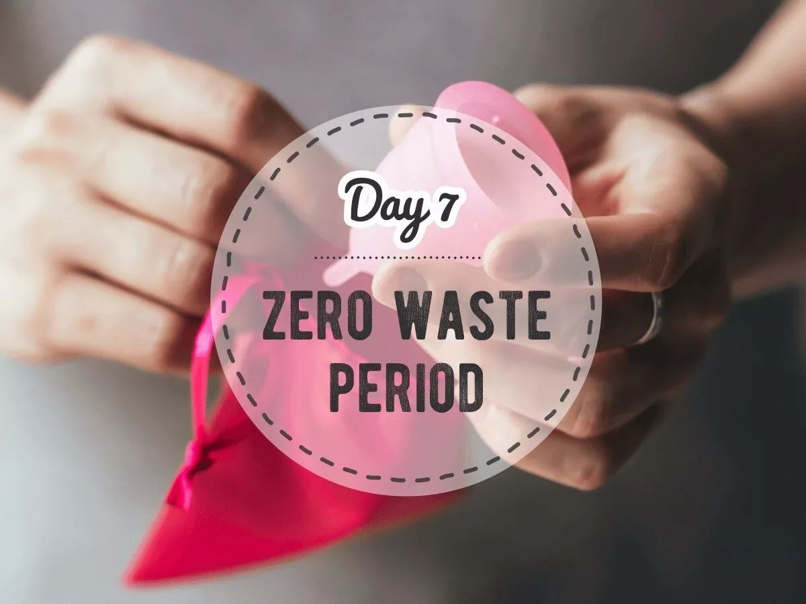
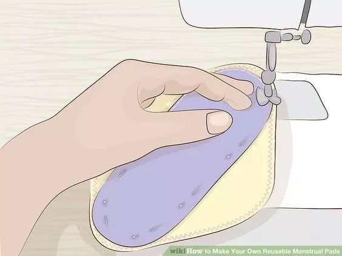
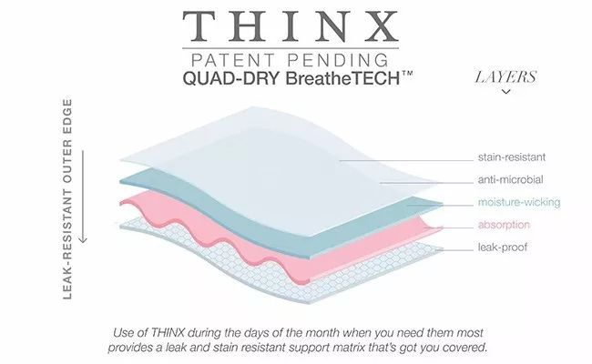
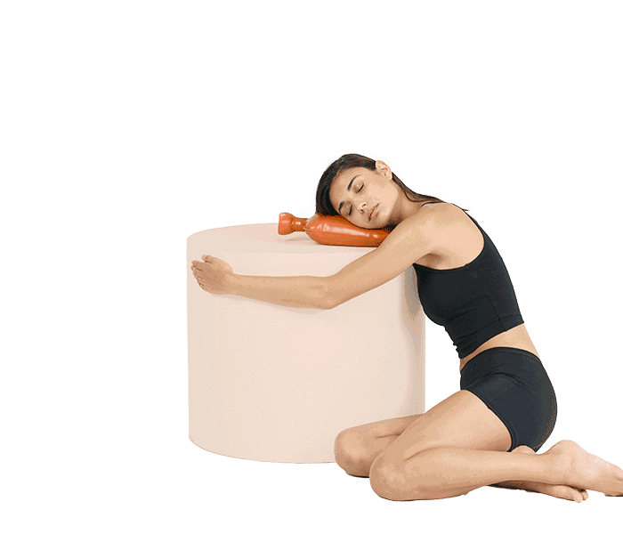

Day7 - 放飞自我的生理期
===========================================

每个月的生理期是我最不想面对的日子。特别是在踏上零垃圾旅程之后，除了生理上的不适，再加上看到用掉的姨妈巾和大大小小的塑料包装们，我的心情就更加烦躁了！

.. image:: images/Day07_002.jpg
   :align: center

::

   图片来自网络

据统计，女性平均一生会经历500次生理期，按每个周期用掉20张卫生巾来计算，一辈子我们要扔掉10000张卫生巾！

在一次性卫生巾的成份中，包含着高分子吸水树脂和PE膜等原料，这部分材料是难以自然降解的。用过的卫生巾无法回收利用，只能混在生活垃圾中，但无论是填埋、焚烧还是随意丢弃，都会给自然环境造成危害。

除了危害环境，一次性卫生巾还会带来健康隐患。大部分的卫生巾和棉条都有经过化学处理，生产过程中可能会使用的消毒药剂、漂白剂、黏合剂与私密部位直接接触，会引起过敏或其它妇科疾病。另外，卫生棉条在体内放置太久或吸收力太强，还可能会导致中毒性休克症候群（TSS - Toxic Shock Syndrome）。

::

   图片来自Pinterest

**今天介绍三种神器！帮你轻松迎来零垃圾大姨妈！**

神器一：月亮杯
------------------------

“月亮杯”又称为「月经杯」或「月事杯」，英文为 menstrual cup，是一种用医疗硅胶（或天然橡胶）制成的杯子，柔软有弹性，置于阴道内较接近外阴部的位置来盛装经血，是除了卫生巾、棉条、可重复使用的水洗式卫生棉以外的又一个女性经期用品，面世至今已有80多年的时间。

有关月亮杯的科普请认真学习这两篇扫盲贴：

* `"月亮杯"是什么？女性的福音，既省钱还环保，你一定想全方位地了解它！ <https://mp.weixin.qq.com/s?__biz=MzI1MTQ2NDAxNg==&mid=2247483953&idx=1&sn=fe04f83c4a28d22e283e694e5547b5e3&chksm=e9f3d20ede845b18519673bc726aacaf5cff6edc3159445ee79a3fce8b6726450b380c38c33e&scene=21#wechat_redirect>`_
* `有了moon-cup，再也不用唱响血染的风采 <https://mp.weixin.qq.com/s?__biz=MjM5OTM3NzMwMg==&mid=2651041889&idx=1&sn=63c5d17a8426e30a0265947f9d9d0379&chksm=bccb70988bbcf98ed9bf66a68c5279a46a45054e71a4f4881450458dbc37f21962ecb0dd43ef&scene=21#wechat_redirect>`_

虽然早就知道月亮杯这个神奇的存在，但连棉条都很少用的我，对于要把一个“杯子”徒手放进体内还是有一些抗拒的。但经不住身边小伙伴纷纷表示「一生推」的诱惑，两个月前我终于忐忑地迈出了一小步，于是：

**打开了新世界的大门！**

.. image:: images/Day07_005.jpg
   :align: center

::

   图片来自网络

环保、省钱、卫生这些都自然不在话下，但在我看来，月亮杯最大的功能是 **解放女性**！没有黏糊糊的闷热；没有异味；不用担心把椅子染红；不用经历血崩的恐惧；放入后完全感觉不到它的存在（除非装满了）；甚至，我还【毫无科学依据】地认为它治好了我几十年的痛经（可能是错觉，请谨慎参考）。我终于可以笑着迎接大姨妈了！

::

   有月亮杯护体的我

和任何技能一样，成功地放入和取出月亮杯也是需要练习的（我才不会告诉你我第一次花了半个小时...现在大概10秒？）。详细指南请再次学习上面的两篇图文教程。

划几个重点：

1. 每个生理期开始前和结束后用开水消毒
2. 放松，选择适合自己的放入取出姿势
3. 除了量最多的那天需要取出2-3次，其他日子都是早上放入晚上取出（因人而异哈）
4. 担心会漏？可配合下文的二号神器共同使用

.. image:: images/Day07_007.jpg
   :align: center

::

   图片来自网络：不同品牌的月亮杯

神器二：水洗卫生棉
------------------------

如果月亮杯对你来说有点hold不住，水洗卫生棉则是可以轻松切换的零垃圾替代方案。本文并非软文，但水洗卫生棉我只用「布知道」。可单独使用，也可以配合月亮杯共同使用，从日常护垫到超长夜用，给你一个不一样的大姨妈。

.. image:: images/Day07_008.jpg
   :align: center

::

   图片来自布知道

* 安全：不用喷洒了除草剂的棉花；不用打农药的棉花；不用甲醛处理防皱；不添加荧光剂；不用芳香剂；不化学染色；不用偶氮；不漂白。
* 舒适：舒适透气，柔软呵护，告别刺激感。
* 环保：主要材质是棉花，废弃后可迅速降解。

更多信息可参考：`「Q&A」布知道可洗卫生巾的常见问答 <https://mp.weixin.qq.com/s?__biz=MzUxNjAzODEwMQ==&mid=2247483650&idx=1&sn=aa7c3bfdc4389113650fa2e17adc6132&chksm=f9accdb8cedb44ae2c6e8ed8822b2a13e7dd8eb27f10661df78304a1e3817b437404fe5e6580&scene=21#wechat_redirect>`_

心灵手巧的国外网友还表示，可以自己做呀！教程奉上 → https://www.wikihow.com/Make-Your-Own-Reusable-Menstrual-Pads

::

   图片来自wikihow

神器三：生理期内裤
------------------------

先声明，这个神器我本人并没有用过。之前看过介绍，刚好身边有一位朋友正在使用并且体验良好，所以一并分享给大家。

来自美国的「THINX」是一个立志要令全世界对大姨妈改观的内裤品牌。看起来和普通内裤没什么区别，不过，使用专利材料THINX QuadTECH的THINX是一条可以吸收经血、能够重复使用的防漏内裤。

::

   THINX独有的四层设计（防污抗菌、吸湿排污、吸收层、防漏层）

不敢用月亮杯？不想换卫生棉？只要穿上这条内裤，就可以开启轻松自在的大姨妈模式了。以下是消费者董小姐的使用感受，仅供参考：

- "一开始感觉还挺厚的，但是用起来还不错"
- "不在量最多的那天用，基本不用换哒"
- "吸收的还蛮快的，比传统的卫生巾真是好太多了"
- "清洗起来也是挺方便的"

::

   THINX官网的独特风格

----

.. image:: images/gozerowaste_footer.jpg
   :align: center
   :width: 400

.. note:: 本文来自公众号「GoZeroWaste」