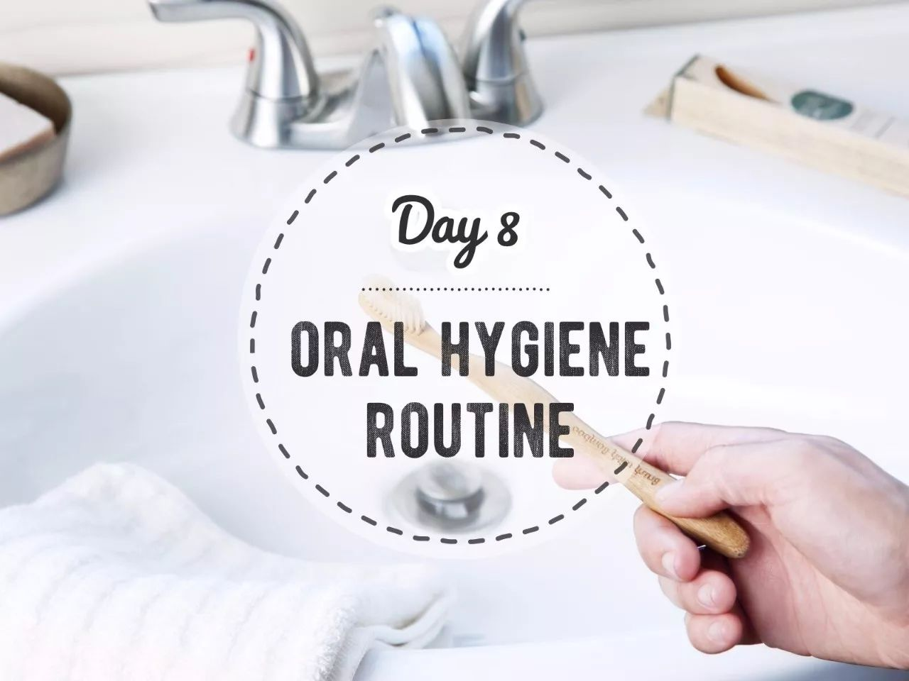
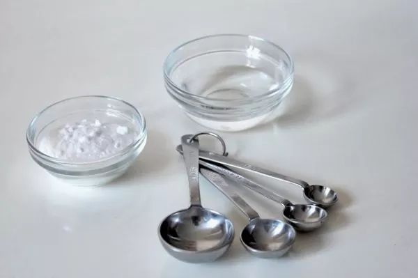
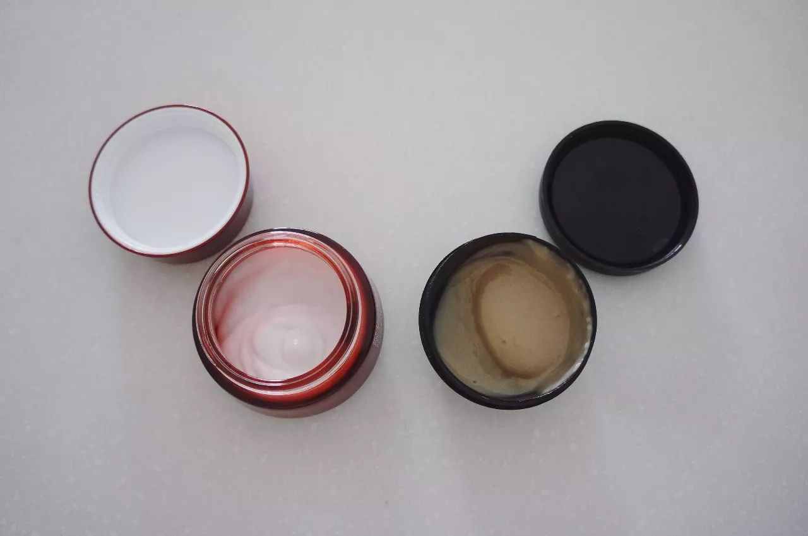
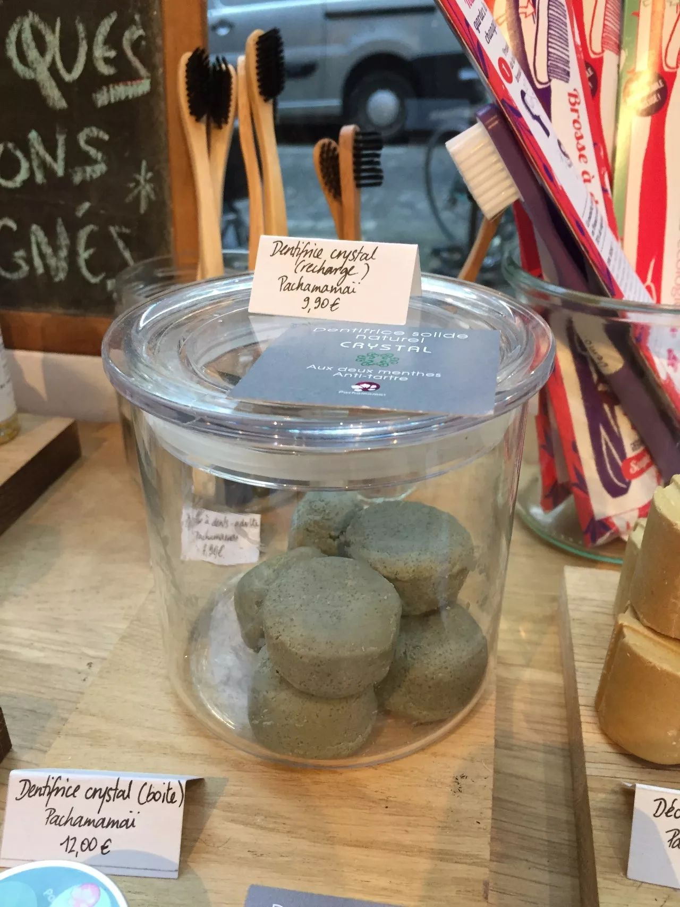
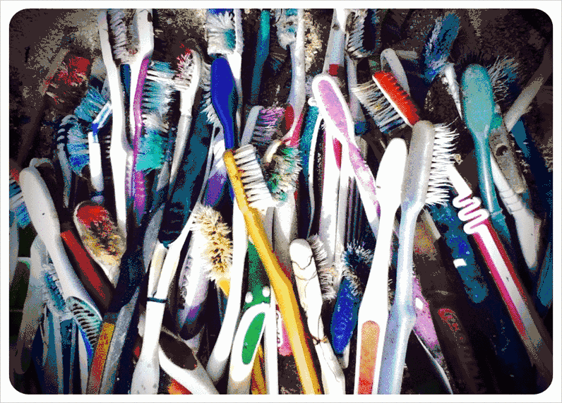
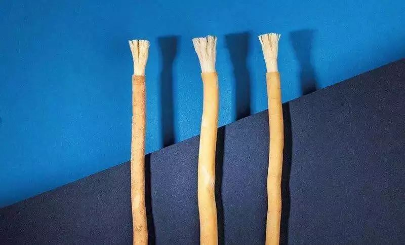
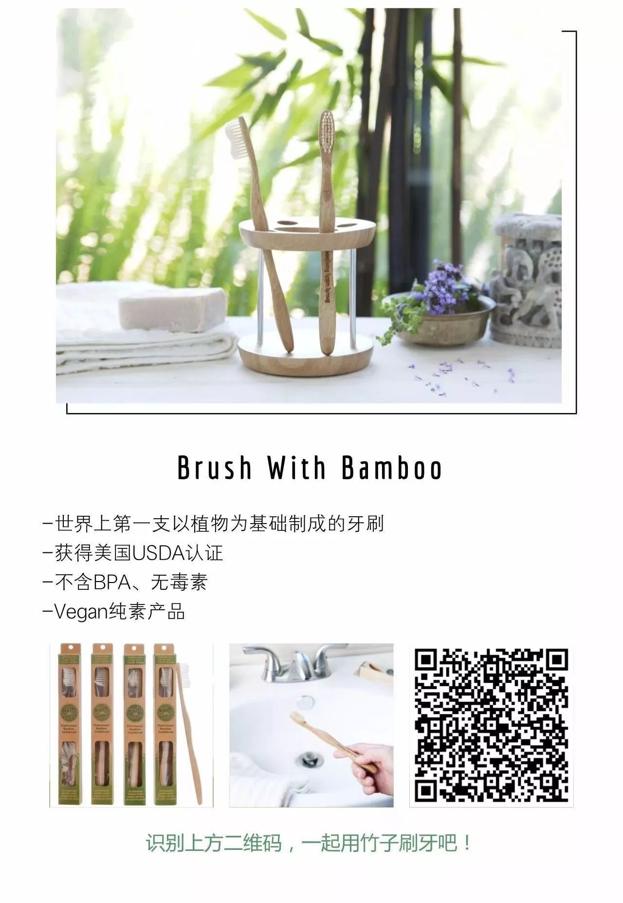
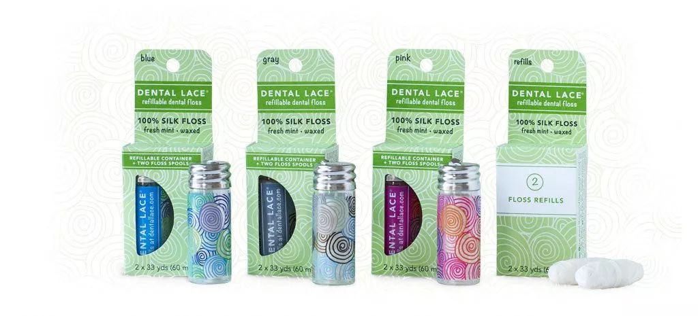
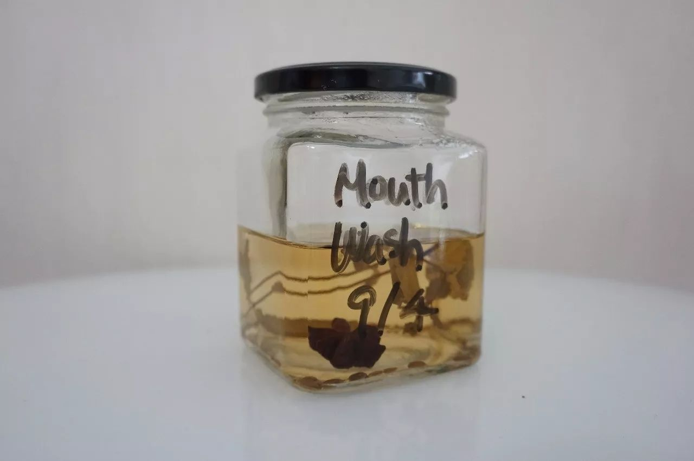

Day8 - 好好刷牙，好好爱地球
===========================================

早上七点，闹钟准时响起，顶着一头乱发走进浴室，睡眼惺忪地将牙刷塞进嘴里，刷刷刷刷刷刷......

慢着！瞪大眼睛一看，牙刷、牙膏、牙线、漱口水，全是塑料的！！

你知道吗？每年有47亿支塑料牙刷被扔进垃圾桶，足足可以绕地球19圈！

今天我们就来聊聊，爱护地球的 Zero Waster 们，该如何爱护牙齿呢？

牙膏
------------

DIY
^^^^^^^^^^^^

和大多数零活者（Zero Waster）一样，牙膏是我自制的第一件零垃圾个人护理用品，因为真的非！常！简！单！椰子油和小苏打按3:2的比例混合拌匀，只需30秒，Ta~Da! 一罐零垃圾零污染的牙膏便做好了！不过，还有更省事的，连椰子油都省了，直接用牙刷蘸着小苏打就OK！

::

   图片来自 trashisfortossers.com

另外，来自群友「鱼戏鱼珠」分享的中药牙粉也值得一试：大青盐15、生石膏15、骨碎补12、花椒5、白芷5、细辛5、防风8、薄荷叶8、旱墨莲8。后面的数字代表份量，去药店按比例打成细粉。

购买无包装
^^^^^^^^^^^^

没错，和打酱油一样，牙膏也能买到散装的！

::

   用自己的罐子去北京F2N农夫市集“打”牙膏（右）；产品来自Lily's Handmade

::

   巴黎零垃圾小店里的固体牙膏

普通牙膏
^^^^^^^^^^^^

如果以上两种方法都不适用，如果只能去超市买普通牙膏，没关系，也可以选择更环保的产品 —— **不含塑料微珠的牙膏**。有关塑料微珠的定义及危害可参考减法维根的科普文 → `震惊，中国每年都有209万亿粒塑料微珠被排入大海！ <https://mp.weixin.qq.com/s?__biz=MzA5MTkzOTg1MA==&mid=2654052961&idx=1&sn=6b29ae4612a05f1ca5eb89aee0f0f231&chksm=8bb1b704bcc63e12d89f37449a86a52054403e433b58bc889a5a42cf41850ff8268e2ce03f2b&scene=21#wechat_redirect>`_

化妆品和个人护理产品中发现的微珠成分，最常见的是：

- 聚乙烯 Polyethylene / Polythene (PE)
- 聚丙烯 Polypropylene(PP)
- 聚对苯二甲酸乙二醇酯 Polyethylene terephthalate (PET)
- 聚四氟乙烯聚甲基丙烯酸甲酯 Polymethyl methacrylate (PMMA)
- 尼龙 Nylon

牙刷
------------

在中国，最早的刷牙工具是杨柳枝。在隋唐时期，人们把杨柳枝泡在水里，要用的时候，用牙齿咬开杨柳枝，里面的杨柳纤维就会露出来，好像细小的木梳齿，就可以用来刷牙了。这便是“晨嚼齿木”这个说法的由来。

1938年，全世界第一支塑料牙刷被生产出来，带来便利的同时也给环境造成了极大的负担：每一支被扔掉的塑料牙刷都仍然填埋在地球上某个垃圾堆里，无法降解；又或是被冲进海洋或沙滩，被鱼类海鸟误当成食物吞食，再通过食物链重回我们体内；又或是被焚烧处理，释放各种有毒气体。

以下是几种对环境比较友好的牙刷选择：

马毛牙刷
^^^^^^^^^^^^

在塑料牙刷被发明出来之前的很长一段时间内，人类都用动物毛发制成的牙刷清洁牙齿。优点是原料天然，缺点是不适合vegan人士、动物保护人士、以及像我一样对气味敏感的宝宝。

树枝牙刷（miswak）
^^^^^^^^^^^^^^^^^^^^

来自迪拜的创业公司THIS Toothbrush将古老的树枝牙刷再次带进人们的视野，更多信息可见 → `迪拜人最酷户外装备：树枝刷牙 <https://mp.weixin.qq.com/s?__biz=MjM5MTM2NDY0NA==&mid=2651400292&idx=1&sn=7aa886b5eb2af07bf82f9dd6a5864dd8&chksm=bd4b2b2f8a3ca239460216b1b6165f3d342db3a81a2c67cf0ebbc3cc77157b2bc5e618471124&scene=21#wechat_redirect>`_

::

   图片来自THIS Toothbrush

可更换刷头的牙刷
^^^^^^^^^^^^^^^^^^^^

.. image:: images/Day08_008.jpg
   :align: center
   :width: 400

::

   同样摄于巴黎零垃圾小店

BrushWithBamboo
^^^^^^^^^^^^^^^^^^^^

众多零垃圾博主一致推荐，这是世界上第一支以植物为基础制成的牙刷。刷柄是野生毛竹，刷毛含62%的蓖麻籽油。详细介绍戳 → `Brush with Bamboo | 早晚三分钟，世界大不同 <https://mp.weixin.qq.com/s?__biz=MzI1MTQ2NDAxNg==&mid=2247484086&idx=1&sn=512b0216e0214c2ec385ffe1e9a969e4&chksm=e9f3d289de845b9f18f75adda49c0d2f0c2988723de5f326840f7be14df1b0f42ce9b6b47932&scene=21#wechat_redirect>`_ 

牙线
------------

市面上常见的牙线多为尼龙材质，覆上一层蜡，再装进一个小小的塑料盒子。

可降解的牙线？听起来不错？不过，我很喜欢的一位零垃圾博主 Wasteland Rebel 发过一篇环保牙线的测评（http://wastelandrebel.com/en/zero-waste-dental-floss/），结论是，没有一款牙线适合 Vegan Zero Waster（纯素零活者），因为目前所有不含尼龙的环保牙线都是蚕丝材质的。其中最优的选择当属 Dental Lace：材质为蚕丝+小烛树蜡，包装为玻璃罐+金属盖+纸盒，有替换装。

::

   图片来自Dental Lace

退而求其次，还有以下几个方案不妨一试：

1. 学习零垃圾鼻祖Bea Johnson，从不穿的丝绸衣服上抽出丝线
2. 头发：嘿嘿没想到我的头发还挺强韧（看到这里你是不是也默默地拔了一根？）
3. 针线盒里的普通绵线，如果裹上一层蜡效果可能会更好

漱口水
------------

参考豆瓣友邻Lan的配方，我也成功在自家厨房做出了漱口水！

+ 韩国烧酒240ml（原方为伏特加，高度数白酒应该都可以）
+ 八角1颗
+ 茴香一小把
+ 薄荷叶几片（原方为薄荷精油几滴）

泡上一个半月后，取适当份量，按 1:8 比例用纯净水稀释即可使用。

::

   酒精+香料+薄荷=清新口气

----

.. image:: images/gozerowaste_footer.jpg
   :align: center
   :width: 400

.. note:: 本文来自公众号「GoZeroWaste」