Day9 - 来呀～ 一起赶集呀！
===========================================

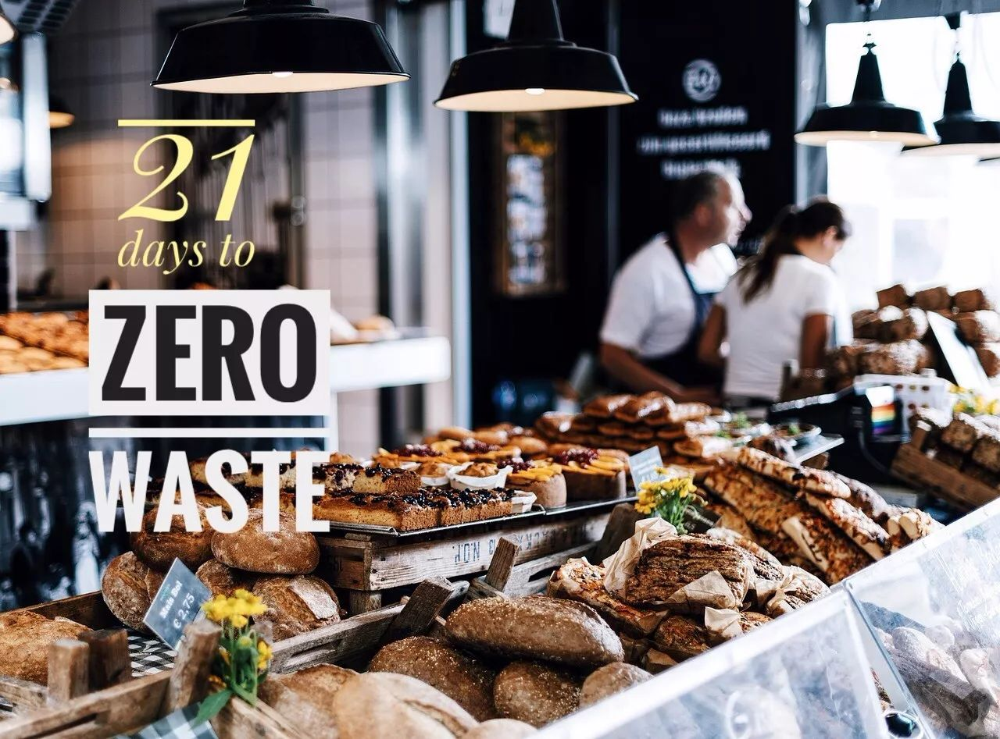

刚刚过去的这个周末，连着去了两天农夫市集。然后，今天中午又去了一趟。是的，想要堵我很容易，市集就是我的据点 :)

两年前刚来北京的时候，某个百无聊赖的周末刷着豆瓣，突然发现三里屯er一家咖啡厅的楼顶露台居然在卖菜！这么不讲道理的跨界，必须要去看个究竟！这便是我第一次逛农夫市集。

农夫市集？不就是菜市场吗？非也~~与大多数菜市场里的菜贩子不同，农夫市集是由农户将种植的食物亲手传递给消费者。除了新鲜的瓜果蔬菜，这里还有无添加美食、手工艺品、手作护肤品和有趣的活动。

两年后的现在，周末只要 GoZeroWaste 不办活动，我都会雷打不动地出现在市集（所以有时就干脆和市集合作办活动了呗）。就算不买东西，去和市集的好朋友们打个招呼也很幸福。

一座城市，因为市集，而变得有温度。

.. image:: images/Day09_002.jpg
   :align: center

爱上农夫市集的六大理由
------------------------

1. 自然农法种植的蔬菜
^^^^^^^^^^^^^^^^^^^^^^^^

黄瓜有黄瓜味、苹果有苹果味，被工业种植麻木的味蕾多久没有这样的体验了？今年夏天，我居然开始爱吃胡萝卜了！没有农药化肥，用水冲掉泥巴就直接塞进嘴里，简直甜到飞起！

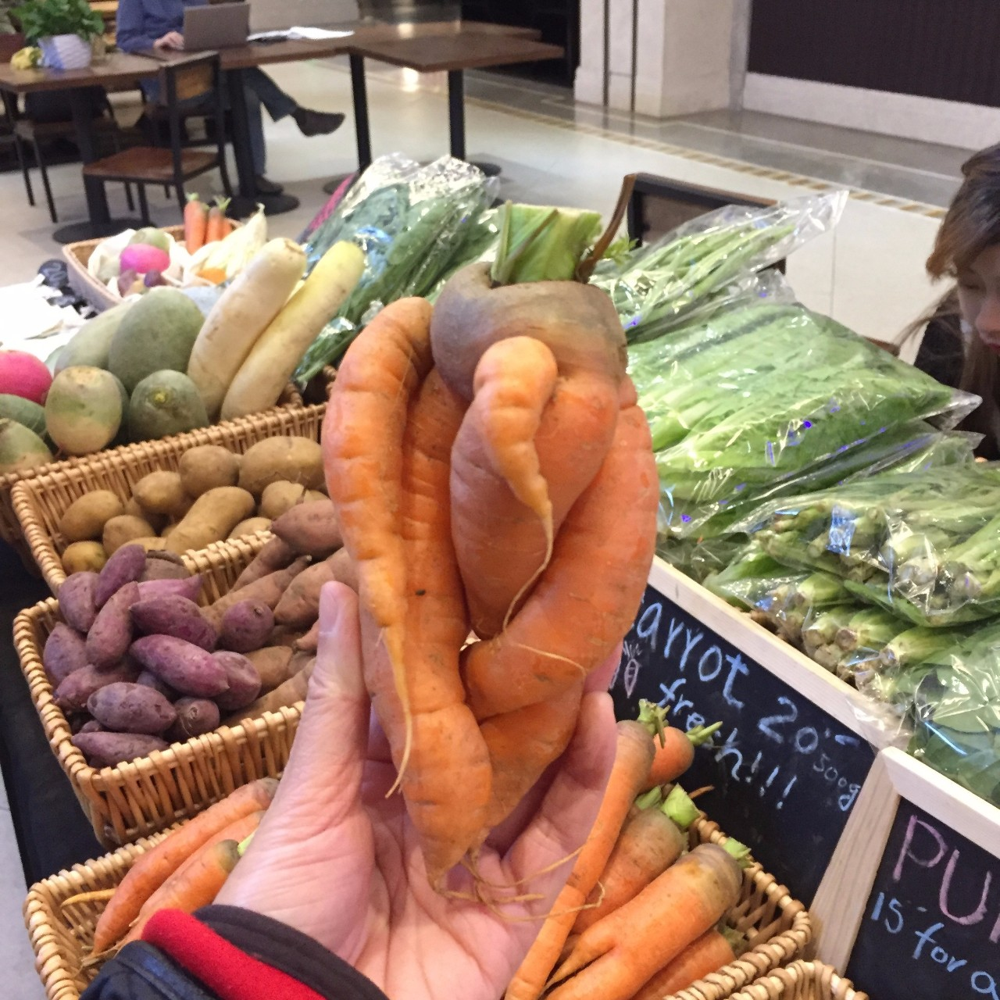

::

   野蛮生长的胡萝卜

2. 用食物联结彼此
^^^^^^^^^^^^^^^^^^^^^^^^

Who grows my food? 我吃的食物是谁种的？他是哪里人？家里有几个孩子？有没有养狗？什么时候开始种菜的？今年收成怎么样？来市集的路上堵车了吗？每次去赶集，除了买买买，最开心的莫过于和商户们聊聊天，一来二去也都成了朋友。有时间还可以去农场帮忙种地，了解农户的日常生活，看看餐桌上的食物究竟是怎么种出来的。

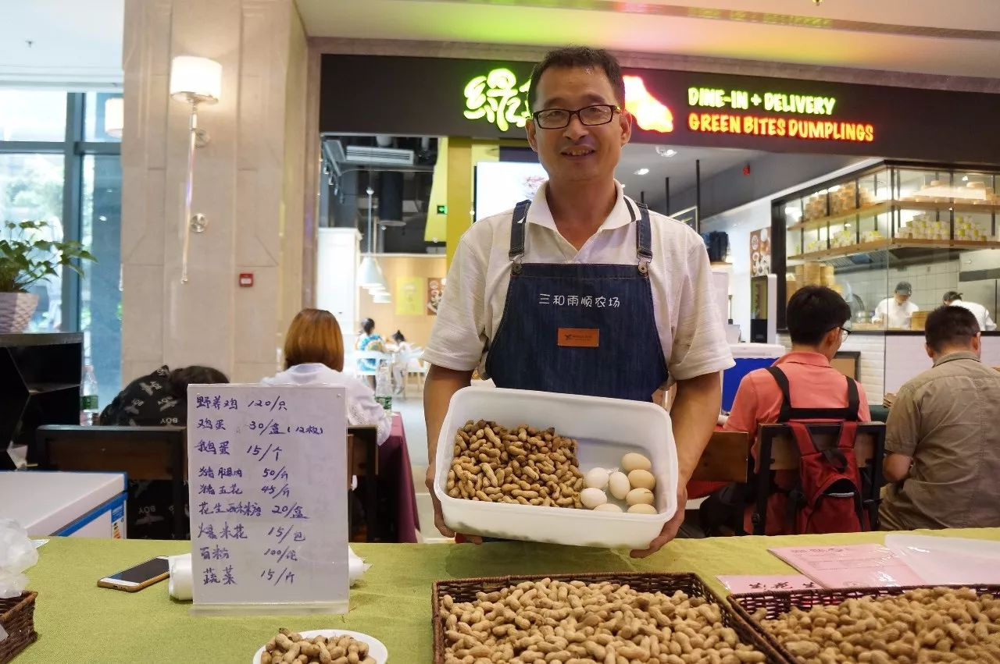

::

   三和雨顺农场的李哥，最爱听他说唐山话啦

3. 轻松实现零垃圾购物
^^^^^^^^^^^^^^^^^^^^^^^^

没有小票、没有包装、没有塑料袋。因为认同环保健康的理念，市集的商户们对我的零垃圾购物都极力支持！棉布袋、饭盒他们早就见怪不怪，还会主动拉上我讨论怎么减少包装、怎么影响消费者一起参与，太感人了！

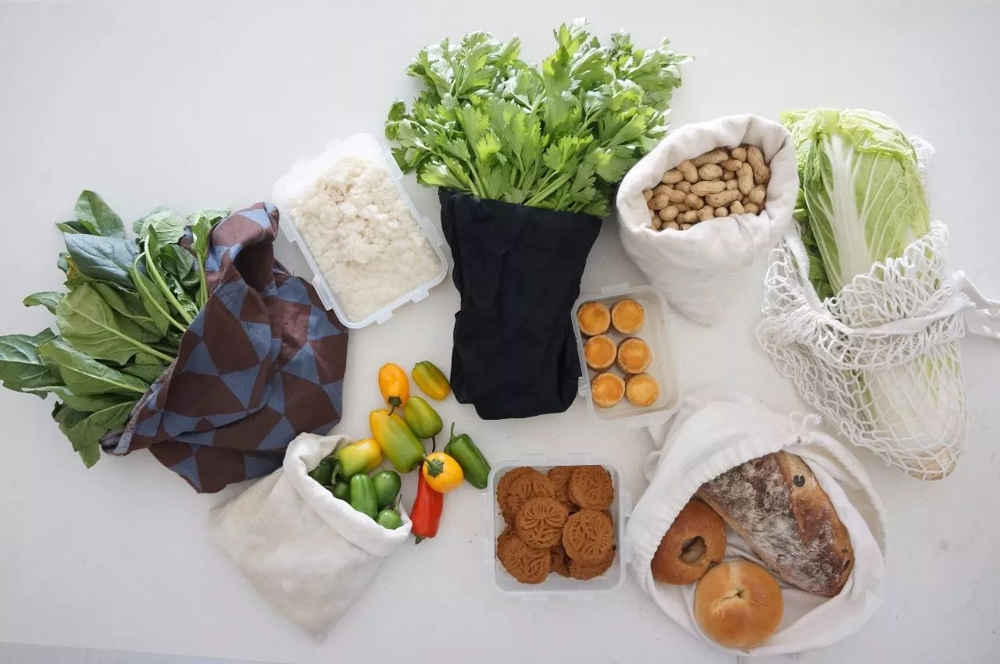

::

   零垃圾买菜日常：没有一个塑料袋

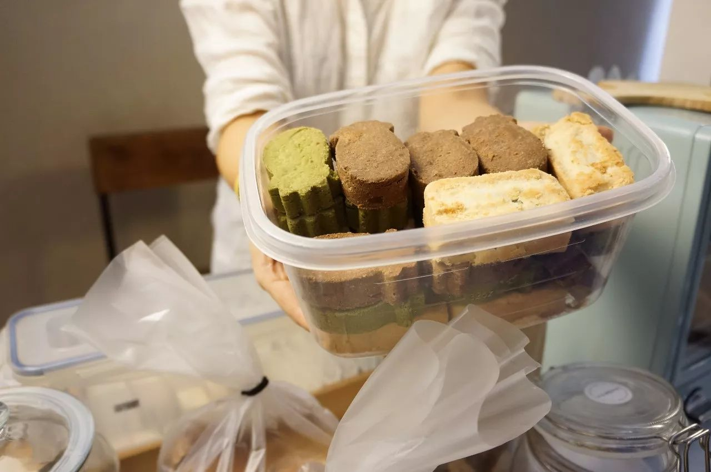

::

   纯素凤梨酥，我是这样买的

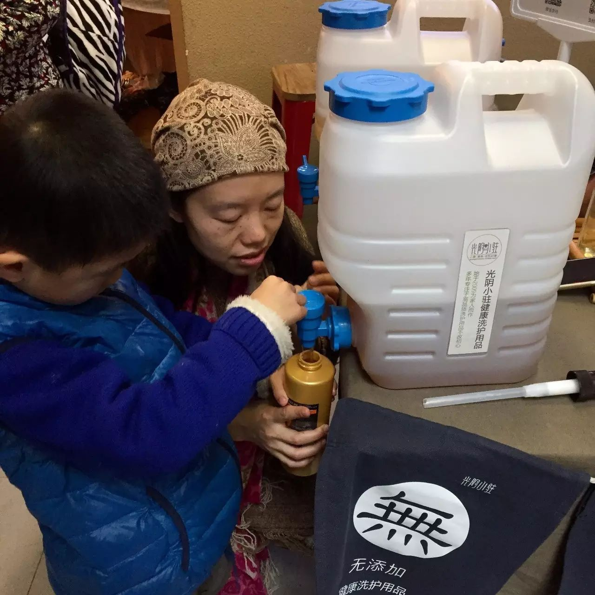

::

   无添加洗发水，我是这样打的

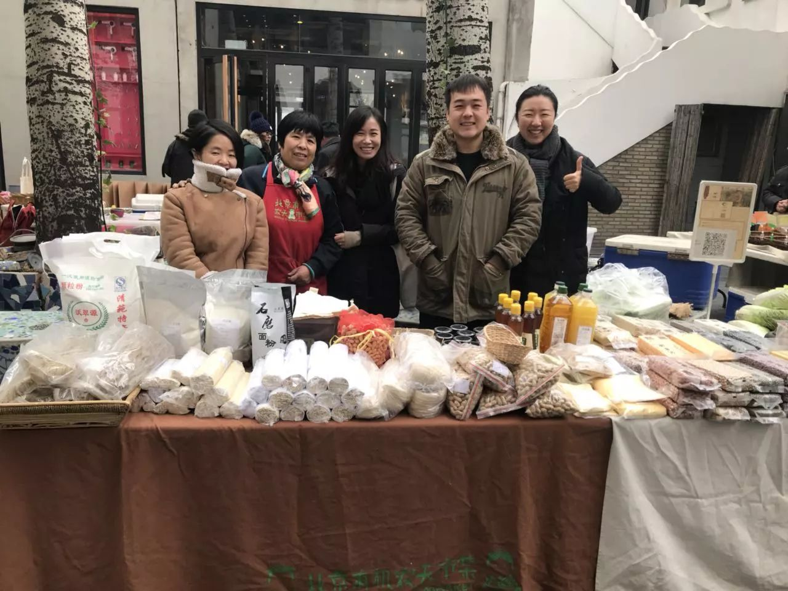

::

   快报！沃翠园杂粮包装大改造项目组今天正式成立啦，敬请期待华丽变身！

延伸阅读 → `一场农夫市集的正确”打”开方式 <https://mp.weixin.qq.com/s?__biz=MzI1MTQ2NDAxNg==&mid=2247483827&idx=1&sn=c5d4ffb85a730d03c33003bd47678cec&chksm=e9f3d18cde84589aa41abbb391b4f0ed38c687cac7d73176da2f2ecc5d19b7c4620342692646&scene=21#wechat_redirect>`_

4. 本地购物，缩短食物里程
^^^^^^^^^^^^^^^^^^^^^^^^^^^^^^^^

除了包装材料，远距离网购食物也会因为长途运输而造成大量碳排放。在线下的市集向本地的商户直接购买，能够最有效地缩短食物里程（food miles=消费者与食物原产地之间的距离），减少对环境的负担。

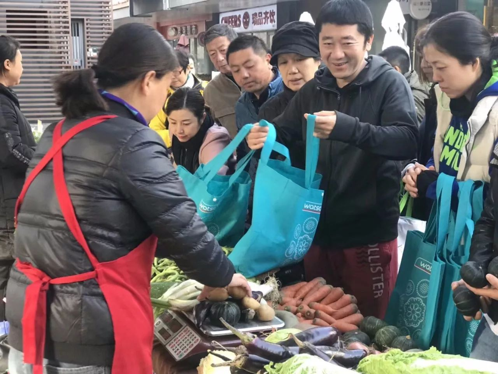

::

   图片来自北京有机农夫市集

5. 各种好玩的活动
^^^^^^^^^^^^^^^^^^^^^^^^

除了吃吃喝喝，市集还会不定期举办各种有温度有态度的活动：二手交换、DIY工作坊、主题分享会等等等等，每次赶集，都是选择一种时尚又环保的生活方式！

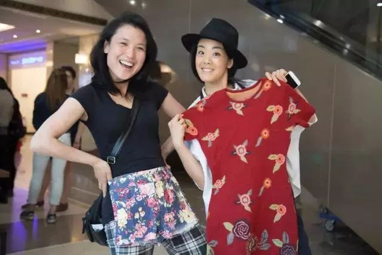

::

   F2N农夫市集的二手交换活动

.. image:: images/Day09_011.jpg
   :align: center
   :width: 400

::

   北京有机农夫市集在2017北京设计周上的展览

6. 一座城市的正确打开方式
^^^^^^^^^^^^^^^^^^^^^^^^^^^^^^^^

如今，每到一座城市，最让我期待的就是当地的农夫市集。奢侈品店里的名牌包包无法为城市代言，只有充满各种音调、颜色和味道的市井，才是这座城市最真实的样子。

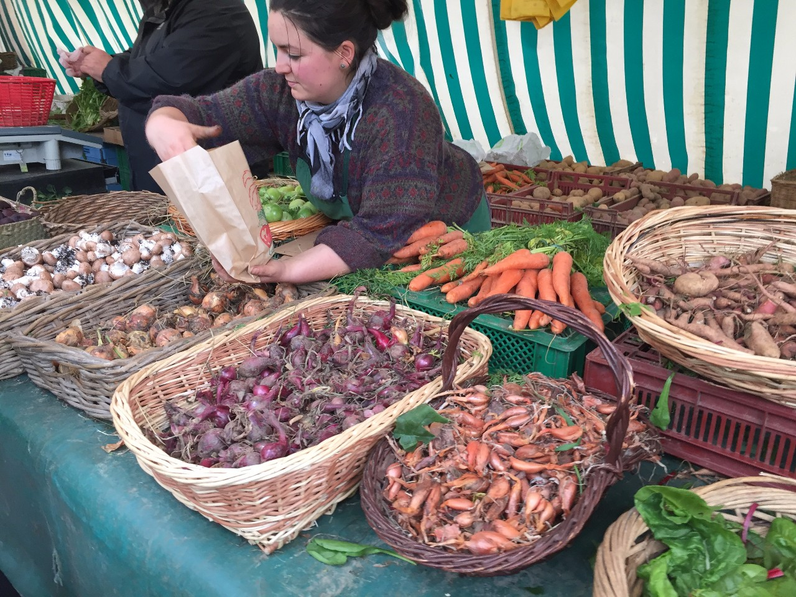

::

   巴黎巴士底市场

市集信息
------------------------

以下是我去过的三个农夫市集，具体开集时间和地点请留意公众号通知。

北京有机农夫市集
^^^^^^^^^^^^^^^^^^^^^^^^

北京从农场到邻居
^^^^^^^^^^^^^^^^^^^^^^^^

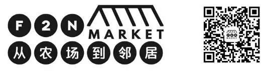

广州城乡汇
^^^^^^^^^^^^^^^^^^^^^^^^

----

.. image:: images/gozerowaste_footer.jpg
   :align: center
   :width: 400

.. note:: 本文来自公众号「GoZeroWaste」