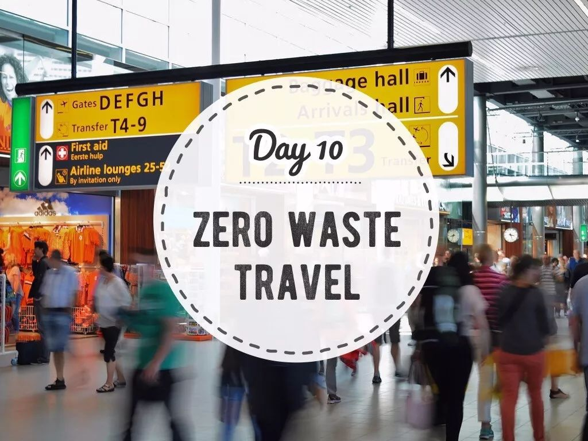
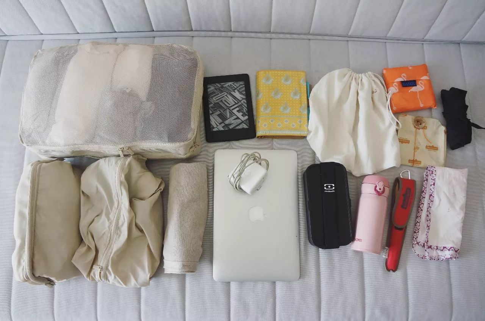
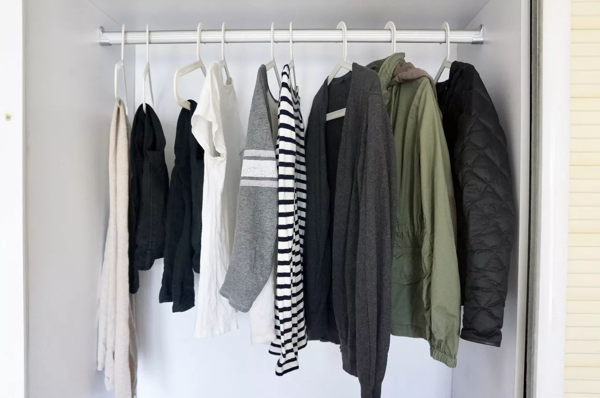
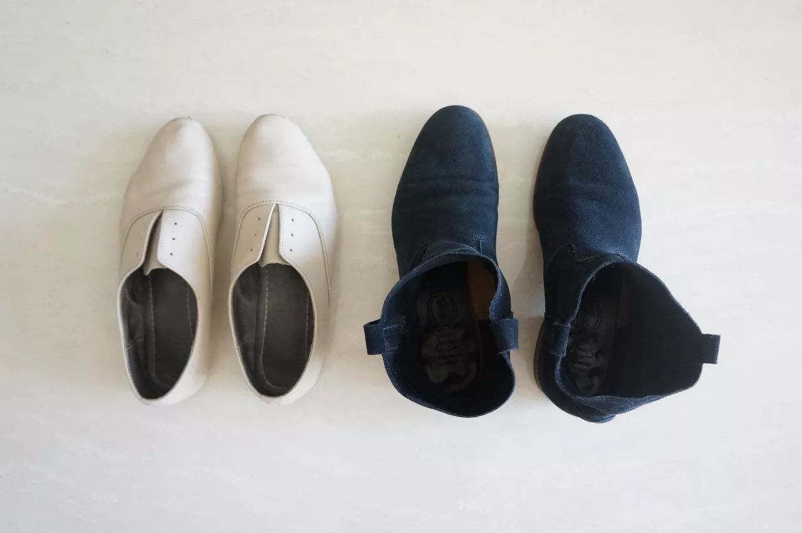
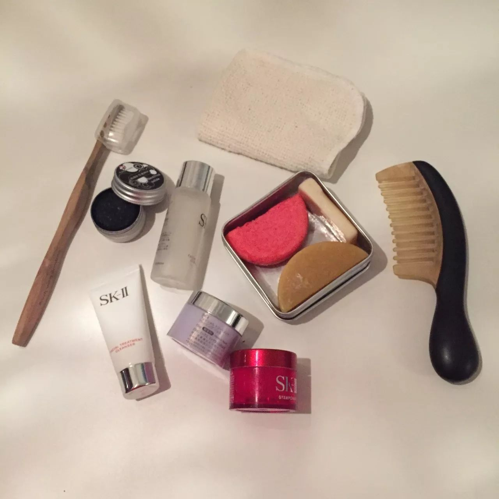
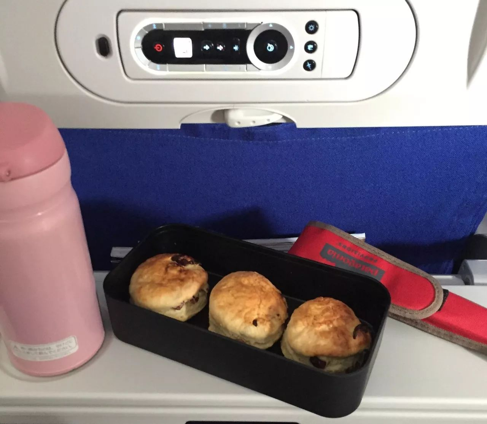
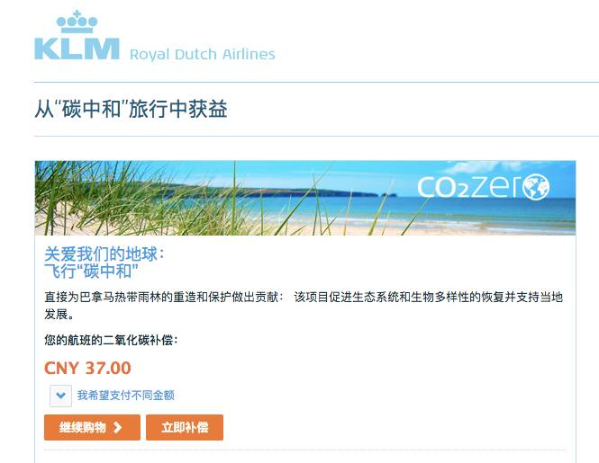
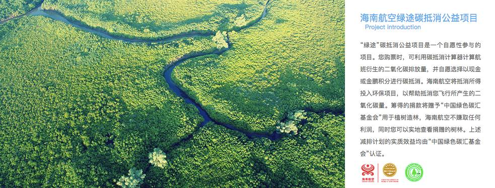

Day10 - 轻轻地，我们去旅行
===========================================

旅行与零垃圾？

听起来是貌似两件相互矛盾的事情，而事实上，也的确是这样。

Zero Waste Travel（零垃圾旅行），本身就是个伪命题。毕竟，不管搭乘哪种交通工具，都不可避免会产生碳排放。

另外，对于 zero waster 们来说，离开熟悉的环境前往一个新的目的地，无法将平时的全套零垃圾装备悉数带齐。听起来就没什么安全感，一个不留神，恐怕垃圾就猝不及防地出现了。

轻装上阵的零垃圾旅行
------------------------

如何尽可能降低旅行造成的环境影响呢？

其实，从收拾行李的那一刻开始，我们就可以选择做一位环境友好的旅行者。

对于一个从不托运行李的人，箱子当然要越轻越好，可以省去踮着脚，咬着牙，红着脸，用全身的力气挺举箱子的尴尬；另一方面，对于航空旅行来说，飞机燃料是目前为止最大的碳排放源。

携带的行李越多，班机重量就越重，飞行时需要的燃料也就越多，因而排放更多的二氧化碳。

所以，负责任旅行的第一步就是：精简行李、轻装上阵，pack smart and travel light！

前几周，我出了一趟门，十天、三座城市、三个季节、三十度温差，不过我的行李只装了半个登机箱。今天就给大家看看，我的箱子里到底装了啥？

衣服
^^^^^^^^^^^^^^^^^^^^^^^^

今年夏天，我开始逐步搭建胶囊衣橱，所以我的衣服并不多。不过，这次从北京去广州和上海，可以说是跨越了夏秋冬三个季节，收拾衣服的时候还真是费了一些功夫，可以说是搬出了半个衣橱。

从右到左分别为：

- 轻薄羽绒*1
- 纯棉外套*1
- 开衫*1
- 长袖T恤*2
- 短袖T恤*1
- 长裤*2
- 围巾*1

没入镜的还有背心一件、睡衣一套、毛巾一条和内衣若干。据说很多读者在素食星球后台关心我穿不穿秋裤，11月初那会还不需要出动秋裤君......我当然穿秋裤啦！我还有棉裤呢！

此行温差较大，所以一定要get叠穿的技能！30度的大广州只需要穿一件短袖T，早晚微凉可以披上一件开衫，穿越到魔都的秋天可以加一件外套，最后回北京再穿羽绒。

万一北京下雪了，还可以穿成：背心+短T+长T+开衫+羽绒+外套，是不是很机智？！

打包行李箱，从一整柜的衣服中挑出旅途中最想穿的那几件，想办法搭配出尽可能多的组合，这不正是打造胶囊衣橱的过程吗？

旅行归来，不妨问问自己，我真的还需要那么多衣服吗？

你的胶囊衣橱，原来就在行李箱里！

鞋子
^^^^^^^^^^^^^^^^^^^^^^^^

衣服可以每天不重样，但鞋子一定得少而精。这次出行我只带了一双单鞋，一双踝靴 （另外还有一双在酒店穿的人字拖）。

::

   这双靴子的名字也叫Elsa

裸色单鞋负责夏秋两季，藏蓝踝靴则能够从秋穿到冬，和每套衣服都轻松搭配，可以和好友在江边闲聊漫步，也可以站上舞台发表演讲。

洗漱包
^^^^^^^^^^^^^^^^^^^^^^^^

对于女生来说，出门必不可少的绝对是洗漱包，以下是我的部分洗护用品：

一条小小的有机棉面巾，叠成小方块之后完全不占地方。

皂盒里分别是洗头皂、身体皂和洗手/衣皂，开始零垃圾生活后我爱上了没有包装、成分天然的手工皂，还能根据皂盒的大小随意切割。

除了洗面奶是以前的囤货，其他几个中样的瓶罐都是反复使用的，分装了卸妆膏、爽肤水和面霜。

另外，还有代替塑料牙刷的竹牙刷和小铁罐里的固体牙膏。

部分ZeroWaste装备
^^^^^^^^^^^^^^^^^^^^^^^^

下面这张图片里的东西只是我的零垃圾百宝箱里的一小部分，并不会占据太多空间，但每件物品都非常实用，不管是平时还是旅行中，使用率都很高。

仔细看你会发现，这些都是 **可以重复使用的物品**，有了这些装备，就能成功避免塑料袋、纸巾、外卖餐盒、餐具、矿泉水瓶等一次性垃圾的产生！

.. image:: images/Day10_007.jpg
   :align: center
   :width: 400

**1 白色的有机纯棉布袋**

这是专门用来买面包的，宽口的设计令它能够轻松驾驭吐司、欧包等大型面包。

**2 黑色的袋子**

其实是改造于老公的一条亚麻裤子，将长裤改成短裤之后，剪下来的裤腿部分我便请裁缝师傅帮忙做成了袋子，用于买菜、买水果、买板栗等。

**3 购物袋**

红色火烈鸟图案是 BAGGU 购物袋，展开之后容量感人，没有它装不了的东西。

**4 蜂蜡膜**

它是一次性塑料保鲜膜的替代品，用来包裹没吃完的水果面包，也可以直接带去店里买点心。蜂蜡的密封性很好，能够锁住面包的水分。纯素的朋友可以选择树蜡膜。

**5 饭盒**

这是一套便当盒的其中一个，轻巧易携。别看体形小，人家可是能装下一份云吞面的！而且连汤都不会洒！

**6 水杯**

作为一个中年人，不带个保温杯你好意思出门吗！旅行时，在机场、车站都能轻松找到饮水处。很多餐厅和咖啡厅（如星巴克）都提供饮用水，只要礼貌地把杯子递过去就 OK 啦！如果要买咖啡，在星巴克使用自带杯可享立减3元优惠！

**7 餐具**

一套竹制的刀叉勺筷装在回收矿泉水瓶做成的套子里，请问还有比这更环保的餐具套装吗？

**8 手帕**

代替纸巾，两条换洗轮流用。

除了轻装上阵，我们还能做什么？
----------------------------

上个月我搭乘 KLM（荷兰皇家航空）从巴黎飞回北京，行前在荷航网站办理值机时，选好座位后突然跳出来一个问题，“您愿意参加荷航的 CO2 ZERO 项目吗？” CO2ZERO 是荷航的二氧化碳补偿服务，乘客可以补偿所乘航班的二氧化碳排放，乘客捐献将直接并完全投入于各种可持续能源项目中。

于是，我为这次飞行贡献了37元人民币的碳补偿，这部分费用将被用于巴拿马热带雨林的重造和保护。

航空业的温室气体排放占全球总排放的 2%-3%。国外大部分航空公司（达美、国泰、泰航、捷星、美联航等等）都有与荷航类似的碳补偿计划，帮助乘客实现“碳中和”飞行。至于国内的航空公司，貌似目前只有海南航空推出了碳抵消项目。希望更多航空公司能够加入其中，和乘客一起努力，让飞行更环保。

Zero Waste Travel 经验总结
----------------------------

1. 轻装上阵，给行李箱减重；
2. 自带水杯、餐具、手帕、布袋；
3. 自带洗漱用品和拖鞋；
4. 使用电子登机牌；高铁刷身份证过闸机；
5. 飞机上用外套或披肩取暖，不使用毛毯（通常会将塑料袋扯坏）；
6. 自带耳机；
7. 选择负责任的航空公司，参与碳抵消；
8. 长途旅行时尽量选择直飞航班；
9. 理性购买纪念品
10. ...

最后，抛个问题大家讨论一下：为了不产生塑料垃圾，很多 zero waster 会选择不吃飞机餐。不过，餐食的保质期一般只有24小时，据说飞机到站后，没发完的也会当成垃圾处理掉。**所以，飞机餐到底是吃，还是不吃？**

----

.. image:: images/gozerowaste_footer.jpg
   :align: center
   :width: 400

.. note:: 本文来自公众号「GoZeroWaste」