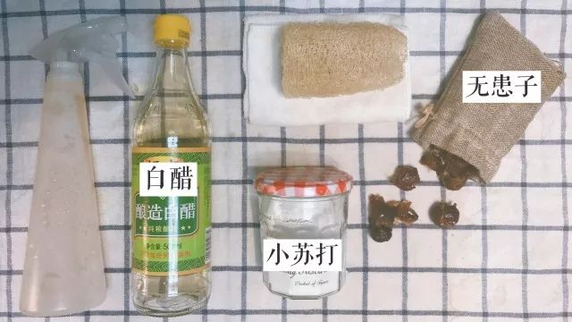
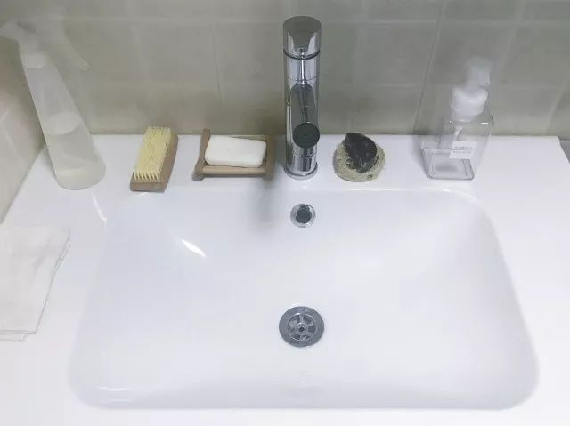
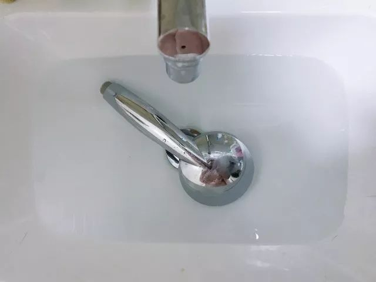
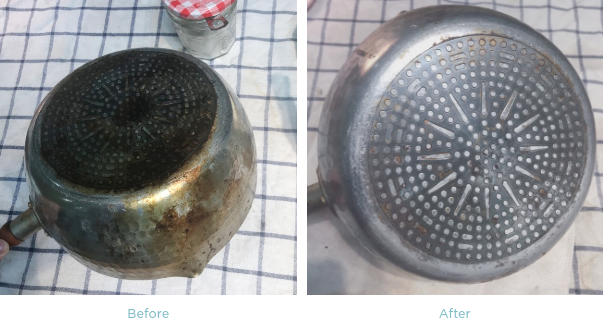
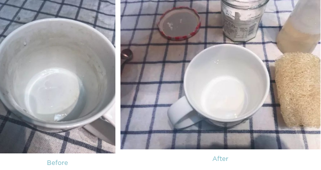
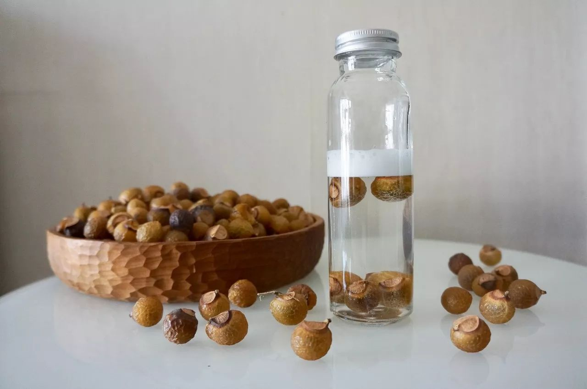
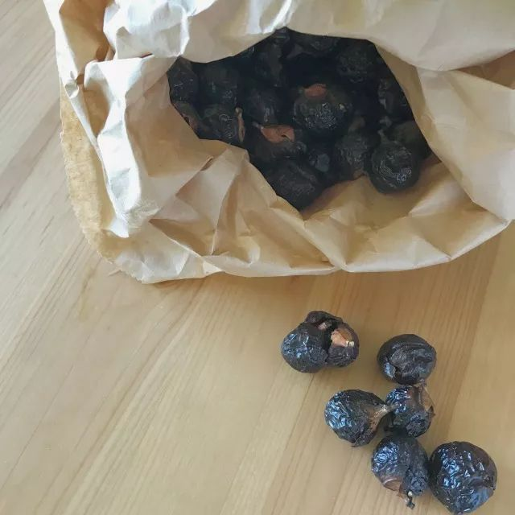
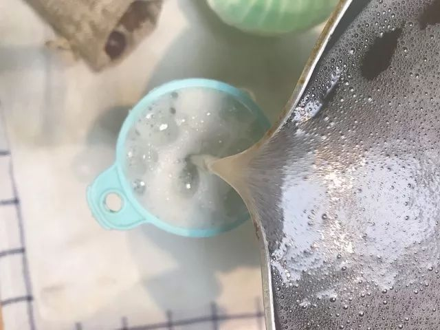
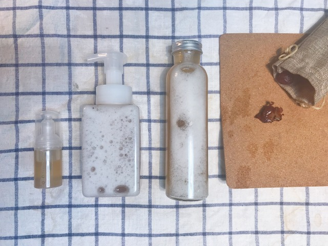
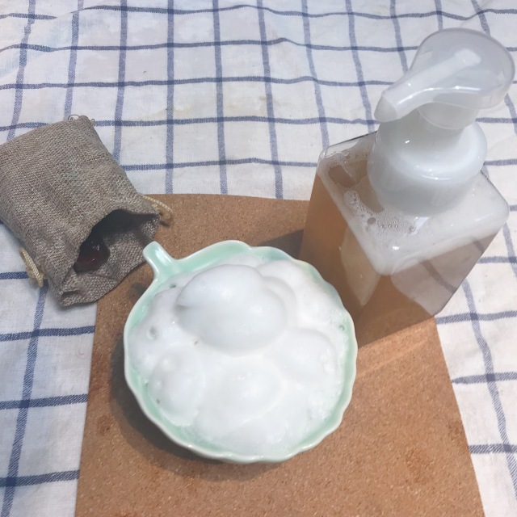

Day11 - 天然无负担的清洁用品
===========================================

.. image:: images/Day11_001.jpg
   :align: center

::

   （本文授权转载自「归真Living」，感谢博主绵绵提供内容）

在践行 Zerowaste 极简生活之前，面对超市货架上琳琅满目的清洁用品，洗碗液、油烟净、洁厕灵、卫浴清洁剂、除水垢剂...每一种看上去似乎都必不可少。我看过一篇文章中甚至盘点了#20种居家必备清洁用品#。

这些瓶瓶罐罐买回家会占据过多空间，很多放到过期都用不上几次。除了包装会产生塑料垃圾之外，很多清洁剂中的化学成分对呼吸道、皮肤有刺激，对水源环境也有污染。

.. image:: images/Day11_002.jpg
   :align: center

在仔细研究这些不同种类的清洁剂成分表之后，我发现它们当中很多有效成分都是有重合的。也就是说，或许我们根本不需要那么多种清洁剂。

**真正精简下来，其实三种就够了 —— 酸性清洁剂、碱性清洁剂、泡沫清洁剂。**

今天就和大家分享一下，我日常使用的三种纯天然清洁剂。

::

   清洁用品全家福

白醋
------------

用途：浴室清洁剂，除水渍皂渍。

浴室的污垢主要来源于水渍，市面上常见的除水垢剂一般是柠檬酸，可以溶解水垢中的碳酸钙。我们可以用弱酸性的白醋来替代。

提高温度能够加速化学反应，因此用温热水效果更好。对醋的气味敏感也可使用柠檬汁代替。

① 清洁镜柜玻璃、洗手台、浴缸、水龙头
^^^^^^^^^^^^^^^^^^^^^^^^^^^^^^^^^^^^

.. image:: images/Day11_004.jpg
   :align: center

**自制白醋清洁剂**：将白醋和温水以 1：3 的比例混合，可灌装喷瓶中喷洒于污垢处或用毛巾沾取擦拭，用干毛巾擦干。

.. image:: images/Day11_005.png
   :align: center

|

::

   洗手台清理后

.. image:: images/Day11_007.jpg
   :align: center
   :width: 400

::

   干净的洗手台会长猫~

② 清洁花洒
^^^^^^^^^^^^^^^^^^^^^^^^^^^^^^^^^^^^

在北京水质比较硬，花洒的出水口总会堵塞。将醋加入热水中，浸泡花洒。定期这样清理一下，让出水口保持通畅。

::

   简单粗暴的我选择直接拆下来泡

③ 清洁马桶
^^^^^^^^^^^^^^^^^^^^^^^^^^^^^^^^^^^^

直接将少许白醋倒入马桶，稍等片刻让醋酸反应，然后用马桶刷，刷刷刷~白醋溶解污垢的同时还兼具消毒杀菌的功能呢。

小苏打
------------

用途：厨房清洁剂，除油污异味。

很多人分不清碱面和小苏打。碱面是碳酸钠（NaCO3），一般用于做馒头；而小苏打则是碳酸氢钠（NaHCO3），烘焙常用。

小苏打能够将油污分解成水溶性物质，使其更易于清洁，兼具吸附异味的功能，最适合用于厨房清洁了。

.. image:: images/Day11_009.jpg
   :align: center

① 清洁厨房电器、橱柜、台面、墙砖
^^^^^^^^^^^^^^^^^^^^^^^^^^^^^^^^^^^^

冰箱、微波炉、烤箱... 这些最能藏污纳垢的厨房电器，又与入口的食物接触密切，使用食用级的小苏打来清理才更安心。

**自制小苏打清洁剂**：将 30g 小苏打溶于 500ml 温水中，灌装喷瓶喷洒于污垢处或用毛巾沾取擦拭，用清水再抹一遍即可。

台面墙面上附着的油污也可以用小苏打溶液来擦拭处理~

② 清洁锅底油污、杯子茶渍
^^^^^^^^^^^^^^^^^^^^^^^^^^^^^^^^^^^^

如果是烧菜糊了锅，在 **锅里盛水加上少许小苏打煮一下** 就会非常好刷了。但如果是长期清洗不仔细导致的锅底变黑，就要拿出清洁力更强的 **小苏打清洁膏** 来打磨。

**自制小苏打清洁膏**：根据用量取小苏打和水以 2：1 的比例混合，制成小苏打膏，用刷子沾取打磨。（碱性比较强最好避免直接接触皮肤）

|

③ 除橱柜、冰箱异味
^^^^^^^^^^^^^^^^^^^^^^^^^^^^^^^^^^^^

橱柜里有时会放一些口味比较重的调味料，如咖喱、孜然等，很容易搞得一开柜门就是扑鼻的味道。冰箱也是一样，我记得小时候妈妈往冰箱里放了一瓶韭菜花... 然后每次开冰箱都是一股韭菜味，非常让人崩溃。

现在学会了往橱柜冰箱里放一小碟小苏打粉，吸附除味的效果就很棒了。

无患子
------------

用途：万能的天然皂液，除油脂污渍，可与白醋或小苏打混合使用。

无患子是什么？戳 → `无患子 | 纯天然不伤手的清洁神器 <http://mp.weixin.qq.com/s?__biz=MzI1MTQ2NDAxNg==&mid=2247484003&idx=1&sn=0caf45ac4328042ecaaac97d8220ee4c&chksm=e9f3d25cde845b4a0136cbf525ea4df26560b59c53275d222abe2a38f65bf09d5a6d4d5e08ad&scene=21#wechat_redirect>`_

无患子是一种结在树上果实，南方一些城市路边就能见到。无患子作为天然清洁剂由来已久，因无患子果皮中含有皂苷，能够产生清洁泡沫，并具有去油杀菌的功效，可用于洗手、洗发、洗衣等。

.. image:: images/Day11_012.jpg
   :align: center
   :width: 400

::

   秋天的无患子树（图片来自GoZeroWaste南京群友晏铭妈）

::

   刚摘下来的无患子（图片来自GoZeroWaste）

将无患子去核，取厚实的果皮晒干，可直接置于纱布袋或起泡网中揉搓出泡，或水煮制成皂液使用。

如果南方的朋友见到路边的无患子树一定不要错过，身边没有无患子树的我们就只能借助某宝购买晒好的无患子果皮了。无患子用量其实很省，之前 Zerowaste 野餐的时候小伙伴拿了一袋子分给大家，我装了一小袋用到现在还没有用完。

.. tip:: 目前 GoZeroWaste 群友已在上海、南京、杭州、武汉等多个城市捡到了无患子，
         我们的技术顾问 heyuan 同学还贴心地做出了一版《无患子宝地图》！
         需要的同学们请于 GoZeroWaste 后台回复“地图”查收！

自制无患子皂液
^^^^^^^^^^^^^^^^^^^^^^^^^^^^^^^^^^^^

1. **取 8-10 颗无患子果皮置于 500ml 水中煮开。**

2. **水开之后再小火煮 15 分钟。**

3. **待皂液冷却后，反复挤压无患子果皮并搅拌，进一步萃取。**

  注意：建议将无患子置于布袋中煮，或直接煮后用纱布过滤后再装瓶，尤其是起泡瓶，没有过滤会堵塞瓶口。

4. **待完全冷却后准备装瓶**

这个蓝色的橡胶小漏斗很实用，我家中酱油、醋这些调料装瓶也会用到。

我一般会装三个瓶，最右侧玻璃瓶用作洗碗液，中间起泡瓶作为洗手液，左边小小的是随身携带便于洗手、清洗餐具。这些大概是一周左右的用量，因为无患子皂液是纯天然萃取，保质期很短，一次不要做太多，每次用后冷藏可保存2周。

**起泡瓶是无患子皂液的好伙伴**。因为无患子皂液不像浓度高的化工清洁剂一样很容易出泡，但是水状的皂液放在起泡瓶里却很容易压出绵密的泡沫。

煮完的无患子果皮也可以装在小纱布袋里，悬挂在洗手池旁，一揉搓还是会出泡的。

洗碗的话可以多倒一些，配合同样 **纯天然的丝瓜络** 清洗餐盘锅具，真正的绿色环保清洁。

作为包容性强的万能清洁剂，也可以将白醋或小苏打混合与无患子皂液中，清洁力 MAX 啦！

需要提醒大家的是，这些纯天然的的清洁剂，最好都是随制作随用，不要存放过久，不然也会变质的哦~

----

.. image:: images/gozerowaste_footer.jpg
   :align: center
   :width: 400

.. note:: 本文来自公众号「GoZeroWaste」