Day13 - 新挑食主义：少肉多蔬菜
===========================================

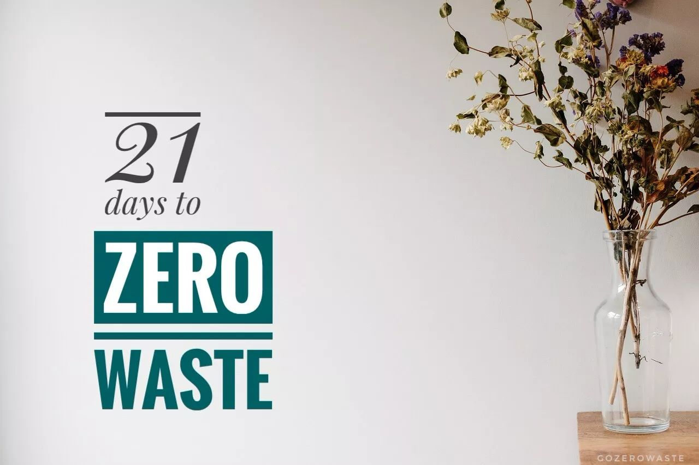

前几天听一个朋友说，她小的时候家里条件不好，吃肉是件非常奢侈的事情。当年她奶奶的愿望就是有一天可以用卡车买肉，吃个痛快！

的确，随着经济实力的增强，国人在吃肉这件事上也是卯足了劲：目前，中国的人均食肉量是 63 公斤/年，超过《中国居民膳食指南》（2016）所建议的人均 27.4 公斤/年一倍以上。

肉类的过量摄入不仅增加了罹患糖尿病、心血管疾病和癌症的风险，现代集约化肉类生产在土地利用、动物饲料以及温室气体排放等方面对环境有着严重的负面影响。

畜牧业生产占用了世界上 30% 的土地和超过 25% 的淡水，牛羊通过“肠道发酵”（主要是打嗝和粪便排放）释放大量的甲烷，畜牧业的碳排放占全球总量的 14.5%。

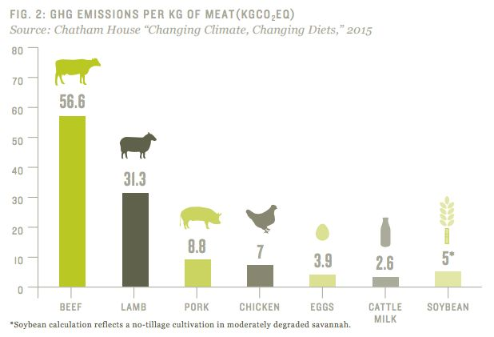

::

   每生产一公斤食物对应的温室气体排放量

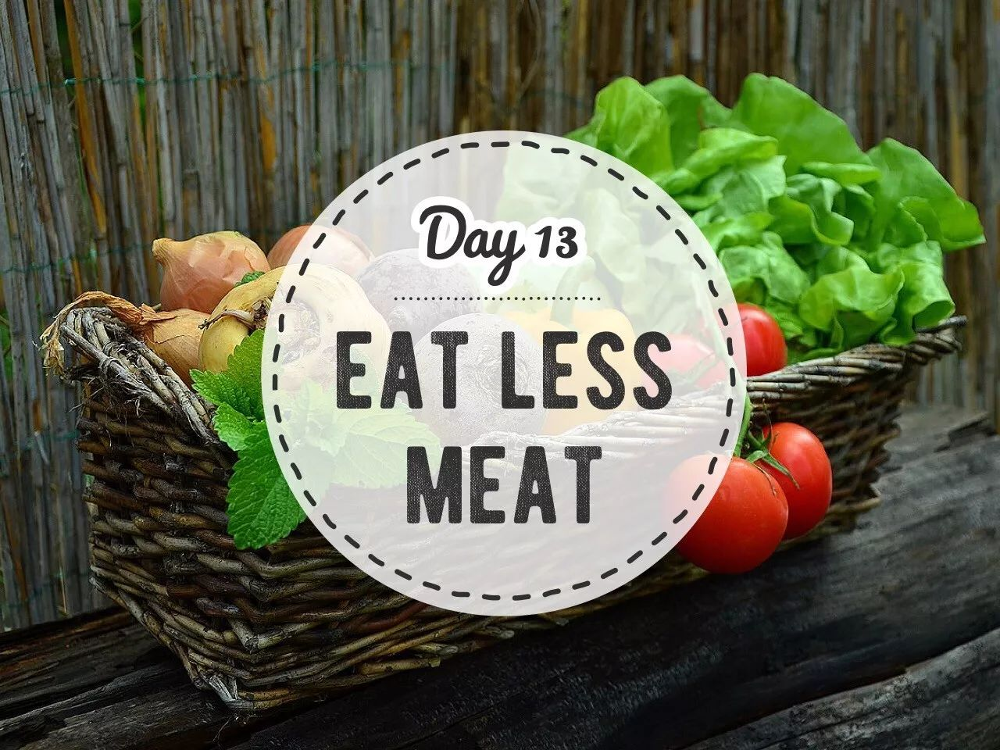

不吃肉？很多人一听到就直摇头：臣妾做不到啊！！嘿嘿，在如何少吃肉这件事上，我本人多少还是有点心得的。毕竟曾经我也是个半夜哭着（是真哭！）吵着要吃肉的人呐！

以下是我亲测有效的一些方法，你也不妨一试吧！

1. 慢慢来
------------

我是从 Meatless Monday 开始减少肉类摄入的。**周一不吃肉** 是一项兴起于 2003 年的全球性运动，目前已在 40 多个国家广泛推行。Meatless Monday 号召大家：每周一天，远离肉食！

不过呢，跟一些坚定的素食主义者不同，意志力薄弱的我刚开始很难抵挡肉食的诱惑，即便是一周一天 Meatless Monday 我都很难坚持，到了晚上百爪挠心地想吃肉。秉承“做人咧，最紧要就系开心”的价值观，我向来不会强迫自己，想吃肉就吃点呗。神奇的是，慢慢地，周一我能坚持下来一天了，再后来，连周二也不会想念肉了。

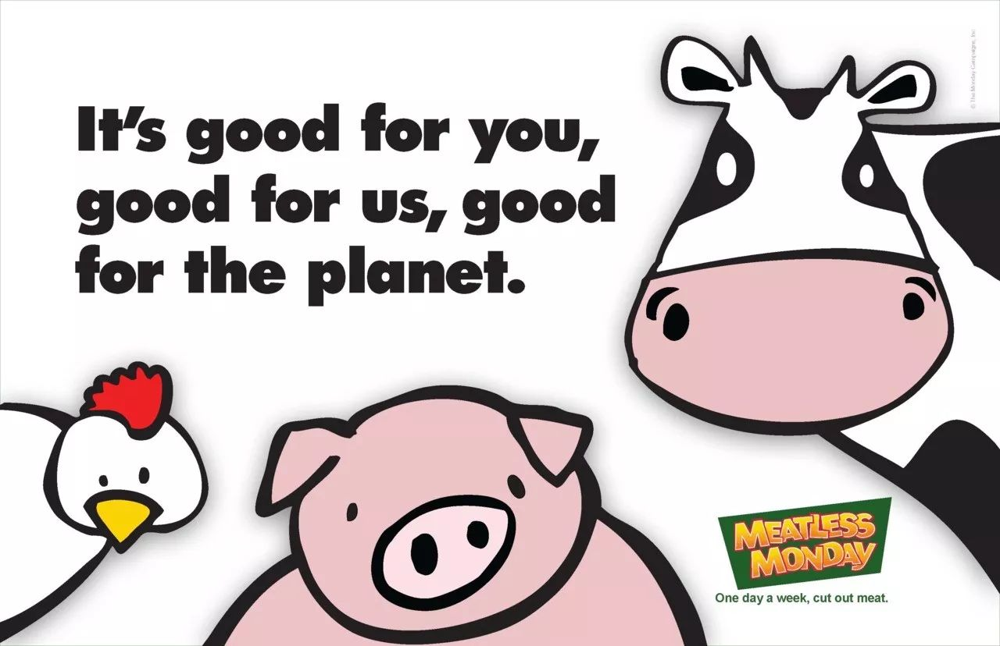

2. 扫除偏见
------------

很多人（包括之前的我）都理所当然地认为，不吃肉就没办法摄取人体所需的蛋白质，而事实上，植物可以为我们提供丰富的蛋白质、钙和铁。

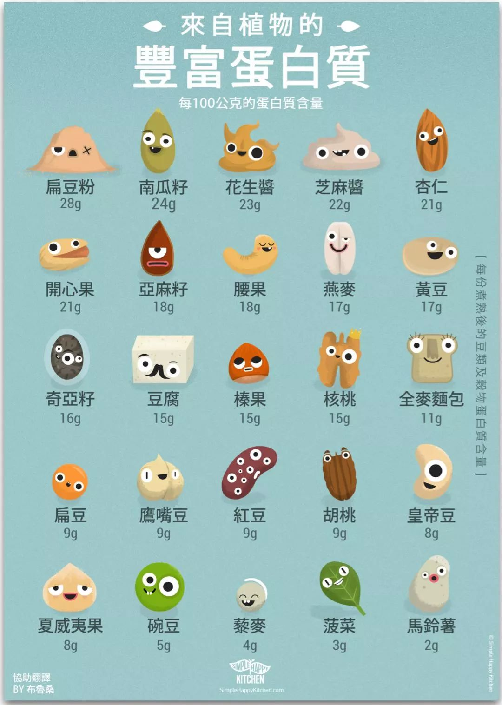

|

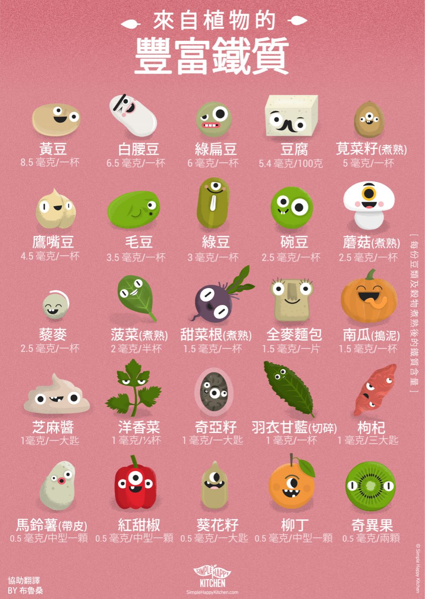

|

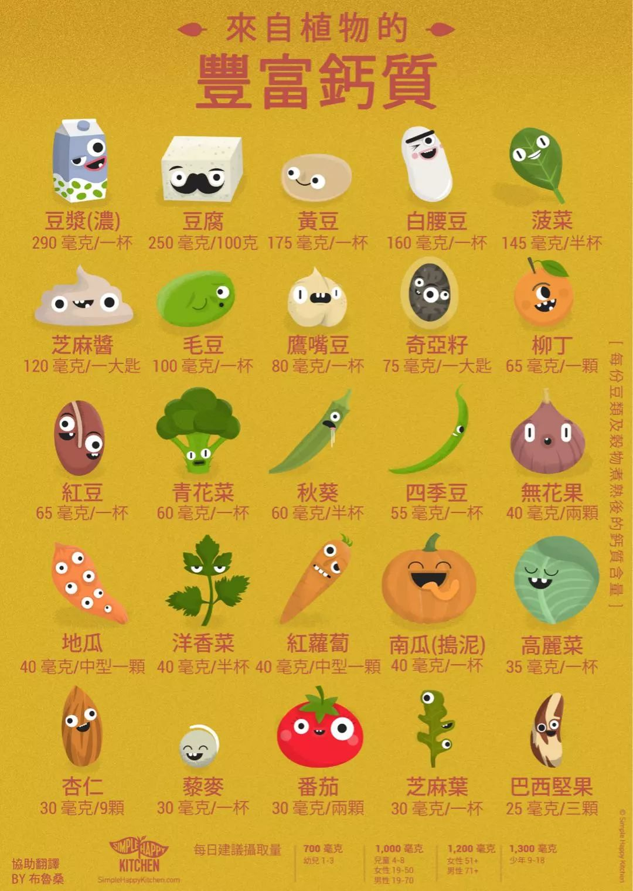

3. Listen to your body.
------------------------

了解自己的身体，读懂身体发出的信号。吃肉少了之后，身体变得很轻松。起初，我在外面吃饭时会嘴馋吃肉，但第二天肠胃就会不舒服，身体会用她的方式告诉我她不再想吃肉了。后来我又陆续 get 到了她发出的信号：不想吃鸡蛋啦，不想喝牛奶啦......遵命遵命！

不过，每个人的身体情况不同，所以切忌跟风、走极端，选择适合自己的饮食结构才最重要。

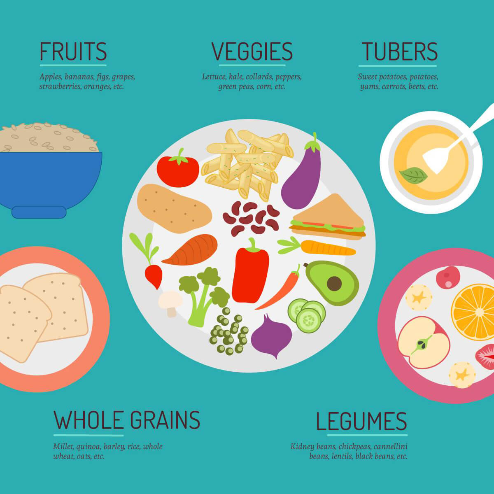

4. 找到好吃的素食餐厅
------------------------

把素菜做得好吃又好看，目前对我来说还是很有挑战。好在最近几年，国内的素食餐厅发展迅速，提供了丰富的用餐选择。不过我非常抵触仿荤菜。明明瓜果蔬菜豆腐都有各自的味道，非要把它们做出肉味，exm？有没有考虑过它们的感受？

.. image:: images/Day13_009.jpg
   :align: center

::

   ZEROGO餐厅的素咖喱饭，怎么都不吃不腻

5. 书和纪录片
------------------------

我是从纪录片 Before the Flood 中了解到畜牧业的污染后，才开始尝试 Meatless Monday，在此也分享一些书和纪录片，希望能帮助大家更有动力地选择少肉多蔬食。

Cowspiracy 奶牛阴谋
^^^^^^^^^^^^^^^^^^^^^^^^

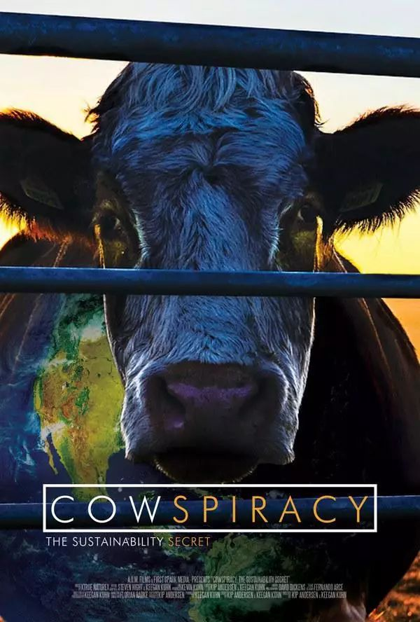

Food, Inc. 食品公司
^^^^^^^^^^^^^^^^^^^^^^^^

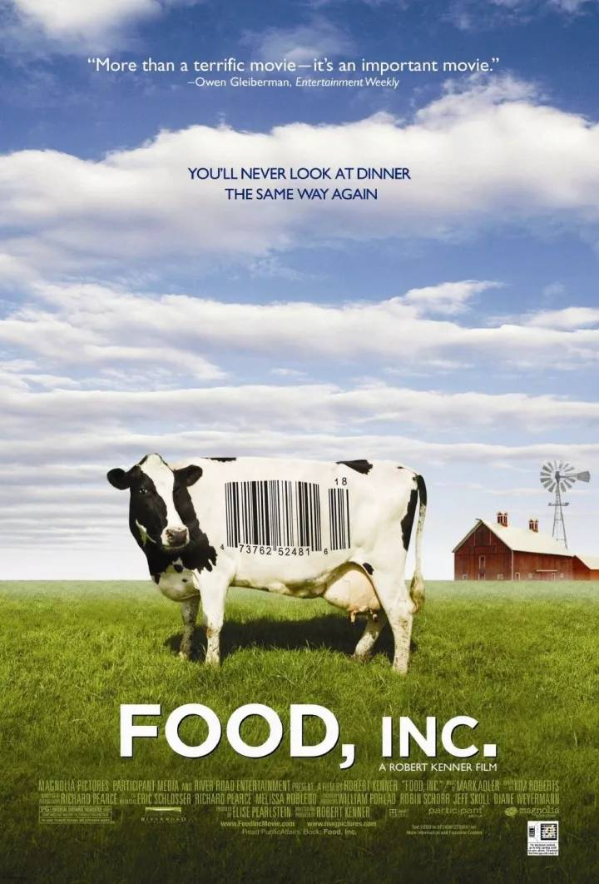

《世界和平饮食》
^^^^^^^^^^^^^^^^^^^^^^^^

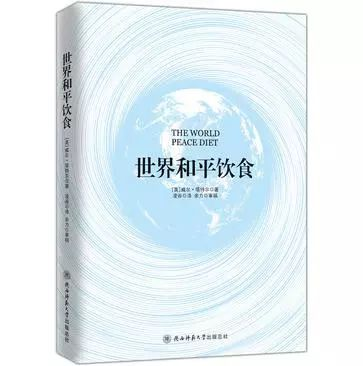

**少肉多蔬食，用每一口改变世界！**

----

.. image:: images/gozerowaste_footer.jpg
   :align: center
   :width: 400

.. note:: 本文来自公众号「GoZeroWaste」