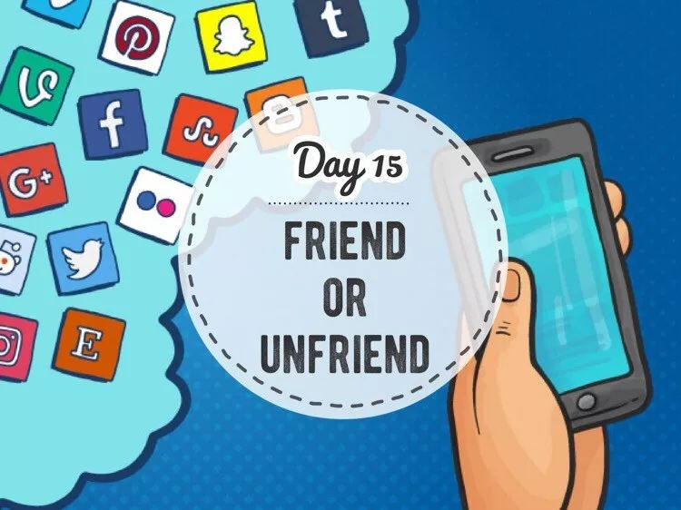
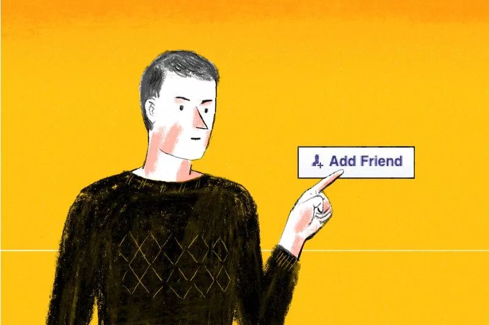
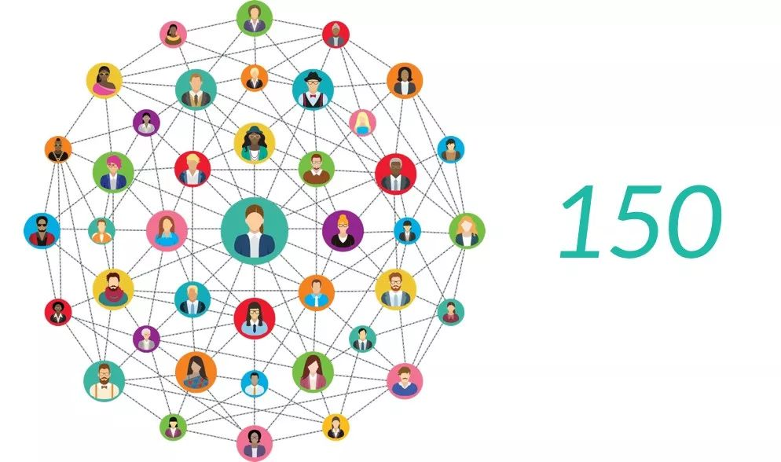
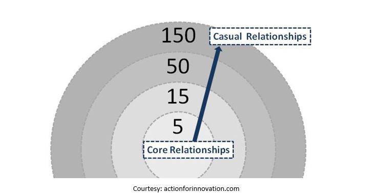
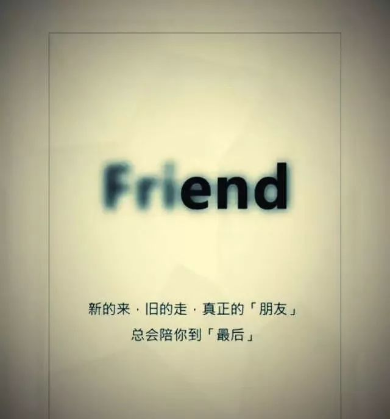

Day15 - 朋友圈的断舍离
===========================================

Hihi，这是 GoZeroWaste 新年里的第一篇推送，先祝大家新春快乐！健康平安！

你们这个年过得好吗？

讲真，如果今年春节微信开通了“一键识别群发拜年信息并自动删除”的功能，就算要付费我也二话不说掏钱买下！

作为一个极度抗拒群发祝福的人，群发（包括看起来不像但实际也是群发）的信息我一概不回，也早早在 GoZeroWaste 的微信群里打好招呼，请大家不要刷屏发祝福，也不要发红包。（在此感谢群友们的配合！）

.. image:: images/Day15_002.jpg
   :align: center

::

   图片来自SocialSmile

不过，春节这几天我也一直低着头摆弄手机，倒不是为了发微信拜年，而是忙着删微信、删好友、设置分组、屏蔽朋友圈... 时不时陷入沉思：这些给我发拜年短信的人，真的是我的“朋友”吗？我真的需要这么多“朋友”吗？

是时候，给朋友圈来一次断舍离了。

你可能会问，这跟 GoZeroWaste 有何相干？

事实上，关系非常大！

不知道你有没有遇到以下的情形：

刷出一条朋友圈，看到对方的名字挠头想了半天：这人谁呀？我好像不认识 ta 呀？为什么会出现在我的朋友圈里？然后，你可能需要通过 点击头像→翻看聊天记录→翻看历史朋友圈→仔细辨认照片 等一系列操作才能回忆起来：“哦，原来是三年前在上一家公司入职培训时认识的其他部门的一位同事呀，哎，叫什么来着？！”

这难道不是对时间的极大 waste 吗？！

::

   图片来自TIME

GoZeroWaste 不只是琢磨如何减少看得见的垃圾，看不见的 waste（例如把与家人相处的宝贵时间浪费在刷毫无营养的朋友圈和群发千篇一律的拜年短信上）也是我们希望消除的“垃圾”。只有这样，才能真正实现高质量的简单生活。

如何对朋友圈进行断舍离？
---------------------------

先给大家介绍一个数字 —— **150**，这便是著名的 **邓巴数字（Dunbar’s Number）**。牛津大学的人类学家罗宾·邓巴（Robin Dunbar）在20世纪90年代提出，人类的大脑皮层限定了我们拥有稳定社交网络的人数是150人，这也是熟人社交的天花板。一旦超出这一数值，人们将无法正常进行交往或者生产生活效率明显降低。

::

   图片来自lyzhie.com

1. Relationship audit - 你有多少微信好友？
^^^^^^^^^^^^^^^^^^^^^^^^^^^^^^^^^^^^^^^^^

诚然，社交媒体让我们跟彼此更近更紧密了，微信好友过千的大有人在。陆续也有很多人对邓巴数字提出了质疑。姑且不论我们是否已经具备了更先进的社交工具和更发达的大脑皮层，邓巴教授为我们提供了进行 relationship audit（关系审计）的参考：邓巴理论由一系列数字组成，按3倍的关系递增/减。

**5：挚友** （最核心的小群体，最亲密无间、无话不谈、不离不弃的朋友）

**15：知己** （互相信任、理解和支持的朋友）

**50：亲近朋友** （愿意花时间跟这些人一对一吃饭聊天，但不会分享过于私人的感受）

**150：一般朋友** （跟这些人一起参加 party 不会觉得不自在）

**500/1500**：再往上就是不太稳定的社交关系了，最多也就算个点赞之交吧

::

   图片来自LEVITATE

每个人所处的圈子不同，以上的数字可能也会大小不一。问问自己，你更愿意把时间花在哪些朋友身上呢？那些只在春节群发信息、完全没有互动、已经记不起究竟是谁的某某某，是时候把 TA 从好友清单中移除了。

2. 朋友圈权限 – 哪些人的朋友圈可以不看？
^^^^^^^^^^^^^^^^^^^^^^^^^^^^^^^^^^^^^^^^^

把朋友圈看作是与朋友见面分享近况，你愿意跟什么样的人坐下来聊天？一上来就推销自家产品的，转载各种道听途说的标题党资讯的，用 720 种方法晒包包晒衣服的，浑身散发着负能量永远都在抱怨这个那个的…… 我不想跟这些人聊天，自然也不想看他们的朋友圈。

一段健康的关系（不管是情侣还是朋友），是 **互相滋养** 的，是可以交换感受的：我们会分享最近的小确幸，会聊聊看完一篇文章的心得，也会倾诉对人生的一点困惑与思考。简单来说，**我想看走心的朋友圈，我想交认真生活的朋友。**

::

   图片来自Impetus Media

**如何屏蔽没有养分的朋友圈：**

1) 单个操作：点开头像 → 进入右上角菜单 → 不看他（她）的朋友圈

2) 批量操作：进入微信设置 → 隐私 → 不看他（她）的朋友圈 → 下拉屏幕用“+”号把通讯录里的朋友放到这里

顺手还可以在设置 → 隐私中 **关掉“朋友圈更新提醒”**，这样就不会因为总看到小红点而忍不住要刷朋友圈了。

3. 群、公众号
^^^^^^^^^^^^^^^^^^^^^^^^^^^^^^^^^^^^^^^^^

跟朋友圈类似，判断的标准也是这个群或公众号能否给我滋养，如果不能请果断退群或取关。

4. 定期回顾
^^^^^^^^^^^^^^^^^^^^^^^^^^^^^^^^^^^^^^^^^

不管你喜不喜欢，身边的朋友是流动的，而且也应该是流动的。在不同的人生阶段，我们会认识新的朋友，有人会从点头之交变成挚友，也有人渐行渐远最终成了故人。**亲疏随缘，何必强求**。活在当下，把时间留给最重要的人。

----

.. image:: images/gozerowaste_footer.jpg
   :align: center
   :width: 400

.. note:: 本文来自公众号「GoZeroWaste」