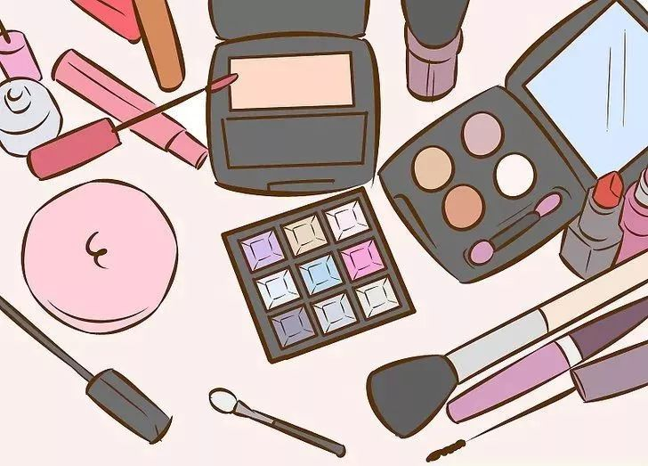
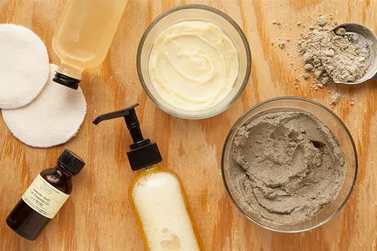

Day20 - 懒人版护肤及彩妆大法
===========================================

.. image:: images/Day20_001.jpg
   :align: center

前段时间出差，随手拍了一下我的洗漱包：

-黑色小罐子——牙膏；
-几个分装瓶罐——洗面奶/面霜/爽肤水/洗发水；
-左下三个圆罐罐——手工皂/粉底/腮红兼口红；

此图一发，评论区出现了以下三种声音：

1）“哇，好清爽！”“我也要断舍离！”并向我投来鼓励的表情包；

2）“切，这算啥！我的比你更少！”并向我示范了更简约的版本，鞭笞我再接再厉；

3）“艾玛，你大概不是个女人！“并向我传授了精致女人的活法指南，如右 → `为什么女人要不停地买买买？这是我见过的最真实的回答！ <https://mp.weixin.qq.com/s?__biz=MzI2MTcxMjI0MQ==&mid=2247497870&idx=2&sn=14f40b16a47e667ca62abf0855157a4e&chksm=ea548890dd230186dfd1ecca4572c34cd3d0c8ceb05a6208c8654ac65ddbf7953c9052a73148&scene=21#wechat_redirect>`_

哼哼，谁还不是个小公举咋地？想当年，那个坐拥 N 个眼影盘、每天在不同色系之间游走、宁愿迟到也誓要画出完美的眼线...... 的我，去哪了？

护肤品和彩妆，可以说是我践行 Zero Waste 路上一道巨大的屏障。在产品成分（天然无毒）和包装废弃物（可回收/重复使用）这两个指标上，国内很难找到完美的“零垃圾护肤”解决方案。下文所分享的也只是我个人过往两年中摸索出的一些小小经验，有太多局限性，并不适用于每个人。仅供参考，仅供开脑洞。

 我用的产品
 ------------------------

先来一张大合照~~对了，下文会出现一些品牌名称，但这并不是软文。我用的产品大多是朋友亲手做的，能把她们的名字写到文章里，我很有底气呢。

.. image:: images/Day20_005.jpg
   :align: center
   :width: 400

后排从左到右

1) Luna洁面仪：不用换刷头是最吸引我的卖点；

2) Lily‘s Handmade面霜：旧容器循环使用；

3) Lilys's Handmade洗面奶：旧容器循环使用；

4) Lily's Handmade面部精华油：冬天晚上润肤用，代替一切；

5) Lily's Handmade玫瑰保湿水：爽肤水，与6功能相同，交替使用；

6) 听草知语玫瑰精油润肤水：爽肤水，与5功能相同，交替使用；

前排从左到右

7) 细活裡手织布洁面方巾

8) Lily's Handmade定制腮红+口红

9) RMS Beauty "UN" COVER-UP：粉底，购于美国

10) MUJI眉笔

如今的我，不愿再花大量时间精力去研究今年又有哪些新产品、流行什么新色系、霓虹国卖疯了的美容仪是哪一款。对我来说，拥有以上这 10 件适合自己的产品就够了。

.. image:: images/Day20_006.jpg
   :align: center
   :width: 400

之所以说是“懒人版”，因为我是能少一样绝不多用一样，比如：卸妆直接用洗面奶代劳了；冬天的晚上想快点钻进被窝，那就只抹面油，其他步骤通通省略；口红腮红用同一块，省去了颜色搭配的烦恼...... Again，仅供参考啊小仙女们。

哦对了，昨晚在构思这篇文章的时候，我给自己出了个难题：再极致一点，如果只能带一样东西出门，我要挑哪个？

于是，我今天冒死做了个实验：早上出门只拍了听草知语的玫瑰水。被北京冬天干燥的户外和更干燥的室内蹂躏了一天后，此刻我的脸依然很水嫩（啊捂脸~！）要知道，以前在广东生活时，我的脸可是到了秋冬必定爆皮、只能靠神仙水续命的那种大干脸！

.. image:: images/Day20_007.jpg
   :align: center
   :width: 400

::

   十里挑一，就是这一瓶！

所以，再想想，我们到底需要多少护肤品呢？

如何购买
------------------

除了 Luna（网购）、RMS（美国门店）和 MUJI（中国门店），其他三个品牌（Lily's Handmade/听草知语/细活裡）都是我在北京的农夫市集上认识的朋友。如果你在北京，不妨去市集上跟她们聊聊天，听听产品背后的故事和信念吧。这三个品牌都有微店，可自行搜索选购。

.. image:: images/Day20_008.jpg
   :align: center
   :width: 400

::

   Lily做的手工皂，看起来是不是很好吃？图片来自Lily's Handmade

关于包装 
------------------

很幸运，Lily's Handmade 和听草知语都很有环保意识，所以当我提出要做到产品包装“零废弃”时，虽然会造成额外的工作量，但她们还是欣然满足了我的要求。将旧的容器循环使用，这样就不会造成一次性包装废弃物。

当然，护肤品并不能在市集现场散装购买。她们会将我的容器带回工作室清洁、消毒、灌装，下次赶集时再带给我。

.. image:: images/Day20_009.jpg
   :align: center
   :width: 400

::

   于是，便有了写着我名字的产品呢~

不在北京怎么办？我鼓励大家去当地的农夫市集、手工市集、豆瓣甚至淘宝上找手作天然护肤品的商家，然后和他们讨论看看如何能实现废旧包装循环使用。如果你有成功经验，或者你就是愿意参与的卖家，请在文章下方留言，让更多人知道吧~

BTW，泰瑞环保已经与科颜氏合作开启了空瓶回收再造计划，顾客只要将空瓶送到科颜氏专营店便可进行回收。期待未来有更多品牌能够参与其中！

关于化妆棉
------------------

记得两年前刚开始接触零垃圾的时候，我兴高采烈地在网上买了可重复使用的化妆棉，解决了一次性化妆棉的问题。虽然材质柔软、可水洗，但此化妆棉有个硬伤：太厚了！把爽肤水倒上去再往脸上擦？不存在的！还没等hu到脸上呢，大部分都被化妆棉吸收了，太浪费（银子）了！所以后来干脆直接上手，还省得洗化妆棉了。不过拿来卸妆倒是不错。

只是再后来，我发现小方巾既能洗脸又能卸妆，完全符合我多一样不如少一样的“懒人法则”。于是，这一沓化妆棉便收进抽屉，直到这次拍照才重见天日。

关于DIY
------------------

的确，国外的 Zero Waste 博主们都很擅长在家 DIY 护肤品，超市和药店的散装货架上也能买到各种原材料，可以说是非常方便了。

::

   图片来自网络

然而，DIY 这件事情本身有诸多限制，如材料配比的准确性、操作环境的清洁程度、防腐防潮条件等，再考虑到在国内购买散装原材料的难度，有时为了减少一个面霜的包装却要网购 N 个带包装的原料，这反而背离了 zero waster 的初衷。所以，我并不鼓励大家都追求“手作”。还是那句话，**选择合适自己的方法，力所能及就好。**

不过呢，还是有一些零难度的 **厨房护肤彩妆配方** 供大家参考，比如用可可粉和肉桂粉毫无违和地代替大地色眼影和眉粉，比如用芦荟、黄瓜、柠檬等材料自制纯天然面膜等等。

::

   图片来自网络

----

.. image:: images/gozerowaste_footer.jpg
   :align: center
   :width: 400

.. note:: 本文来自公众号「GoZeroWaste」