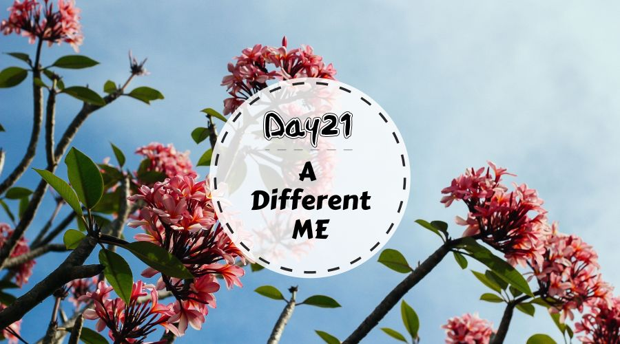
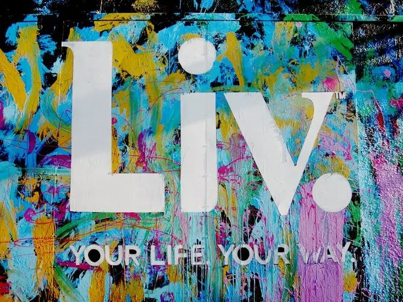

Day21 - 拥抱一个全新的自己
===========================================

随着2018年接近尾声，《21天零垃圾生活养成手册》也终于写到了最后一篇！

经过前面20天的打怪升级，不知道你的感受如何呢？生活中是否不知不觉发生着一些改变呢？**这段旅程的最后，让我们一起，感知全新的自己。** 是不是以为误入心灵成长鸡汤文？哈哈哈，别担心，接着往下看哈~

一个全新的自己
------------------

Day21最后一关，等待你的并不是传说中的大boss，而是非常简单的两个小任务：

1) **写一篇垃圾日记**：没错，让我们回到这一切开始的地方——垃圾桶。和 `Day1写“垃圾日记” <Day01.html>`_ 一样，再次记录一天中产生的所有干垃圾，并与第一天对比，观察这21天里最切实的改变：垃圾变少了；

2) **感受生活的变化**：除了垃圾桶瘦身了，生活状态上有没有一些变化呢？比如，经过 `Day3的“十分钟快手断舍离” <Day03.html>`_，在决定物品的去留时没那么纠结了？比如，在 `Day5自带杯子 <Day05.html>`_ 的实践中，拿出自己的杯子买咖啡感觉特别良好？又比如，通过 `Day15给朋友圈做减法 <Day15.html>`_，把高质量的相处时间留给真正的朋友？

知道我们为什么出发，也要知道我们走过了怎样的路。最后一天，就让我们慢下来，用心感受一下这21天带来的奇妙改变吧~~

写在最后 
------------------

在这 21 天有趣实验的终点，以下是我最想跟你说的话：**零垃圾，不是关于“零”，也不是关于“垃圾”。**

垃圾减量是我们的切入点，但这仅仅只是一个开始。从垃圾桶出发，全面审视自己的生活，在衣食住行的方方面面探索自己真正的需求，**探索自己与垃圾、自己与食物、自己与物品，以及最终，自己与自己的关系。** 这才是我希望通过《21天零垃圾生活养成手册》传达出的一种态度。

这份手册不是模板，这只是生活的其中一种可能。

零垃圾生活，重点应划在“生活”二字。我并不喜欢被贴上“环保主义”的标签，我们在倡导的一切，不过是用心生活而已。只是谁能想到，这段美妙的生活体验，竟然是从翻垃圾桶开始的呢？（笑）

《21天手册》结束了，生活还在继续，我们的陪伴也将一直继续。祝愿各位在探索生活可能性的路上保持好奇，实验愉快！

最后来一发剧透：2019 年我们将推出『21天零垃圾生活训练营』，由 GoZeroWaste 联合各个领域的达人倾情打造。欢迎大家锁定公众号推文，积极报名参与！

----

.. image:: images/gozerowaste_footer.jpg
   :align: center
   :width: 400

.. note:: 本文来自公众号「GoZeroWaste」