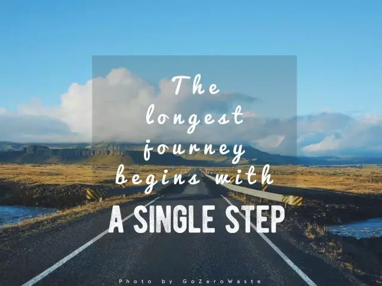
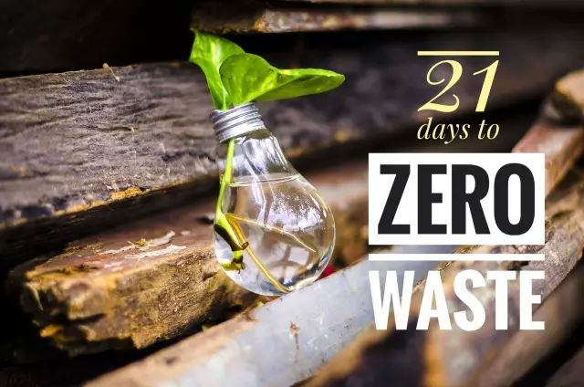

.. 可持续生活指南 documentation master file, created by
   sphinx-quickstart on Mon Oct 12 09:47:50 2020.
   You can adapt this file completely to your liking, but it should at least
   contain the root `toctree` directive.

21天零垃圾生活养成手册
===========================================

.. only:: not i18n

  .. note:: 2016/09 - 2017/09
            
            零垃圾生活试验一年整

            1 Year of Zero Waste Life

这一年中，总会时不时听到身边不同的朋友同样的评价：“你好棒哦，但我觉得我肯定做不到。” 嗯？这话听起来怎么这么耳熟？一年前，我第一次从Lauren Singer的报道中知道零垃圾这个概念时，不也说了一模一样的话吗？

.. image:: images/Index_001.jpg
   :align: center

于是我开始反思，为什么很多人（包括一年前的自己）都觉得零垃圾是个不可能完成的任务？可能是被“零”这个看似极致的目标给吓到了，也可能是觉得环保的生活离自己很遥远，或是觉得改变很麻烦要耗费很多时间和精力。

然而，通过这一年的实践，我的亲身体会是：零垃圾并不是一项宏大的工程，而是由日常生活中一个个小小的习惯和选择组成的。最难的，是迈出第一步。

所以，我为你准备了一份《21天零垃圾生活养成手册》，从今天开始，我会每天分享一个零垃圾小任务，连续21天。如果你愿意，不妨跟我一起，每天只做一件小事，说不定21天后，你会发现改变已经悄然发生。

目录
--------

.. toctree::
   :maxdepth: 1

   Day01
   Day02
   Day03
   Day04
   Day05
   Day06
   Day07
   Day08
   Day09
   Day10
   Day11
   Day12
   Day13
   Day14
   Day15
   Day16
   Day17
   Day18
   Day19
   Day20
   Day21

----

.. image:: images/gozerowaste_footer.jpg
   :align: center
   :width: 400

.. note:: 本文来自公众号「GoZeroWaste」

