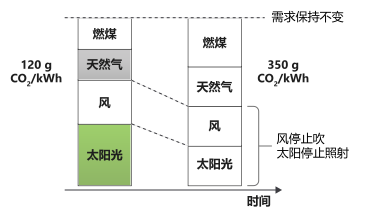
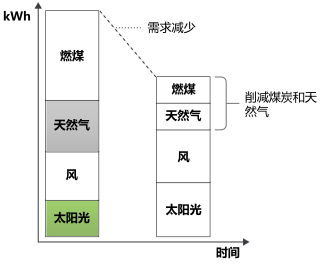
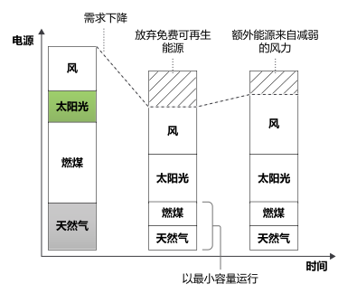
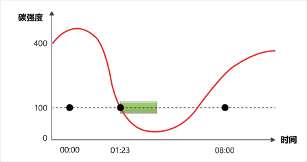

原则 3：碳强度
===========================================

电的碳强度用于衡量每消耗一千瓦时电所产生的碳 (CO2eq) 排放量。

碳强度的标准单位是 gCO2eq/kWh，即每千瓦时碳的克数。

并非所有电力都以相同的方式产生。在不同的地方和不同的时间，利用不同的能源发电，其碳排放量也不尽相同。有些能源，如风能、太阳能或水力发电，是清洁的可再生能源，不排放碳。其他化石燃料能源则会排放不同数量的碳来发电。例如，燃烧天然气的发电厂比燃烧煤炭的发电厂排放的碳更少。

如果你的电脑直接由水电站供电，那么它所消耗的电力的碳强度为零 gCO2eq/kWh。水电站发电是不排碳的。大多数人不能直接接入水电站，而是接入电网，由产生不同碳量的混合能源提供电力。因此，当接入电网时，碳强度通常大于零。

碳强度的可变性
-------------------------------------------

碳强度因地点不同而变化，因为有些地区的混合能源比其他地区含有更多的清洁能源。

由于可再生能源的可变性，碳强度也会随时间而变化。例如，当天气阴暗或无风时，碳强度会增加，因为在你的混合能源中，更多的电力来自于排放碳的能源。

在一天当中，电力需求会不断变化，而这种需求需要通过能源供应来满足。有些能源供应很容易控制它所产生的电力；例如，煤电厂可以少烧煤。有些能源供应不能轻易控制它所产生的电力；例如，风力发电场不能控制风的大小，它只能丢弃（缩减）基本上是免费生产的电力。

作为能源市场运作方式的副产品，随着电力需求的下降，通常情况下，高排放的化石燃料能源会先被缩减，可再生能源会在最后被缩减。

减少应用程序的用电量可以降低当地电网混合能源的碳强度。

边际碳强度
-------------------------------------------

如果你选择消耗更多能量，这些能量就来自于边际电厂。这个电厂可以控制它所输出的能量，而可再生能源不能控制太阳或风，因此边际电厂往往由化石燃料提供动力。

边际电厂会排放碳。无论何时，电网中的混合能源都具有碳强度，为了满足新需求而必须使用的能源也具有碳强度，后者称为边际碳强度。

化石燃料发电厂的碳强度很难缩减为零，它们有一个最低的运行门槛。有的根本不缩减，它们被认为是稳定可用的的基本负荷。正因为如此，我们有时会遇到一种反常的情况，即，丢弃（缩减）免费生产的可再生能量，以消耗化石燃料发电厂用花了钱的燃料生产的能量。

如果一个新的负荷将由本来会被缩减的可再生能源供应来满足，那么边际碳强度将为零 gCO2eq/kWh。

有时，电的边际碳强度为零 gCO2eq/kWh，如果在这种时候运行计算，所消耗的电力不会排放碳。

需求转移
-------------------------------------------

目前，电网系统中几乎没有储能或缓冲的方式。通常情况下，电力的生产使供应总能满足需求。如果可再生能源产生的能量超过了支持需求所需的能量，而我们所有的储能系统都已储满，我们就会缩减（丢弃）这些清洁能量。一种解决方案是将工作负荷转移到可再生能源供应较多的时间和地点，这就是所谓的需求转移。

如果你能灵活控制工作负荷的运行时间和地点，就可以选择在碳强度较低时用电，在碳强度较高时暂停。例如，在碳强度更低的其他时间或地区训练机器学习模型。

诸如 `Putting a CO2 figure on a piece of computation <https://ieeexplore.ieee.org/document/6128960>`_ （某项计算的 CO2 图）之类的研究表明，这些做法可使碳减排量高达 45% 到 99%，具体取决于为电网供电的可再生能源数量。

全方位审视你的应用程序，找出灵活运行工作负荷的机会，并使用电的碳强度来指示何时或是否运行这些工作负荷。

计算碳强度
-------------------------------------------

许多服务允许你获取不同电网当前碳强度的实时数据。 有些提供未来碳强度的估计值；有些提供边际碳强度。

- `碳强度 API <https://carbonintensity.org.uk/>`_ ：英国碳强度数据的免费资源。
- `ElectricityMap <https://api.electricitymap.org/>`_ ：针对非商业性的单一国家/地区使用，提供免费解决方案；针对商业性和多个国家/地区使用，提供高级解决方案。
- `WattTime <https://www.watttime.org/>`_ ：针对单电网地区提供免费解决方案，针对多电网地区提供高级解决方案，并提供实时边际排放量。

|

----

.. note:: 版权声明：SSE 系列文章翻译自 `Microsoft <https://docs.microsoft.com/en-us/learn/modules/sustainable-software-engineering-overview/>`_ 原创文章，遵循 CC-BY-SA-4.0 版权协议，转载请附上原文出处链接和本声明。
