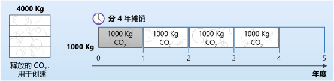
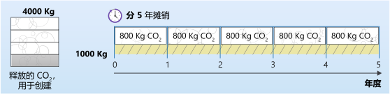

原则 4：隐含碳
===========================================

你用来阅读本文档的设备在其制造过程中释放了一些碳；一旦它的使用寿命结束，处置它可能会释放更多碳。 隐含碳（也称为“内含碳”）是指设备在制造和处置过程中排放的碳污染量。 当计算运行你的软件的电脑的碳污染总量时，要同时考虑运行电脑的碳污染和电脑的隐含碳。

隐含碳意义重大
-------------------------------------------

根据混合能源的碳强度，与为设备供电的电力的碳成本相比，设备的隐含碳成本可能很高。

例如，一台 `2019 R640 戴尔服务器 <https://i.dell.com/sites/csdocuments/CorpComm_Docs/en/carbon-footprint-poweredge-r640.pdf>`_ 每年的摊销内含碳成本为 320 kg CO2eq。预计每年还将消耗 1760.3 kWh 的电力。 2019 年欧盟的平均碳强度为 0.276 kg CO2eq/kWh。

因此，总的碳成本将为 320 + (0.276 * 1760.3) = 805 kg 碳/年，其中 320 千克或约 40% 来自于隐含碳。隐含碳是服务器碳排放总量的重要组成部分。

.. note:: 对于消费类设备，隐含碳成本往往要高得多，有时比电力消耗带来的终生碳成本还高。有关示例，请参阅 `Smartphones Are Killing The Planet Faster Than Anyone Expected <https://www.fastcompany.com/90165365/smartphones-are-wrecking-the-planet-faster-than-anyone-expected>`_ （智能手机毁灭地球的速度比任何人想象的都要快）。

不要浪费硬件
-------------------------------------------

当你购买电脑时，它已经排放了一大堆碳。它们也有有效期，电脑旧了，不能处理现在的工作负荷，需要更新换代。如果你这样想，硬件就成了碳的代用指标，因此，作为可持续软件工程师，如果我们的目标是 **具有碳效率** ，就必须做到硬件高效。

你可以做很多事情来实现硬件高效，但其中一件是帮助延长硬件的有效期。电脑不会磨损，也没有活动部件，但会过时。它们之所以会过时，是因为我们在不断创造突破极限的软件。

延长硬件的使用寿命
-------------------------------------------

核算隐含碳的一种方法是在设备的预期寿命期内摊销碳。例如，如果建造一台假想的服务器需要 4,000 Kg 碳，而我们希望这台服务器有 4 年的寿命，则可以认为这相当于在其寿命期内每年释放 1,000 Kg 的碳。

如果以这种方式计算隐含碳，任何设备，即使是不耗电的设备，也会在其生存期内有效地释放碳。考虑到这一点，如果对于假想的服务器，按 5 年而不是 4 年摊销这 4,000 Kg 碳，那么每年释放的碳将减少到 800 Kg。

如果我们对前面讨论的 2019 R640 戴尔服务器的使用寿命应用这一概念，将其使用寿命从 4 年延长至 5 年，那么，摊销的碳将从 320 kg CO (2)eq/年降至 256 kg CO (2)eq/年。

硬件之所以退役，要么是因为它发生了故障，要么是因为它难以处理现在的工作负荷。软件无法帮助解决第一个问题，但是，如果我们专注于构建能够在旧硬件上运行的应用程序，就可以帮助解决第二个问题。

|

----

.. note:: 版权声明：SSE 系列文章翻译自 `Microsoft <https://docs.microsoft.com/en-us/learn/modules/sustainable-software-engineering-overview/>`_ 原创文章，遵循 CC-BY-SA-4.0 版权协议，转载请附上原文出处链接和本声明。
