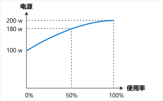

原则 5：能量均衡
===========================================

利用率是衡量电脑资源被使用程度的指标，通常用百分比来表示。闲置的电脑利用率低，没有被利用；以最大容量运行的电脑利用率高，被充分利用。

`能量均衡 <https://en.wikipedia.org/wiki/Energy_proportional_computing>`_ 是衡量电脑系统的功耗与完成有用工作的速度（其利用率）之间关系的指标。如果总体功耗与电脑的利用率成正比，则称其能量均衡。

在能量均衡系统中，能效是一个常数，无论利用率如何变化，能效都是不变的。然而，硬件的能效并不是恒定的。它因环境而异。由于硬件设备的许多不同组件之间的交互很复杂，因此它可能是非线性的，这意味着功率和利用率之间的关系不成比例。

利用率为 0% 时，电脑的功耗仍为 100 W；利用率为 50% 时，功耗为 180 W；利用率为 100% 时，功耗为 200 W。功耗与利用率之间的关系不是线性的，它不在原点相交。

由于这种关系，你对电脑的利用率越高，它将电能转化为有用计算操作的效率就越高。 在尽可能少但利用率最高的服务器上运行你的工作，可以最大限度地提高其能源效率。

静态功耗
-------------------------------

造成能量不均衡的原因有多种，其中之一就是静态功耗。

一台闲置电脑，即使利用率为零，也会消耗电能。 这种静态功耗因配置和硬件组件而异，但所有组件都有一定的静态功耗。 这种潜在功耗是电脑、笔记本电脑和移动设备提供节能模式的原因之一。 如果设备处于闲置状态，最终会触发休眠模式，使磁盘和屏幕进入睡眠状态，甚至改变 CPU 频率。 这些节能模式可以节省电力，但也有其他损失，比如设备唤醒时重启速度较慢。

服务器通常不会配置为激进模式，甚至最低限度的节能模式。 许多服务器用例要求尽快满负荷运行，以应对快速变化的需求。 这种情况会使许多服务器在低需求期间处于闲置模式。 闲置的服务器需要付出内含碳和低效利用的代价。

时钟速度
-------------------------------

时钟速度（频率）是指电脑或其微处理器的工作速度，以每秒循环数（兆赫）表示。 动态调整计算设备的时钟速度通常用于消费类设备，目的是使能量更均衡。

时钟速度表示电脑执行指令的速度。

微处理器的能效随时钟速度而变化，高时钟速度往往比低时钟速度更不节能。 例如，在 I7-3770K 系统中，3.5 GHz 运行速度的功率为 50 W，5 GHz 运行速度的功率为 175 W 左右。时钟速度增加大约 40%，需要增加 >3 倍以上的功率。

考虑到这一点，在利用率较低时降低时钟速度可以提高能效，从而最大限度地提高硬件的能效。

|

----

.. note:: 版权声明：SSE 系列文章翻译自 `Microsoft <https://docs.microsoft.com/en-us/learn/modules/sustainable-software-engineering-overview/>`_ 原创文章，遵循 CC-BY-SA-4.0 版权协议，转载请附上原文出处链接和本声明。
