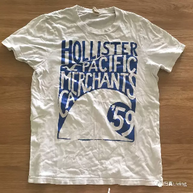
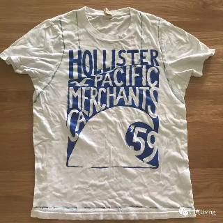
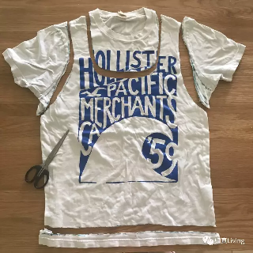
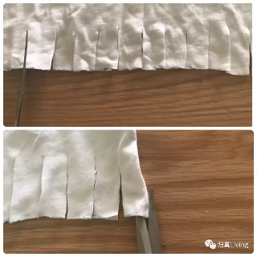
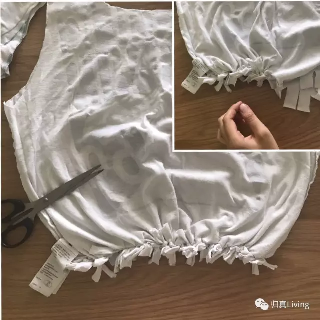
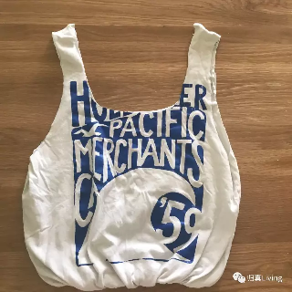
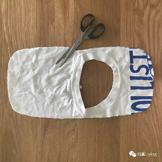
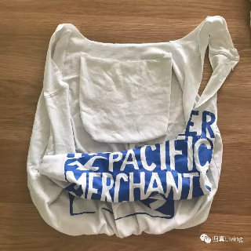
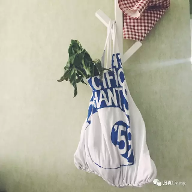

旧T-Shirt秒变环保手提袋
================================

「物尽其用」是极简主义的精髓之一。压箱底的旧T-Shirt摇身一变成为环保手提袋，操作十分简单，无需针线，几分钟就可以搞定哦。

【材料】T-shirt、剪刀、笔
--------------------------------

我用的是先生的旧衣服，被我喂圆之后他也是不太能穿得下这件Tee了，很喜欢又舍不得扔掉，这样改造一下也算是赋予它新的生命啦。

【步骤】
--------------------------------

Step1：将衣服铺平，画出要剪裁的轮廓
^^^^^^^^^^^^^^^^^^^^^^^^^^^^^^^^^^^^^^^^

衣服有点皱我懒得熨了，为了剪裁更精确，还是建议熨烫平整后再操作。提手外侧轮廓可以沿着肩线去画，我习惯将袋子挎在肩上，因此提手轮廓会比肩线稍长一些。领口部分裁成U字型，作为袋子的顶部开口。然后根据你想要的袋子深度剪掉底边，需要留出8cm左右的余量，后面会有用。

Step2：沿着画好的线剪裁出手提袋轮廓
^^^^^^^^^^^^^^^^^^^^^^^^^^^^^^^^^^^^^^^^

前后两片布要一起剪，保证对称。需要注意的是提手部分要尽可能保留宽度，太窄可能承重的时候会勒手。（先生此刻心痛地看着他心爱的衣服被肢解完毕。）

Step3：底部剪出“流苏”
^^^^^^^^^^^^^^^^^^^^^^^^^^^^^^^^

剪出小布条，宽度约2cm，长度约5cm。仍然是前后两片一起剪，尽量均匀。别忘记两边也要剪开哦。

Step4：翻过来，将底部前后“流苏”两两打结
^^^^^^^^^^^^^^^^^^^^^^^^^^^^^^^^^^^^^^^^^^^^^^

将衣服反面朝外，剪好的布条前后系在一起。打好结可以翻过来再检查一下有没有小布条露出来，有遗漏的话再塞进去系好。

全部系紧之后翻过来——当当当当！一个简单的环保手袋就完成啦！

如果有心的话，可以用剪裁废料在内侧缝出一个小口袋，可以装一点零钱。如图：

|

全部完成后可以下水洗一洗。晾干之后就可以愉快地背去市集啦！

其实旧衣服可以改造出各式各样的环保袋，大家有什么DIY绝技，欢迎留言分享呀：）

.. note:: 本文来自公众号「归真Living」
