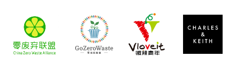

.. 可持续生活指南 documentation master file, created by
   sphinx-quickstart on Mon Oct 12 09:47:50 2020.
   You can adapt this file completely to your liking, but it should at least
   contain the root `toctree` directive.

关于我们
===========================================

ZeroTogether 是一个关注环保可持续的网络组织，Zero 是零废弃、零浪费、净零排放、零碳生活的“零”。

Zero 不是一个容易的目标，它涉及环境、能源、社会、经济等多方面，只有各国政府、各行业以及人民群众团结起来，才能尽早实现碳中和，逆转全球气候变暖，实现可持续发展。

让我们一起努力，Zero Together！

团队成员
----------------

- 壹个兜子

有意参与该项目者，请先阅读《`编写指南 <guideline.html>`_》和《`编写规范 <specification.html>`_》，感谢分享。

特别鸣谢
----------------

