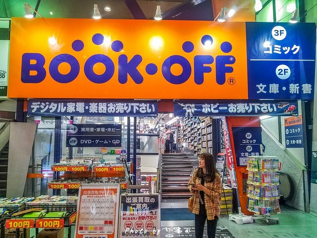

BOOK OFF
===========================================

Book Off 是日本最大的二手书店连锁店。该公司成立于1991年8月，取得了爆炸性的成功，现已扩展到日本全国的866家商店以及8个海外地点。除了书籍，其连锁店还销售漫画、CD、DVD、视频游戏，甚至还销售二手视频游戏机、手机和便携式媒体播放器。这些商店以其大面积，清洁和明亮的照明而著称。

----

.. note:: 版权声明：本文由 ZeroTogether 团队整理，遵循 CC-BY-SA-4.0 版权协议，转载请附上原文出处链接和本声明。

