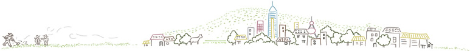

.. 可持续生活指南 documentation master file, created by
   sphinx-quickstart on Sat Oct 24 16:45:12 2020.
   You can adapt this file completely to your liking, but it should at least
   contain the root `toctree` directive.

.. raw:: html

   <h1 align="center">可持续生活指南</h1>
   

      
   

   
   <!--
   

      <iframe src="https://player.bilibili.com/player.html?aid=202973587&bvid=BV14a411F7C1&cid=262449069&page=1&high_quality=1" width="640" height="480" scrolling="no" border="0" frameborder="no" framespacing="0" allowfullscreen="true"> </iframe>
   

   -->

   

      <iframe style="position: absolute; width: 100%; height: 100%; left: 0; top: 0;" src="https://player.bilibili.com/player.html?aid=202973587&bvid=BV14a411F7C1&cid=262449069&page=1&as_wide=1&high_quality=1&danmaku=0" frameborder="no" scrolling="no"></iframe>
   

    

   

      

         <a href="21天零垃圾手册/index.html">
            <h2>21天手册</h2>
         </a>
         
21天零垃圾生活养成手册

      

      

         <a href="/subjects/a/">
            <h2>农业</h2>
         </a>
         
农业

      

      

         <a href="/subjects/a/">
            <h2>能源</h2>
         </a>
         
能源

      

      

         <a href="/subjects/a/">
            <h2>素食</h2>
         </a>
         
素食

      

      

         <a href="/subjects/a/">
            <h2>回收</h2>
         </a>
         
回收

      

      

         <a href="/subjects/a/">
            <h2>海洋污染</h2>
         </a>
         
海洋污染

      

      

         <a href="/subjects/a/">
            <h2>全球变暖</h2>
         </a>
         
全球变暖

      

      

         <a href="/subjects/a/">
            <h2>绿色金融</h2>
         </a>
         
绿色金融

      

      

         <a href="/subjects/a/">
            <h2>城镇转型</h2>
         </a>
         
城镇转型

      

   

连接
============

我有想参与环保，过可持续生活，但我不知道怎么做......

You can contact me via online contact form available on `my website <http://zerotogether.net>`_.

许可
=======

.. literalinclude:: ../LICENSE

目录
=======

.. toctree::
   :maxdepth: 1
   
   走进可持续生活/index
   21天零垃圾手册/index
   垃圾分类/index
   绿色金融/index
   环境污染/index
   有机农业/index
   环保组织/index
   Upcycling/index
   项目分享/index
   信息列表/index

   about/index

.. image:: ./_static/images/qrcode_https_zerotogether.net.png

项目
========

.. rst-class:: center

.. rst-class:: center
.. rst-class:: index_links

    `ZeroTogether <http://zerotogether.net>`_ ·
    `Gitee <https://gitee.com/luhuadong/green-guide>`_ ·
    `Read the Docs <https://greenguide.readthedocs.io>`_

Indices and tables
==================

* :ref:`genindex`
* :ref:`modindex`
* :ref:`search`
