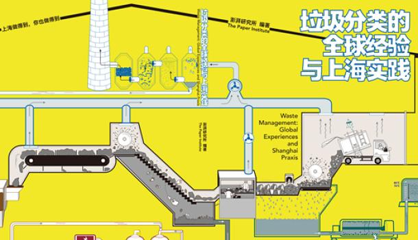

图书推荐
===========================================

垃圾分类的全球经验与上海实践
-------------------------------------------

垃圾与每一个人密切相关，面对日益紧迫的垃圾问题，2019年7月1日，被称为中国“严垃圾分类措施”的《上海市生活垃圾管理条例》正式实施。那么，上海为何要强制推行垃圾分类？这次推广垃圾分类的成效如何？2020年，中国还将有46个城市基本建成垃圾分类处理系统。上海的垃圾分类实践经验有哪些可供中国其他城市参考？在全球范围内，还有哪些值得借鉴的垃圾分类经验呢？本书将做出直观的分析与回答。

`购买链接 <https://union-click.jd.com/jdc?e=&p=AyIGZRNdEAoSBVcTWyUCEwZWG1gQABIHVB1aEDJWWA1FBCVbV0IUWVALHEpCAUdESR1JUkpJBUkcVFcWT0VSWkZBSksJUFpMWFtdC1ZWalJZG1oUARIEUBlbFQMUBlArG0IcYFBXaClwexFxU0JFV3h1WCFcDRkOIgZlG1oUABcHUR5ZEzIiB1IrGnsGFwZcEmsUMhIAVBJbFgASAVwcWBMyFQdcKwZRUEhPAEsYR0oiN2UYayUyEjdWKxl7UEVQVRoMQAMWAwEaXkFRFVddTAwUVhoPURoJRgVAAAArWRQDFg4%3D>`_

hPAEsYR0oiN2UYayUyEjdWKxl7UEVQVRoMQAMWAwEaXkFRFVddTAwUVhoPURoJRgVAAAArWRQDFg4%3D

寂靜的春天
-------------------------------------------

可持续式发展生活指南
-------------------------------------------

简单，可行，脚踏实地的想法和建议，为每个人提供拯救地球的机会。

- 中文书名：《可持续式发展生活指南》
- 英文书名：The Sustainable(ish) Living Guide
- 出版时间：2020年1月
- 作 者：Jen Gale
- `豆瓣 <https://site.douban.com/110577/widget/notes/307426/note/760617610/>`_

塑料的秘史
-------------------------------------------

现代社会是由塑料构成的。如果没有心脏起搏器、涤纶、计算机、移动电话、胶底运动鞋或者口香糖（口香糖是塑料？是的！），我们的世界将会怎样？

但是，我们爱上塑料一个世纪后，这种浪漫开始消退。生产塑料是利用日益减少的化石燃料，排出有害的化学物质，污染环境并且破坏海洋生物。然而每年我们所应用和消耗的塑料逐年增加，过去10年所生产的塑料与整个20世纪相当。我们陷入一种对塑料不健康的依赖——一种有毒的关系当中。

在《塑料的秘史——一个有毒的爱情故事》引人入胜并使人大开眼界的书中，记者苏珊·弗赖恩克尔告诉我们，人类已经到达危机的边缘。她通过追溯历史、科学和全球经济来评估塑料对我们生活的真正冲击。

弗赖恩克尔通过8个人们熟悉的塑料制品：梳子、坐椅、飞盘、点滴袋、一次性打火机、塑料袋、苏打水瓶和信用卡来讲述故事。每个物品都展示了我们这个人造世界中不同的一面，它们共同为我们提供一种新的思维方式去思索塑料这种已成为能定义和象征我们这个时代的媒介物质。

我们不能也不必驻足停留在一条塑料铺成的道路上。塑料为我们指明了一条新的道路：我们可以与这种因爱生恨却又似乎无法完全脱离开的材料建立一种新的有创造性的伙伴关系。

- 中文书名：《塑料的秘史——一个有毒的爱情故事》
- 英文书名：Plastic：A Toxic Love Story
- 出版时间：2013年1月
- 作 者：苏珊·弗赖恩克尔
- `豆瓣 <https://book.douban.com/subject/21818172/>`_

----

.. note:: 版权声明：本文由 ZeroTogether 团队整理，遵循 CC-BY-SA-4.0 版权协议，转载请附上原文出处链接和本声明。

