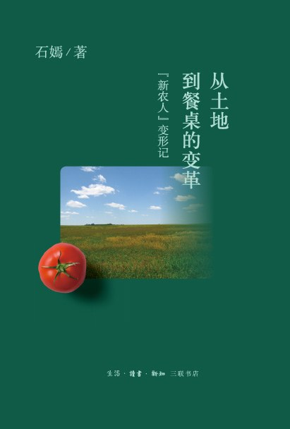

从土地到餐桌的变革
===========================================

.. note:: 「新农人」变形记

简介
-------------------------------------------

十年前，农学博士石嫣来到美国农场当起了实习生。半年的务农生活改变了她的人生轨迹。回国后的石嫣先后参与了北京小毛驴市民农园和分享收获农场的创建，成为一名“新农人”。十年来，石嫣和一群有志于改变中国农业现状的青年一道，在田间地头和互联网之间架构起一座桥梁，传播和践行生态农业。他们是新时代的“新农人”。

本书呈现了石嫣在美国务农的经历，以及她对于有机农业、有机食物、农民与消费者之间的关系、人与土地的关系等问题的观察和思考。

IEZVk1FVJGDlMZUhwHQARdHgwRBhsBUExSEldBAFNPU0FWQFVlGVoUBhs%3D

::

   《从土地到餐桌的变革》

- 作者: 石嫣
- 出版社: 生活·读书·新知三联书店
- 出版年: 2019-11

目录
-------------------------------------------

- 推荐序　生态农业与环保农村
- 自序一　我的“洋插队”生活
- 自序二　我在中国当农民
- 申请农场被拒
- 初到地升农场
- 我的动物伙伴们
- 最难熬的第一周
- 泥胶鞋乐队
- 春天，新生
- 什么是社区支持农业？
- 厨艺交响曲
- 第一次配送蔬菜
- 有机农场之旅
- 困惑一：有机食品是否更安全？
- 困惑二：什么样的产品叫有机食品？
- 困惑三：有机食品的价格贵吗？
- 困惑四：有机农业能养活人类吗？
- 地球安息日庆典
- 月亮石农场的女人聚会
- 小岛探险
- 这就是生活
- 卡门和他的400 英亩有机农场
- 与城市经理的对话
- 三场可怕的暴风雨
- 吉拉德和他的奶牛
- 让我们离土地更近一点
- 美国报纸对我的报道
- 逛美国的农夫市集
- 以好价格从好人那里买好东西
- 难忘的26 岁生日
- 艺术家的农场
- 你好！哈洛！
- 当尼克和琼的“孩子”　
- 玉米王国
- 和爱玛的同居生活
- “上吊”的火鸡
- 你会成为素食主义者吗？
- 我的食品本地化系统之梦
- 坐火车游纽约
- 后记
- 致谢
- 参考文献

购买链接
-------------------------------------------

`京东 <https://union-click.jd.com/jdc?e=&p=AyIGZRprFQEUAFMYXxIyVlgNRQQlW1dCFFlQCxxKQgFHREkdSVJKSQVJHFRXFk9FUlpGQUpLCVBaTFhbXQtWVmpSWRtYEwUUBFEca1d2eXBUE1NIZ3IEDVw9ERwaGRJBDkMOHjdUK1sUAxACVR9eFwQiN1Uca0NsEgZUGloUBBAOXCtaJQIVBlwbWRcKGw9VG10lBRIOZUYfR1haUgVYCV0yIjdWK2slAiIEZVk1FVJGDlMZUhwHQARdHgwRBhsBUExSEldBAFNPU0FWQFVlGVoUBhs%3D>`_

|

