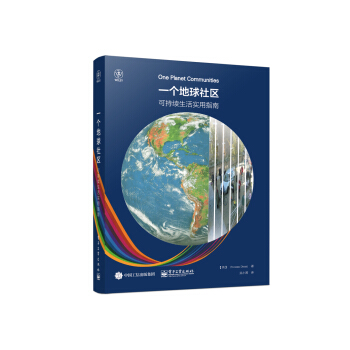

一个地球社区
===========================================

简介
-------------------------------------------

本书作者将从这些项目中获得的实践经验娓娓道来，与房地产开发和规划专业(包括建筑、规划、工程、测量、开发管理、金融、法律、销售和营销，以及物业管理)的学生、专家及对此感兴趣的个人分享，表达了深刻的见解，既包含这个快速兴起的领域里的前沿思想，又提供了简单实用的建议。从一开始就提出一个“抛砖引玉”的问题，即如何将可持续发展从一个抽象的概念变为一个清晰的框架，为实际的设计、开发、长期管理和治理决策提供指导。书中给出的答案是“一个地球生活”，这一方法将生态足迹化为简单的原则框架；还介绍了如何运用这一框架来为英国、欧洲、中国、美国、南非、中东和澳大利亚等地的项目提供一致的方法。书中还收录了世界各地的其他成功案例。

AEVUlZRwVFAlEdX0VXQlJUGQ8WAEJVXUtbFlYiBVQaXxw%3D

::

   《一个地球社区 : 可持续生活实用指南》

- 作者: (英)Pooran Desai（译者：吴小菁）
- 出版社: 电子工业出版社
- 出版年: 2016

目录
-------------------------------------------

- 前 言

- 第1章 用生态足迹来定义可持续发展

- 第2章 思考生活方式――来自BedZED生态村的经验

- 第3章 理解二氧化碳、温室气体和生态足迹

- 第4章 从绿色建筑到可持续基础设施

- 第5章 零碳零废弃物社区

- 第6章 深入了解零碳和零废弃物

- 第7章 将社区与当地连成一体

- 第8章 带来健康、快乐等多重效益的绿色空间

- 第9章 紧凑和无车――更好的城市

- 第10章 一个地球生活――理念、故事和原则

- 第11章 一个地球社区的设计和建造

- 第12章 着眼于长期――社区治理和物业管理

- 第13章 可持续产品的销售技巧

- 第14章 翻新现有社区以达到“一个地球”生活方式

- 第15章 放眼未来

- 附 录

  - 布赖顿一个地球社区的可持续发展行动计划
  - 萨顿的一个地球生活
  - 产品评价案例

购买链接
-------------------------------------------

`京东 <https://union-click.jd.com/jdc?e=&p=AyIGZRprFQIbDlweWh0yVlgNRQQlW1dCFFlQCxxKQgFHREkdSVJKSQVJHFRXFk9FUlpGQUpLCVBaTFhbXQtWVmpSWRtbHAsbAlQTa0VRVkAjfD1uZwxxD1hFVGZ6TCdJCGUOHjdUK1sUAxACVR9eFwQiN1Uca15sEzdUK1sSAxsHVx9SHQsQBlwrXBULIloRSQFdV0JEB1NrJTIRN2UrWyUBIkU7SFwVBRAEVUlZRwVFAlEdX0VXQlJUGQ8WAEJVXUtbFlYiBVQaXxw%3D>`_

|

