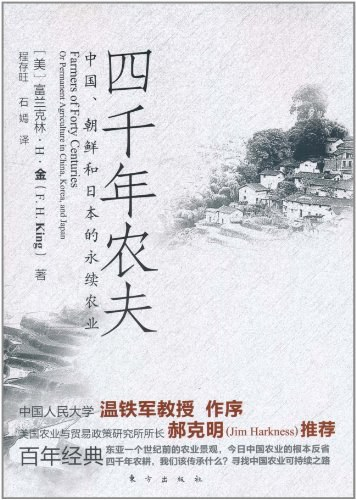

四千年农夫
===========================================

.. note:: 中国、日本和朝鲜的永续农业

简介
-------------------------------------------

美国在不到百年的时间内就穷尽了地力，而中国农耕历经四千余年，土壤肥沃依旧，且养活了数倍于美国的人口。原因何在？ 

中国农耕文化的无穷魅力让富兰克林·H·金认定，东方农耕是世界上最优秀的农业，东方农民是勤劳智慧的生物学家。如果向全人类推广东亚的可持续农业经验，那么各国人民的生活将更加富足。《四千年农夫》记录了东亚农业生产者真实的生活环境，讲述了东方各民族好的耕作方法。富兰克林·H·金认为，农耕的首要条件是保持土壤的肥沃，东方各民族早已遇到此类问题，而且已经找到了解决方法。对此，西方或许也能直接从他们的经验中获益良多。这是西方向东方学习保护自然资源的第一课。这便是富兰克林·H·金从东方带回去的重要信息。 直正的农业旅行家很少。富兰克林·H·金是这方面真正的专家。

IEZVk1QVYRAlRIXEcCQgZQHgtHC0FSAEkPFgdCA10aCUcDRQ5lGVoUBhs%3D

::

   《四千年农夫（中国、日本和朝鲜的永续农业）》

- 作者: 富兰克林.H.金
- 出版社: 东方出版社
- 出版年: 2011-6

目录
-------------------------------------------

- 中文版序言 理解中国的小农 （温铁军）
- 英文版序言
- 概述
- 第1章 日本一瞥
- 第2章 中国的墓地
- 第3章 到香港和广州
- 第4章 在西江之上
- 第5章 沟渠化的程度和田地的曲面拟合
- 第6章 老百姓的习俗
- 第7章 燃料问题以及建筑、纺织材料
- 第8章 迈步田野之间
- 第9章 废物利用
- 第10章 在山东
- 第11章 东方，“拥挤的”时空
- 第12章 东方的稻米种植
- 第13章 丝绸文化
- 第14章 茶产业
- 第15章 关于天津
- 第16章 东北和朝鲜
- 第17章 再访日本
- 后记

购买链接
-------------------------------------------

`京东 <https://union-click.jd.com/jdc?e=&p=AyIGZRprFQETBFQTUhcyVlgNRQQlW1dCFFlQCxxKQgFHREkdSVJKSQVJHFRXFk9FUlpGQUpLCVBaTFhbXQtWVmpSWRtYFAETD1wZa2pSa3scQ1p2Z1ZDPEsiUAByVVNzIkMOHjdUK1sUAxACVR9eFwQiN1Uca0NsEgZUGloVABUGUCtaJQIVBlwbWRALFwNXEl4lBRIOZUYfR1haUgVYCV0yIjdWK2slAiIEZVk1QVYRAlRIXEcCQgZQHgtHC0FSAEkPFgdCA10aCUcDRQ5lGVoUBhs%3D>`_

|

