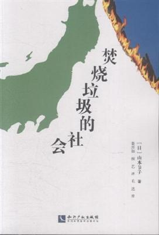

焚烧垃圾的社会
===========================================

.. note:: 

简介
-------------------------------------------

在日本，因为垃圾处理的控制权都在公司的手上，所以建设垃圾处理厂，焚烧垃圾，灰尘填埋，都成为高利益的无尽攫取的行业。为了继续他们的贪婪，焚烧推进派们一边谎称垃圾焚烧的安全神话，一方面确立了全部焚烧的方针。本书为了让一般老百姓了解垃圾焚烧炉的真相，写下了世界上焚烧炉最多的日本的情况，特别强调了其危害性，对于中国的垃圾处理和环境保护有着深刻的借鉴作用。

AEUk5YHQAbAgUTWkUFFFIBSwhGBkdSBx4ORwQiBVQaXxw%3D

::

   《焚烧垃圾的社会》

- 作者: 山本节子（译者：姜晋如）
- 出版社: 知识产权出版社
- 出版年: 2015-7-1

目录
-------------------------------------------

- 第一章 打破“焚烧处理”的“常理”

  - 垃圾通过焚烧处理“可以减少排放量”吗？
  - 因为气候潮湿所以垃圾焚烧处理是卫生的？
  - 利用新的技术就可以分解二噁英吗？
  - 二噁英不可怕吗？
  - 大区域处理及采用连续运转焚烧炉进行的
  - 垃圾发电利于防止全球变暖吗？
  - 政府建设“循环型社会”是来推进回收利用吗？
  - 采用集中垃圾处理设施的大区域方式处理成本会降低吗？
  - 焚烧炉是按照严格的技术标准制造的，因此很安全？
  - 彻底做到循环利用，尽可能焚烧残余的垃圾？
  - 焚烧炉的废水经过封闭处理会变干净？
  - 焚烧灰渣可作为建筑材料有效利用？
  - 引进焚烧炉利于地区的发展？
  - 垃圾处理方法只有焚烧？

- 第二章 看不见的危险

  - 1.美国EPA制定的《焚烧炉管理规定》
  - 2.美国采取“告知方式”，日本采取“不告知方式”
  - 3.焚烧炉产生的有毒物质、美国EPA的清单
  - 4.通过“飞灰混合处理”了解日本和美国的实际状况
  - 5.焚烧炉与健康危害

- 第三章 二噁英——环境和社会的破坏者

  - 1.橙剂（另一场越南战争）
  - 2.油症[发达国家*严重的多氯联苯（PCB）、二噁英污染事故]
  - 3.塞维索——因二英而消失的城市
  - 4.塞维索指令（从二噁英事故中汲取教训）

- 第四章 有害重金属——垃圾焚烧炉不为人知的污染

  - 1.焚烧炉会排放重金属——为什么？
  - 2.重金属污染与健康危害
  - 3.把资源当作一次性用品

- 第五章 汞——闪亮的杀手

  - 1.汞的危害正在全球蔓延
  - 2.日本的汞污染状况
  - 3.污染土壤的焚烧处理

- 第六章 悬浮颗粒物（sPM）——大气中有毒物质的“搬运工”

  - 1.SPM是什么？
  - 2.SPM与健康危害
  - 3.悬浮颗粒物（SPM）对环境的影响及世界各国采取的解决措施
  - 4.日本的PM（颗粒物）对策

- 第七章 替代方案（aItemative）——“非焚烧垃圾处理”

  - 1.“非焚烧垃圾处理”——需要具备什么条件？
  - 2.致力于垃圾不焚烧处理的地区的人们
  - 3.日本：市民提出的《垃圾非焚烧处理》替代方案

- 后记狼何时会来？

- 附录
  - 附录1 世界各国的焚烧禁令和暂停禁令
  - 附录2 从焚烧炉里排放出来的具有挥发性的有机化学物质清单

- 主要参考文献

购买链接
-------------------------------------------

`京东 <https://union-click.jd.com/jdc?e=&p=AyIGZRprFQIUAF0SXRUyVlgNRQQlW1dCFFlQCxxKQgFHREkdSVJKSQVJHFRXFk9FUlpGQUpLCVBaTFhbXQtWVmpSWRtbEwUaDlMba04AZgAQRD5pYBsdFUwlQURPbCxJWnUOHjdUK1sUAxACVR9eFwQiN1Uca15sEzdUK1sSAxsHVxxYEQsWAFwrXBULIloRSQFdV0JEB1NrJTIRN2UrWyUBIkU7HAhGA0AEUk5YHQAbAgUTWkUFFFIBSwhGBkdSBx4ORwQiBVQaXxw%3D>`_

|

