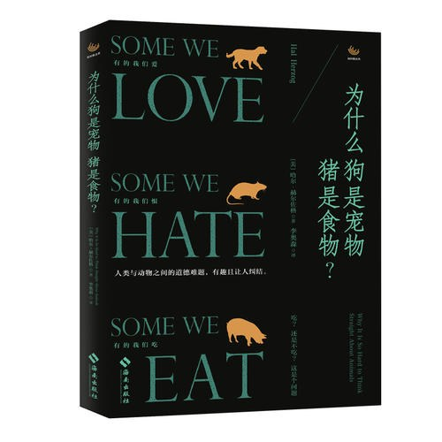

为什么狗是宠物猪是食物？
===========================================

简介
-------------------------------------------

你是否想过以下这些问题：

- 同样是濒临绝种的动物，熊猫为何比娃娃鱼受到更多关注？
- 虐待动物的儿童，长大后会变成暴力分子吗？
- 把心爱的宠物囚禁在自己家中是对的吗？
- 把在收容所等着安乐死的流浪猫喂给动物园的蟒蛇吃这样的做法是否合理？

作者通过本书提供了以上问题令人惊讶的解答，并用他巧妙的智慧透视我们对其他动物的矛盾情感。他以自己的经验，亲身探究各种既有的世俗观念，借由高度娱乐性和启发性的故事，呈现动物与人类关系的差异。作者在书中介绍了有趣的逸事、新的科学研究和他本人道德上的矛盾，探讨了人类与动物之间的复杂难题，从宠物、食物到人类与动物之间的关系，从动物囤积背后的心理因素到动物研究的道德困境，作者带领读者走进纷繁复杂的人与动物的世界。

IEZVk1RQIRAAUYWxEEFlJcHl8UAxoPBUhZHQERVVFIDBJWQldlGVoUBhs%3D

::

   《为什么狗是宠物猪是食物？》

- 作者: [美] 哈尔·赫尔佐格（译者: 李奧森）
- 出版社: 海南出版社
- 出版年: 2019-6-1

目录
-------------------------------------------

- 序文 人类与动物之间的道德难题

- 1 人类与动物的互动

- 2 因为可爱

- 3 狂爱宠物症

- 4 朋友、敌人还是时尚宣言

- 5 谁最爱的动物

- 6 旁观者所见

- 7 美味、危险、恶心与死亡

- 8 老鼠的道德地位

- 9 家中的小猫，盘子上的牛

- 10 潜伏在我们体内的兽性欲望

购买链接
-------------------------------------------

`京东 <https://union-click.jd.com/jdc?e=&p=AyIGZRprFQEVBFIdUxAyVlgNRQQlW1dCFFlQCxxKQgFHREkdSVJKSQVJHFRXFk9FUlpGQUpLCVBaTFhbXQtWVmpSWRtYEgEVAV0eaxEGF1gDeQ9uYkhPCwUrZwRqRQpoK1MOHjdUK1sUAxACVR9eFwQiN1Uca0NsEgZUGloVBxQGUitaJQIVBlwbXhQGFgBWGl4lBRIOZUYfR1haUgVYCV0yIjdWK2slAiIEZVk1RQIRAAUYWxEEFlJcHl8UAxoPBUhZHQERVVFIDBJWQldlGVoUBhs%3D>`_

|

