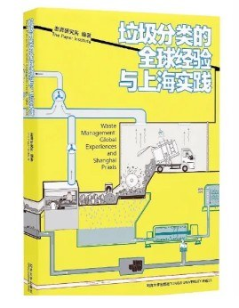

垃圾分类的全球经验与上海实践
==============================================================

简介
-------------------------------------------

垃圾与每一个人密切相关，面对日益紧迫的垃圾问题，2019年7月1日，被称为中国“严垃圾分类措施”的《上海市生活垃圾管理条例》正式实施。那么，上海为何要强制推行垃圾分类？这次推广垃圾分类的成效如何？2020年，中国还将有46个城市基本建成垃圾分类处理系统。上海的垃圾分类实践经验有哪些可供中国其他城市参考？在全球范围内，还有哪些值得借鉴的垃圾分类经验呢？本书将做出直观的分析与回答。

hPAEsYR0oiN2UYayUyEjdWKxl7UEVQVRoMQAMWAwEaXkFRFVddTAwUVhoPURoJRgVAAAArWRQDFg4%3D

::

   《垃圾分类的全球经验与上海实践》

- 作者: 澎湃研究所
- 出版社: 同济大学出版社
- 出版年: 2020-7

目录
-------------------------------------------

- 前言

- 1 垃圾：人类文明的印迹

  - 何为垃圾?
  - 垃圾的影像世界
  - 每天产生多少垃圾?
  - 垃圾对环境有哪些影响?

- 2 垃圾分类的 经验

  - 垃圾分类的 图景
  - 垃圾分类的 经验
  - 日本垃圾分类的社会背景：环保、民主政治与日常美学
  - 日本垃圾分类的“一少一多”
  - 韩国食物垃圾的分类回收
  - 德国垃圾分类原则：谁生产，谁负责
  - 东京的“垃圾战争”
  - 创建社会参与型回收体系
  - 西班牙的废玻璃回收
  - 荷兰阿姆斯特丹的塑料再生
  - 西班牙的回收音乐会
  - 尼日利亚贫民窟：社会企业用包容性策略回收资源
  - 可持续发展的前沿探索：食物共享的 趋势
  - 墨尔本：食物公平卡车计划
  - 伦敦：社区食堂
  - 柏林：食物分享组织
  - 新加坡：食物银行
  - 都柏林：城市农场
  - 巴塞罗那：社区农园
  - 纽约：“596英亩”项目
  - 纽约：厨房联盟
  - 旧金山：食物回收网络
  - 旧金山：食物转移
  - 从英国到阿尔及利亚：食物再循环

- 3 垃圾分类的上海实践

  - 中国垃圾分类的起步
  - 自发的垃圾分类：民间废品回收体系
  - 上海为何是强制实行垃圾分类的 个城市?
  - 上海垃圾分类的标准
  - 上海垃圾分类小窍门
  - 上海垃圾分类的成效与意义
  - 上海垃圾分类大哉问
  - 垃圾分类为何需要社区工作?
  - 为何要所有人行动？
  - 如何让居民相信末端处理？
  - 如何理解“定时定点”？
  - 小区是否一定要“定时定点”?
  - 湿垃圾为何要除袋投放？
  - 上海垃圾分类中的社区行动
  - 志愿者的付出
  - 居委会的压力
  - 物业的责任
  - 社会组织的协力

购买链接
-------------------------------------------

- `京东 <https://union-click.jd.com/jdc?e=&p=AyIGZRNdEAoSBVcTWyUCEwZWG1gQABIHVB1aEDJWWA1FBCVbV0IUWVALHEpCAUdESR1JUkpJBUkcVFcWT0VSWkZBSksJUFpMWFtdC1ZWalJZG1oUARIEUBlbFQMUBlArG0IcYFBXaClwexFxU0JFV3h1WCFcDRkOIgZlG1oUABcHUR5ZEzIiB1IrGnsGFwZcEmsUMhIAVBJbFgASAVwcWBMyFQdcKwZRUEhPAEsYR0oiN2UYayUyEjdWKxl7UEVQVRoMQAMWAwEaXkFRFVddTAwUVhoPURoJRgVAAAArWRQDFg4%3D>`_
- `淘宝 <https://s.click.taobao.com/t?e=m%3D2%26s%3DeodMOme64wAcQipKwQzePOeEDrYVVa64K7Vc7tFgwiHjf2vlNIV67gu6xpKThje0xqmPbz6xcienFi3wFBXvYUtYIXyQ5%2BdaGX93X4IFTwPx%2FVncyXNiWXW0BscCR%2FBjdZr7RBnLmJomXO35yxsaccvUU99q9KO50wgBm77NmAQVmxH5Wl2JojPCt6rZNnVWomfkDJRs%2BhU%3D&scm=null&pvid=null&app_pvid=59590_11.26.37.32_629_1608127158410&ptl=floorId%3A17741&originalFloorId%3A17741&app_pvid%3A59590_11.26.37.32_629_1608127158410&union_lens=lensId%3APUB%401608125544%40212a9f43_06f5_1766bc079cc_d328%400220oNRCxxucoAmbf4phfpuo>`_
