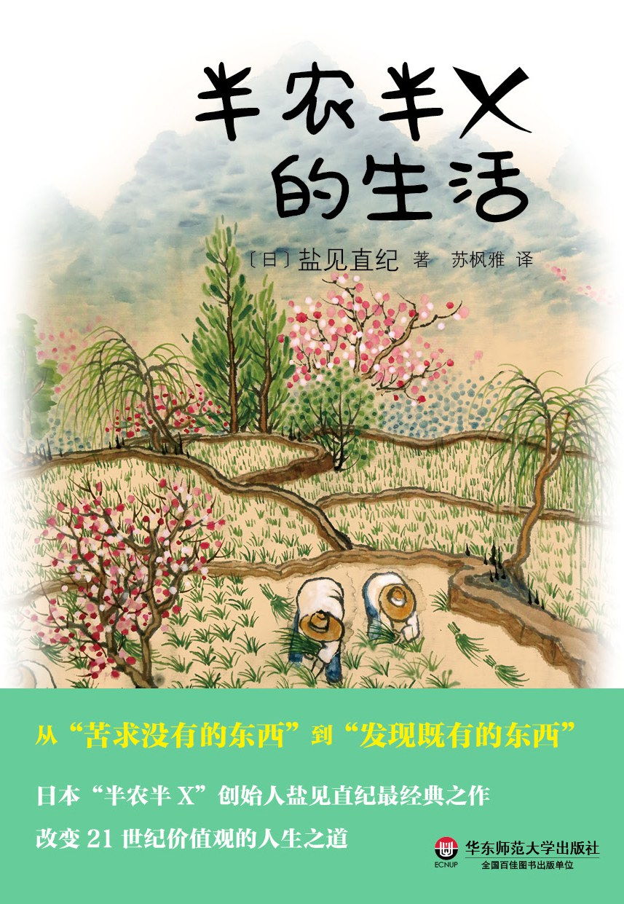

半农半X的生活
===========================================

.. note:: 一味地崇尚大都市的舒适，你真的幸福了吗？

          半农半X，用减法快乐过日子

          创造以自己为主角的人生

          从“苦求没有的东西”到“发现既有的东西”

          一定有一种生活，可以不再被时间或金钱逼迫，回归人类本质。

          一定有一种人生，在做自己的同时，也能够贡献社会。

          每个人其实早已具备今 生所需要的一切，只是不自觉而已。所有的一切早已被安排、准备妥当，用心去感知自己潜在的可能性，活用“既有的一切”，就能创造出“世界上未有的新事物”。

简介
-------------------------------------------

所谓“半农半X”，就是一方面亲手栽种稻米、蔬菜等农作物，以获取安全的粮食（农）；另一方面从 事能够发挥天赋特长的工作，换得固定的收入，并且建立个人和社会的连结（X）。目的是追求一种不再被金钱或时间逼迫，而回归人类本质的平衡生活。作者认为，现今社会面临着环境（各种污染、温室效应）、食物（安全性、食粮自给率）、心灵（人生意义的丧失、物质享乐主义）、教育（科学、感性、生存力）、医疗设施与社会福利（社会文明病、高龄社会的看护），以及社会不安定（经济萎缩、失业）等种种问题，而半农半X的生活，是在这样的时代中，最理想的生存方式。

IEZVk1ElFABQAZCxEARlNcHgwWVhpVV0hbR1ZAAgBLXRdXR1NlGVoUBhs%3D

::

   《半农半X的生活》

- 作者: ［日］盐见直纪（译者：苏枫雅）
- 出版社: 华东师范大学出版社
- 出版年: 2016-8-25

目录
-------------------------------------------

- 前言 为什么要提倡“半农半X”呢？

- 第一章到农村去吧！那里曾是社会复兴之地

  - “半农半X”的精髓所在——人与人之间和乐相处
  - 有可能建立以兴趣维生的社会吗？
  - 摸索“X”的人——各式各样的田园生活
  - 第一次的田园生活要如何开始呢？

- 第二章俭朴的生活 远大的梦想——田园生活的乐趣

  - “半农”的意义——缩小物欲、获得健康、重拾家庭和乐
  - 从事自己的喜爱的工作，同时不可缺少“半农”理由
  - “用减法过日子”——“半农”的生活原则
  - “减法的生活”有着大大的“加值”
  - 以珍惜“生命”为出发点的饮食生活
  - 种稻是家族与地方居民“共同体”的工作
  - 农田里，丰富的生命处处可见
  - “农”是人们的教育道场！

- 第三章你一定找得到！那块叫做“自我”的闪亮宝石！

  - “半X”的目标——“喜欢的”与“有用的”相协调
  - 从“苦求没有的东西”到“发现既有的东西”
  - “郊山的生活”——打造独一无二的乡镇
  - 从一粒种子看人间
  - 现代所缺乏的是付出和分享的文化

- 第四章那是“想做的事”还是“该做的事”？

  - 创造以自己为主角的人生
  - 冲绳的移居现象述说着什么故事？
  - 恢复与万物的关系，才是“半农半X”真正的价值
  - 都市生活和上班生活做不到的事
  - 从“想做什么”到“做过什么”——自我探索之旅
  - “X”将成为改变自己的契机

- 第五章“半农半X”是解决问题的生活方式！

  - 跨越各种社会病态的智慧
  - 从人们自创自演的生活方式中，看见了什么？
  - 志+农工商——创作家的人生
  - 退休之后怎么过？
  - 社区事业与农业的融合
  - “半农半X”的生活是创造幸福的新智慧

- 作者专访 巨大的改变正转动着

购买链接
-------------------------------------------

`京东 <https://union-click.jd.com/jdc?e=&p=AyIGZRprFQIaA1wbXBEyVlgNRQQlW1dCFFlQCxxKQgFHREkdSVJKSQVJHFRXFk9FUlpGQUpLCVBaTFhbXQtWVmpSWRtbHQYbB1Ifa2wceUATb0FQZ0tPD3MeS2tXXE9sLEMOHjdUK1sUAxACVR9eFwQiN1Uca0NsEgZUGloUBxQCUCtaJQIVBlwbWREHEwFWHVolBRIOZUYfR1haUgVYCV0yIjdWK2slAiIEZVk1ElFABQAZCxEARlNcHgwWVhpVV0hbR1ZAAgBLXRdXR1NlGVoUBhs%3D>`_

|

