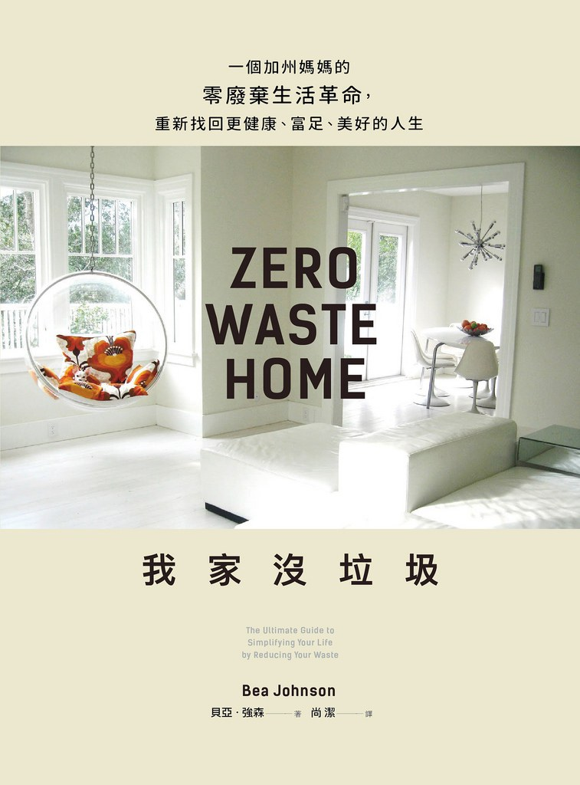

我家没垃圾
===========================================

.. note:: 一个加州妈妈的零废弃生活革命，重新找回更健康、富足、美好的人生

简介
-------------------------------------------

貝亞‧強森的生活中曾充滿高級美食、時裝精品、頂尖設計師家具等物質享受，家裡的大型冰箱塞滿食材，洗衣機和烘衣機總是不停運轉，還有滿櫃用過一次就丟的物品。乍看什麼都有的同時，她卻開始對一陳不變的生活感到心驚。

直到一次搬家過程中，全家只帶生活必需品暫居於小公寓內，她忽然發現：雖然擁有的東西減少，全家人的生活品質反而比以前更好！於是從簡化生活開始，進展到垃圾減量，最終展開吸引千萬人投入的「零廢棄」生活運動。

《我家沒垃圾》不是一本關於達到百分之百沒垃圾的書，而是關於如何成就更好的你。從物質消費中解脫出來，重新取回生命的主導權，就能擁抱更健康、富足以及充滿無限可能的未來！

hPAEsYR0oiN2UYayUyEjdWKxl7URIDXBpaFgBAD1FJXhJWFFRcHVwXUBQCBR9SFAtHAFArWRQDFg4%3D

::

   《我家没垃圾》

- 作者: 貝亞．強森（译者：尚潔）
- 出版社: 遠流出版事業股份有限公司
- 出版年: 2017-9-28

作者
-------------------------------------------

貝亞‧強森透過親自實行零廢棄，試圖打破一般人對環保生活的成見，除了將經驗寫成本書，住家也定期對外開放，向民眾宣導零廢棄生活的理念。她接受過美國NBC、CBS、CNN、BBC等新聞節目專訪，也曾登上《時人》（People）、《舊金山紀事報》(San Francisco Chronicle)等眾多平面媒體，更被紐約時報稱為「零廢棄生活教母」。她曾受邀前往世界各地進行演講，其中包括Google、TEDXTalk等知名機構。

貝亞．強森的社群媒體包括：

- Facebook: www.facebook.com/ZeroWasteHome

- Twitter 和 Instagram: @zerowastehome

譯者：尚潔，1991冬天生，台南人，雙主修中西醫學。大七擔任實習醫師的那一年認識了零廢棄，甫讀英文版《Zero Waste Home》前三章，便決定要翻譯這本書讓更多人知道零廢棄的好。熱衷於實行不塑生活，也是古著及二手舊物的愛好者，正在練習簡化生活。

目录
-------------------------------------------

- 前言
- 5R 與零廢棄生活的好處
- 廚房與買菜
- 浴廁、盥洗用品與健康
- 臥室與衣櫥
- 家事與維護
- 工作空間與垃圾郵件
- 孩子與學校
- 過節與送禮
- 外出的時候
- 動身參與
- 零廢棄的未來
- 致謝
- 資源

购买链接
-------------------------------------------

`京东 <https://union-click.jd.com/jdc?e=&p=AyIGZRlYEQAXD10cXiUCEwZWHlkVABEDVxlTEDJWWA1FBCVbV0IUWVALHEpCAUdESR1JUkpJBUkcVFcWT0VSWkZBSksJUFpMWFtdC1ZWalJZG1oUARcFVRlYEQAQD1ArI25HSlwwRgF2amBvEXA5ZUFCDiltDRkOIgZlG1oUABcHUR5ZEzIiB1IrGnsGFANcGGsUMhIAVBJbFwAXD1EZXh0yFQdcKwZRUEhPAEsYR0oiN2UYayUyEjdWKxl7URIDXBpaFgBAD1FJXhJWFFRcHVwXUBQCBR9SFAtHAFArWRQDFg4%3D>`_

|
