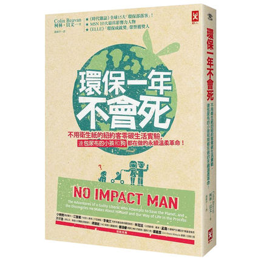

環保一年不會死
===========================================

.. note:: 電梯OUT！外帶食物OUT！瓶裝水OUT！

          體重減輕了，婚姻關係改善了，不再亂花錢了

          紐約客一整年不用衛生紙的環保生活實驗

          幸福指數破表的美好生活再現

简介
-------------------------------------------

地球越來越熱，北極熊被迫離開北極，而紐約在應該是冬天的時刻，室外溫度竟達攝氏21度！面對溫室效應日益惡化，地球人真的無法改變什麼嗎？一對夫妻、一個需要包尿布的小孩與一隻狗組成的家庭，決定在紐約過「零碳」生活，他們發現：

人可以一天爬一百多層樓仍然健步如飛；騎單車行動不僅有效率，還使體態變輕盈；買本地產的食材，自己動手做菜，吃的更健康；擺脫電子產品對生活的制約後，反而體會到獨處的快樂；沒有電視可看，全家相處的時光也不賴；小孩改穿可重複清洗的棉尿布後，小屁屁更舒服……還有，不用衛生紙也是可行的。

《環保一年不會死》紀錄貝文一家的「零污染計畫」生活實驗，也是對人們的善意提醒：人類應對自己與地球仁慈些，零污染的生活值得追求，個人也能帶來巨大的改變。

null&pvid=null&app_pvid=59590_11.88.140.89_625_1608136989684&ptl=floorId%3A17741&originalFloorId%3A17741&app_pvid%3A59590_11.88.140.89_625_1608136989684&union_lens=lensId%3APUB%401608136975%402103fd84_0739_1766c6ee660_aab4%40023nS9wou46a6oA1qPDxHX3I

::

   《環保一年不會死》

- 作者: Colin Beavan（译者：謝維玲）
- 出版社: 野人
- 出版年: 2012-1-5

目录
-------------------------------------------

- 第一章 一個像我這樣的庸人，是如何搞出這驚人之舉的
- 第二章 第一天以及整件事是個大錯誤
- 第三章 當你在垃圾裡看見自己的人生時，所想到的事
- 第四章 要是披薩不用紙盤裝就好了
- 第五章 如何在惹火你老媽的同時，減少你的碳足跡
- 第六章 吃甘藍菜救地球
- 第七章 炫耀性消費
- 第八章 卡嗒，一片漆黑
- 第九章 盡量做對地球有益的事，以彌補傷害
- 後 記 不用衛生紙的日子結束之後

购买链接
-------------------------------------------

`淘宝 <https://s.click.taobao.com/t?e=m%3D2%26s%3DwuVF1UC1ogkcQipKwQzePOeEDrYVVa64K7Vc7tFgwiHjf2vlNIV67iE4YG3U95VaWI6w0dMGH8inFi3wFBXvYUtYIXyQ5%2BdaGX93X4IFTwPx%2FVncyXNiWXW0BscCR%2FBjdZr7RBnLmJomXO35yxsacWsQi567tohD9QGYyPEGTVAhUQ47qyItqToqEEyfcGrxomfkDJRs%2BhU%3D&scm=null&pvid=null&app_pvid=59590_11.88.140.89_625_1608136989684&ptl=floorId%3A17741&originalFloorId%3A17741&app_pvid%3A59590_11.88.140.89_625_1608136989684&union_lens=lensId%3APUB%401608136975%402103fd84_0739_1766c6ee660_aab4%40023nS9wou46a6oA1qPDxHX3I>`_

|

