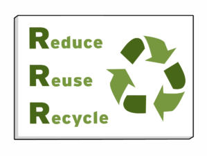
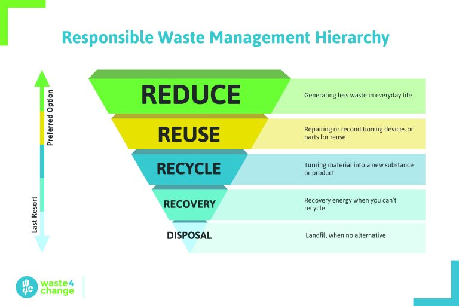
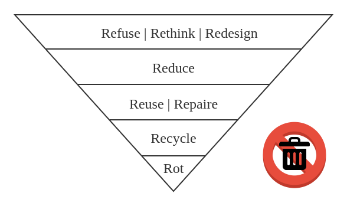

3R助你开启可持续生活
===========================================

很多人说：“我知道全球变暖、我也知道环保的意义，可是我不知道该怎么做...”

其实很简单，我们只需要领取一把钥匙 —— 环保3R原则，便可开启可持续生活的大门。

::

   图片来自 BrainPOP Educators

环保3R原则
-----------------------------

3R 的理念最早源于德国 1996 年实施的《循环经济和废物管理法》法规，后来被广泛运用到世界各国的循环经济建设中。3R 原则不仅对企业绿色生产具有指导作用，对个人参与环保行动同样具有参考价值。

Reduce
~~~~~~~~~~~~~~~~~~~~~~~~~~~~~

减量化原则（Reduce）要求从经济活动的源头就注意节约资源和减少污染，是保护环境的基础和根本。减量化有多重不同的表现，生产运输环节的节能减排、产品的小型化和轻型化以及包装轻简化都是减量化原则的体现。

对个人而言，我们可以减少使用不必要的东西。例如理性消费，只买需要的，不买想要的；点菜时宁少勿多，减少食物浪费；以及节约用电、节约用水、节约用纸......

Reuse
~~~~~~~~~~~~~~~~~~~~~~~~~~~~~

再使用原则（Reuse）要求制造商在研发制造阶段就应将 reuse 纳入考量因素，例如使用标准尺寸零部件以便后续维修，或将耐用性而非易用抛弃作为商品属性。

对个人而言，我们可以选择可重复使用而非用完即弃的商品，物尽其用，延长物品的寿命。例如捐赠或交换二手衣物；自带杯子，避免使用一次性杯；提高家庭自来水的重复使用率......

Recycle
~~~~~~~~~~~~~~~~~~~~~~~~~~~~~

再循环原则（Recycle）要求制造商使用可再生或可降解材料制造产品，使其在废弃后能够被处理为再生资源，而不是不可恢复的垃圾。

对个人而言，我们可以积极参与垃圾分类，让废弃的物品得以回收利用。

优先级原则
-----------------------------

你可能已经发现，3 个 R 是密切关联、缺一不可，同时又遵循优先级顺序的。优先级最高的是 Reduce，因为它能最大限度地减少垃圾的产生；然后是 Reuse 和 Recycle，它们分别是两种避免物品进入垃圾填埋场和焚烧厂的途径，因为 Reuse 能延长物品寿命，不改变物品属性，具有更高的碳效率，因此优先级高于 Recycle，但 Recycle 仍然非常重要。

::

   废弃物管理层次结构，图片来自 waste4change

其实这就是欧盟的固废处理塔状结构原则：

1. 旨在避免垃圾形成和降低其后续有害性的产品设计和生产过程设计
2. 产品或部件的再利用
3. 废弃物分类和无害化的再生资源回收利用
4. 无害化的能源重获
5. 最终的无害化处置

对个人而言，我们在选购商品的时候，可以多问自己 3 个问题：

1. 我真的需要这个物品吗？（Reduce）
2. 这个物品能重复使用吗？（Reuse）
3. 物品破损后能回收利用吗？（Recycle）

进阶nR原则
-----------------------------

追求零废弃的你，除了 Reduce、Reuse、Recycle，还可以做得更好！

在减少使用（Reduce）之前，我们还可以拒绝使用（Refuse），从源头开始，拒绝你不需要的东西，比如永远用不上的赠品。如果你是决策者、设计师、工程师、创客... 那么你还可以重新思考（Rethink）、重新设计（Redesign），做出更低碳可持续的产品。

如果你的动手能力还可以，那么除了重复使用（Reuse）延长物品寿命，还可以通过维修（Repair）和升级再造（Upcycle）的方式让物品焕发新生。最后别忘了，除了回收利用（Recycle），厨余垃圾还可以通过堆肥（Rot）的方式变废为宝。

接下来，我们将拿起 R 钥匙一一开启可持续生活的大门。

----

.. note:: 版权声明：本文为 ZeroTogether 原创文章，遵循 CC-BY-SA-4.0 版权协议，转载请附上原文出处链接和本声明。