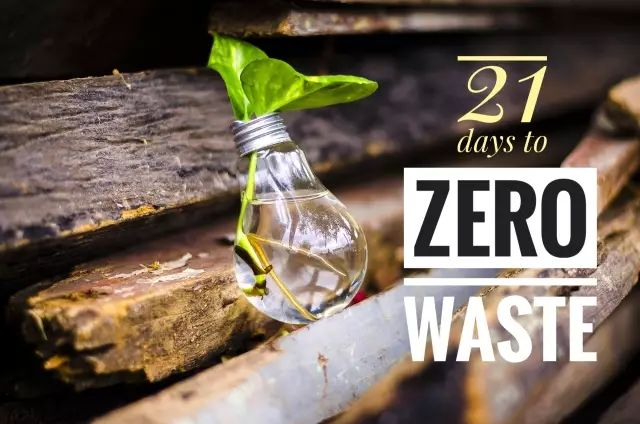

21天零垃圾生活养成手册
===========================================

.. only:: not i18n

  .. note:: 2016/09 - 2017/09
            
            零垃圾生活试验一年整

            1 Year of Zero Waste Life

            —— Elsa 老汤

这一年中，总会时不时听到身边不同的朋友同样的评价：“你好棒哦，但我觉得我肯定做不到。” 嗯？这话听起来怎么这么耳熟？一年前，我第一次从Lauren Singer的报道中知道零垃圾这个概念时，不也说了一模一样的话吗？

于是我开始反思，为什么很多人（包括一年前的自己）都觉得零垃圾是个不可能完成的任务？可能是被“零”这个看似极致的目标给吓到了，也可能是觉得环保的生活离自己很遥远，或是觉得改变很麻烦要耗费很多时间和精力。

然而，通过这一年的实践，我的亲身体会是：零垃圾并不是一项宏大的工程，而是由日常生活中一个个小小的习惯和选择组成的。最难的，是迈出第一步。

所以，我为你准备了一份《21天零垃圾生活养成手册》，从今天开始，我会每天分享一个零垃圾小任务，连续21天。如果你愿意，不妨跟我一起，每天只做一件小事，说不定21天后，你会发现改变已经悄然发生。

目录
--------

- `Day1 - 写一篇“垃圾日记” <https://mp.weixin.qq.com/s?__biz=MzI1MTQ2NDAxNg==&mid=2247484249&idx=1&sn=1460fcb27bb135f80f4c4fad2d0f7131&chksm=e9f3d366de845a708430ed990d00ea323b9e693ef20deb218a91ce8532c9bc315b7c8a7941e7&scene=21#wechat_redirect>`_
- `Day2 - 带上自己的购物袋 <https://mp.weixin.qq.com/s?__biz=MzI1MTQ2NDAxNg==&mid=2247484256&idx=1&sn=020e745a257b42520f745044d147d280&chksm=e9f3d35fde845a49c36c850a6bc9c3d3913a0a8ff9375effc2036354853216324ae8fd287ad6&scene=21#wechat_redirect>`_
- `Day3 - 十分钟快手断舍离 <https://mp.weixin.qq.com/s?__biz=MzI1MTQ2NDAxNg==&mid=2247484260&idx=1&sn=d1b4d7a33432a0344da44fd3dcb2ba5b&chksm=e9f3d35bde845a4d55dc4c0cefea16b8dd3de208fad0b2768f1de77fbdf9d4a98fe7e85213a9&scene=21#wechat_redirect>`_
- `Day4 - 看一部环保主题纪录片 <https://mp.weixin.qq.com/s?__biz=MzI1MTQ2NDAxNg==&mid=2247484266&idx=2&sn=2f87760b2b65531797b665623f86ceaf&chksm=e9f3d355de845a435f42c3d5d7a55b1aa2b2e7567d55badcc42c7179128fadf5902479d26ada&scene=21#wechat_redirect>`_
- `Day5 - 带上自己的杯子 <https://mp.weixin.qq.com/s?__biz=MzI1MTQ2NDAxNg==&mid=2247484331&idx=1&sn=5e12206d88868f6c9cd0b6fe481b8362&chksm=e9f3d394de845a82522044909dde55271c0c1ed676c49e590d32fb1ba071333ab8c32ab435ce&scene=21#wechat_redirect>`_
- `Day6 - 减少食物浪费 <https://mp.weixin.qq.com/s?__biz=MzI1MTQ2NDAxNg==&mid=2247484351&idx=1&sn=4ff046e2da87ef9cad36205f0345defe&chksm=e9f3d380de845a96c325d678269562d34ae37da0d922b764e19a208c1eaec803ff3583bc0aa3&scene=21#wechat_redirect>`_
- `Day7 - 放飞自我的生理期 <https://mp.weixin.qq.com/s?__biz=MzI1MTQ2NDAxNg==&mid=2247484431&idx=2&sn=1e1c29611b0ed3473a98a932873c5524&chksm=e9f3d430de845d26404d80532dbccaa5ff5f014727263043b9a666fdee3ec6c439eef33ae765&scene=21#wechat_redirect>`_
- `Day8 - 好好刷牙，好好爱地球 <https://mp.weixin.qq.com/s?__biz=MzI1MTQ2NDAxNg==&mid=2247484512&idx=1&sn=baaa85ff3460eaab650078abcbfe1b55&chksm=e9f3d45fde845d49a3313fb43c895754d6e69cfaf16cd758fd7538272b368595f8c895dd2b60&scene=21#wechat_redirect>`_
- `Day9 - 来呀~一起赶集呀！ <https://mp.weixin.qq.com/s?__biz=MzI1MTQ2NDAxNg==&mid=2247484576&idx=1&sn=faecbc2149ef93b0aa30cc49a3a467c2&chksm=e9f3d49fde845d89bc5c47b6fccc95e442c867383e50ec65804049ecdf5c568d7ed691ef3461&scene=21#wechat_redirect>`_
- `Day10 - 轻轻地，我们去旅行 <https://mp.weixin.qq.com/s?__biz=MzI1MTQ2NDAxNg==&mid=2247484593&idx=1&sn=3c103e0cc01c1aaa09634f73f9e72e7e&chksm=e9f3d48ede845d98338488223253a892fb575b72a825fe97df39d328d9e5ef7a10d381b7c78f&scene=21#wechat_redirect>`_
- `Day11 - 天然无负担的清洁用品 <https://mp.weixin.qq.com/s?__biz=MzI1MTQ2NDAxNg==&mid=2247484688&idx=1&sn=1286607f3236eac5875faa01c9846eb7&chksm=e9f3d52fde845c3975c5fdf5c771e1e1995cd2230d384606a89f11e4929b9312cd8f22c590bd&scene=21#wechat_redirect>`_
- `Day12 - 不叫外卖，好好吃饭 <https://mp.weixin.qq.com/s?__biz=MzI1MTQ2NDAxNg==&mid=2247484704&idx=1&sn=c563a594ce89e372cd7e03e945500e67&chksm=e9f3d51fde845c091a985d8fd6b43d6534bfab706985c8dbd7e82850bfb0501d764377f4c7a7&scene=21#wechat_redirect>`_
- `Day13 - 新挑食主义：少肉多蔬食 <https://mp.weixin.qq.com/s?__biz=MzI1MTQ2NDAxNg==&mid=2247484740&idx=1&sn=c0361a629675474ca350143c97992cce&chksm=e9f3d57bde845c6d4d5db20a7e3a011b3516ed1b8b6c7a59b1e75a7e306a0e36e48d10d195af&scene=21#wechat_redirect>`_
- `Day14 - 一张纸也不浪费 <https://mp.weixin.qq.com/s?__biz=MzI1MTQ2NDAxNg==&mid=2247484764&idx=1&sn=f8ace79994fc1ef54b1df3e1e7e6e98e&chksm=e9f3d563de845c75c0964d73322b84c8816e66d5e8c94f0fa6c174259632c35c55647cf7a2d0&scene=21#wechat_redirect>`_
- `Day15 - 朋友圈的断舍离 <https://mp.weixin.qq.com/s?__biz=MzI1MTQ2NDAxNg==&mid=2247484889&idx=1&sn=c4fead08f84b98e2361f1854b2c32aa6&chksm=e9f3d5e6de845cf0cd322e69f4911bc4d4ebde4a03810b559457a4768c42ffa8686f4e84f8d3&scene=21#wechat_redirect>`_
- `Day16 - 负责任地“扔扔扔” <https://mp.weixin.qq.com/s?__biz=MzI1MTQ2NDAxNg==&mid=2247484980&idx=1&sn=5139258e2999439c76af48903dc76f14&chksm=e9f3d60bde845f1db0fdfebe100489c85b0e4d6b6e98b6eb1d10495683ac82a234d3eb44a73e&scene=21#wechat_redirect>`_
- `Day17 - 打造心动衣橱 <https://mp.weixin.qq.com/s?__biz=MzI1MTQ2NDAxNg==&mid=2247485141&idx=1&sn=53f6f9aab1753e635a7c4f5e76d6dac8&chksm=e9f3d6eade845ffcbfc23e6f2f0daea75bca3be0ff49ff0766b7937493496a3de671b3f2e0f5&scene=21#wechat_redirect>`_
- `Day18 - 没有塑料袋的冰箱 <https://mp.weixin.qq.com/s?__biz=MzI1MTQ2NDAxNg==&mid=2247485365&idx=1&sn=34e30a9137bf572e76e8468cedf2a458&chksm=e9f3d78ade845e9ce13e24a86e41e0bcfcdb8f25768d5c7d7160463422cd4806573605ad47db&scene=21#wechat_redirect>`_
- `Day19 - 优雅地玩转一块手帕 <https://mp.weixin.qq.com/s?__biz=MzI1MTQ2NDAxNg==&mid=2247485503&idx=1&sn=9d299f7d83e8d6d40a967912a07b9006&chksm=e9f3d800de84511697f93bf0db530f148dd67d4cb13d7b4b1d8cb1ab660a6fc066e7c6ade9d4&scene=21#wechat_redirect>`_
- `Day20 - 懒人版护肤及彩妆大法 <https://mp.weixin.qq.com/s?__biz=MzI1MTQ2NDAxNg==&mid=2247486055&idx=1&sn=190d34766b1cbee58db83ab030919afa&chksm=e9f3da58de84534e37a1f904564a1066e6ef03f9cbf44978b19db3c89a9429b47968bfe8f912&scene=21#wechat_redirect>`_
- `Day21 - 拥抱一个全新的自己 <https://mp.weixin.qq.com/s?__biz=MzI1MTQ2NDAxNg==&mid=2247486072&idx=1&sn=c9c4d0525dc071688f57a76919c763b8&scene=19#wechat_redirect>`_

----

.. image:: images/GoZeroWaste-Footer.jpg
   :align: center
   :width: 400

.. note:: 本文来自公众号「GoZeroWaste」

