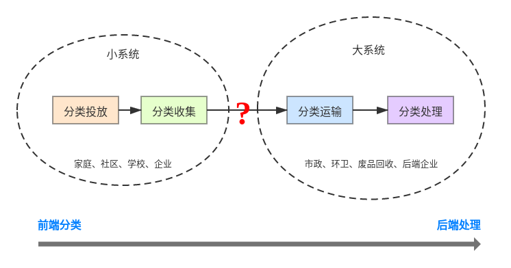
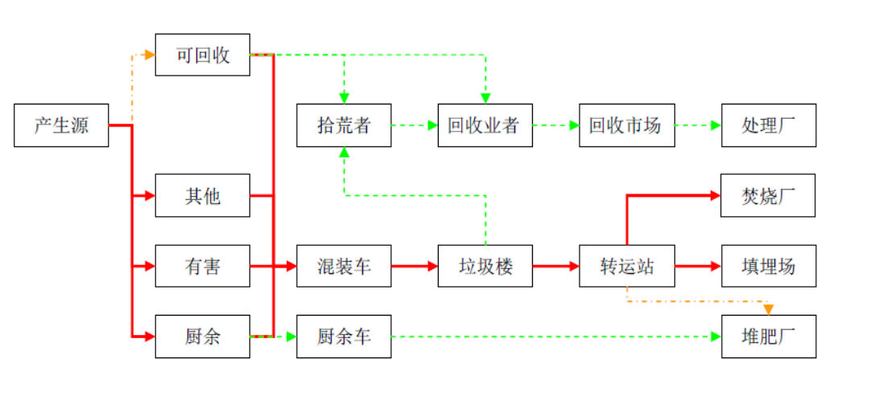

了解城市回收链条
===========================================

垃圾分类是一个系统工程
-------------------------------------------

我们通过上一节 `垃圾分类很重要 <垃圾分类.html>`_ 初步了解了垃圾分类，现在我们就来看看为什么说垃圾分类是一个系统工程，垃圾分类究竟难在哪里？

垃圾分类包括分类投放、分类收集、分类运输、分类处理四个环节，缺一不可。通常我们将分类投放和分类收集称为前端，将分类运输、分类处理称为后端。

- **前端分类** 就是我们普通民众需要参与的，也是体会最深的一部分，我们在家庭、社区、学校、企业里都可能会参与到。前端分类并不是我们把垃圾按照指引分类投放就完事了，还需要做好分类收集，以及将我们的小系统对接到外面的大系统，以帮助物资得到妥善处理。分类收集的作用就在于降低物资的管理和运输成本，更好地与后端衔接起来。

- **后端处理** 则是市政、环卫、回收厂商、企业多方联合起来的处理体系，普通民众通常不太关心或者看不到。比如垃圾清运、废品回收再销售、物资拆解再造等等。

- 在后端的大系统背后，其实还有一个更大的系统 —— 自然生态圈。

现在，你知道垃圾分类难在哪了吧？

城市垃圾处理链条
-------------------------------------------

虽然我国很早就推行垃圾分类，并在 46 个重点试点城市中推行生活垃圾强制分类。但仍然有许多城市尚未落实垃圾分类，或者实行效果并不理想。

许多城市的生活垃圾流向仍然是中间的红色粗线：混合垃圾大部分被送往垃圾填埋场或焚烧厂。

可喜的是，近年来越来越多回收企业参与进来，形成了一定规模的可回收物专有通道（上方绿线）：居民将自家的可回收物通过传统方式或互联网方式卖给回收商，回收商再销售到再生资源回收处理厂。

另外，我国居民的生活习惯和饮食习惯，决定了厨余垃圾的的重量占比达生活垃圾总量的 50% 以上。近年来，许多城市也加快了厨余垃圾生化处理设施的建设，使厨余垃圾得到资源化利用（下方绿线），不过食物浪费的问题依然不容小觑。

- 2020：全国餐厨垃圾处理的能力：3.44万吨/日
- 2020：北京餐厨垃圾处理的能力：0.15万吨/日
- 2020：广东餐厨垃圾处理的能力：0.34万吨/日

小伙伴们可以留心观察一下，你所在的城市垃圾处理链条是怎样的？

垃圾分类背后的逻辑
-------------------------------------------

和可持续发展一样，垃圾分类看起来是很简单，但又很复杂。这里引出一些逻辑，帮助大家看清垃圾分类的真相，小伙伴们可以结合实际情况进行思考，我们可以怎样更好地开展垃圾分类？

- 后端决定前端

- 如何让大家参与垃圾分类才是关键

- 表面上是素质问题，实际上是经济问题

- 物质决定意识

- 选择对环境伤害最小的方式

- 城市之间的攀比

----

.. note:: 版权声明：本文为 ZeroTogether 原创文章，遵循 CC-BY-SA-4.0 版权协议，转载请附上原文出处链接和本声明。
