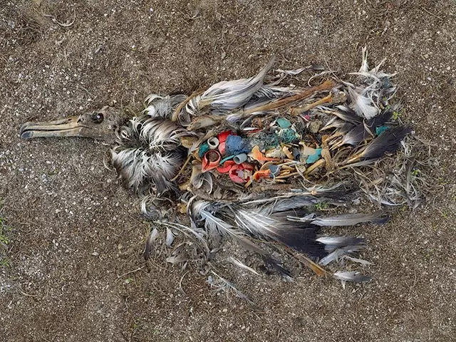
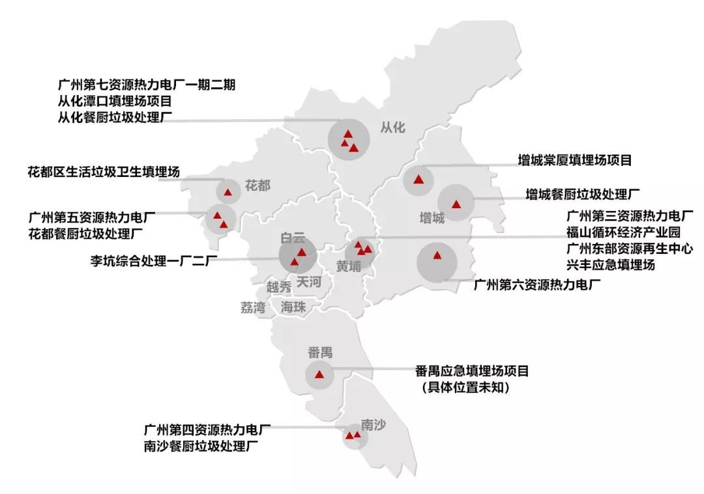
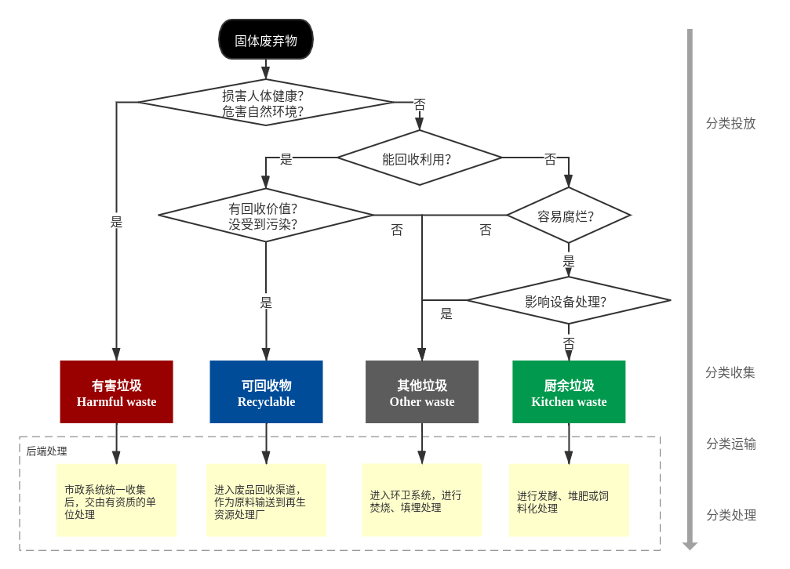

垃圾分类很重要
===========================================

.. 说起垃圾分类，不少人会第一时间想到德国和日本，这两个以“工匠精神”著称的国家，在垃圾分类方面同样成绩斐然。
   然而，却鲜有人知道，我国才是最先提出“垃圾分类”概念的国家。
   早在1957年7月12日，《北京日报》头版头条刊登了《垃圾要分类收集》一文，呼吁北京居民要对垃圾进行分类回收，这便是“垃圾分类”的问世。
   在那个特殊的历史时期，由于全社会物资的极度匮乏，老百姓通常出于节约意识，按照相关要求把牙膏皮、橘子皮、碎玻璃、旧报纸等生活垃圾分门别类地送到国营废品站卖钱，就连烂掉的菜叶子也会捡出来喂鸡喂鸭。
   2019年7月1日，《上海市生活垃圾管理条例》正式实施，上海率先成为全国强制性进行垃圾分类的城市，并在全国掀起了垃圾分类的热潮。

相信大家都听到过“垃圾是放错地方的资源”这句话，可能是由于我们可以用的资源太多了，所以这句话似乎并没有引起大多数人的注意。导致许多资源沦为垃圾，被众人嫌弃，面临被焚烧和填埋的尴尬局面，污染环境的同时也是对资源的极大浪费！

说起垃圾分类，不少人会第一时间想到德国和日本，这两个以“工匠精神”著称的国家，在垃圾分类方面同样成绩斐然。然而，却鲜有人知道，我国才是最先提出“垃圾分类”概念的国家。

早在1957年7月12日，《北京日报》头版头条刊登了《垃圾要分类收集》一文，呼吁北京居民要对垃圾进行分类回收，这便是“垃圾分类”的问世。在那个特殊的历史时期，由于全社会物资的极度匮乏，老百姓通常出于节约意识，按照相关要求把牙膏皮、橘子皮、碎玻璃、旧报纸等生活垃圾分门别类地送到国营废品站卖钱，就连烂掉的菜叶子也会捡出来喂鸡喂鸭。

2019年7月1日，《上海市生活垃圾管理条例》正式实施，上海率先成为全国强制性进行垃圾分类的城市，并在全国掀起了垃圾分类的热潮。

垃圾是怎么产生的？
-------------------------------------------

在开始垃圾分类之前，我们先来思考三个问题：

1. 垃圾是什么？

2. 垃圾从哪里来？

3. 垃圾要到哪里去？

垃圾的前世今生
~~~~~~~~~~~~~~~~~~~~~~~~~~~~~~~~~~~~~~~~~~~

.. raw:: html

   

      <iframe style="position: absolute; width: 100%; height: 100%; left: 0; top: 0;" src="https://player.bilibili.com/player.html?aid=800102068&bvid=BV1ey4y1B79y&cid=249305305&page=1&as_wide=1&high_quality=1&danmaku=0" frameborder="no" scrolling="no"></iframe>
   

::

   垃圾的前世今生，视频来自“自然之友”

你不知道的垃圾历史
~~~~~~~~~~~~~~~~~~~~~~~~~~~~~~~~~~~~~~~~~~~

.. raw:: html

    

      <iframe style="position: absolute; width: 100%; height: 100%; left: 0; top: 0;" src="https://player.bilibili.com/player.html?aid=885020320&bvid=BV1hK4y177M3&cid=249307870&page=1&as_wide=1&high_quality=1&danmaku=0" scrolling="no" border="0" frameborder="no" framespacing="0" allowfullscreen="true"></iframe>
   

::

   你不知道的垃圾历史，视频来自“自然之友”

垃圾对我们有什么影响？
-------------------------------------------

生活在城市里，我们产生的生活垃圾扔到垃圾桶，就有环卫工人帮忙清理，好像真的消失了一样。但其实，它们并没有消失，只是换来一种方式与我们共生。

生物链
~~~~~~~~~~~~~~~~~~~~~~~~~~~~~~~~~~~~~~~~~~~

近年来，海洋塑料垃圾在国际上的关注程度越来越高。研究表面，海洋塑料污染里边的 80% 以上是从陆地迁移到海洋里去的，而这些海洋塑料垃圾会通过生物链影响我们的身体健康。意识到这个问题，我们就会发现垃圾污染与我们息息相关。

::

   中途岛上的候鸟，图片来自网络

同样，垃圾填埋和垃圾焚烧所造成的土壤污染、水污染、空气污染，也会通过生物链，直接或间接地被我们摄入、吸入和接触到，进而影响我们的身体健康。

邻避效应
~~~~~~~~~~~~~~~~~~~~~~~~~~~~~~~~~~~~~~~~~~~

垃圾对我们造成的另一个重要影响，就是“邻避效应”造成的后果。包括影响居民生活环境和身体健康、影响区域经济发展、侵占土地资源等问题。

::

   广州垃圾处理厂分布图，图片来自网络

生活中有哪些垃圾？
-------------------------------------------

我们在谈垃圾分类的时候，所谓的“垃圾”其实是指“城市固体废弃物”（municipal solid waste，简称 MSW）。

固体废弃物
~~~~~~~~~~~~~~~~~~~~~~~~~~~~~~~~~~~~~~~~~~~

城市固体废弃物主要分为 3 大类：工业固废、危险废物（包括医疗固废）和生活垃圾。

生活垃圾又可分为 4 大类：建筑垃圾、绿化垃圾、粪便和一般生活垃圾。这里的”一般生活垃圾“其实就是垃圾分类中的目标对象。

目前我国普遍实行的“四分类”就是将一般生活垃圾划分为有害垃圾、可回收物、厨余垃圾、其他垃圾。（不同的城市在命名和划分上可能有些区别）

.. image:: images/Types_of_municipal_solid_waste.png
   :align: center

常见的 6 类可回收物是“玻、金、塑、纸、衣 + 电子电器”。

四分类
~~~~~~~~~~~~~~~~~~~~~~~~~~~~~~~~~~~~~~~~~~~

1. **有害垃圾（Harmful waste / Hazardous waste）**

   - 定义：有害垃圾是指对人体健康或者自然环境造成直接或者潜在危险的物质。
   - 含有毒性成分或潜在毒性成分的废弃物，比如电池、过期药物及药瓶、过期指甲油、废灯管、油漆桶、杀虫剂等等。

2. **餐厨垃圾（Kitchen waste）/ 湿垃圾（Household food waste）**

   - 定义：餐厨垃圾是指餐饮垃圾、废弃食用油脂、家庭厨余垃圾以及废弃的蔬菜、瓜果等有机易腐垃圾。
   - 厨余垃圾是指居民在家庭中产生的菜帮菜叶、瓜果皮核、剩菜剩饭、废弃食物等易腐性垃圾。
   - 可降解的，包括吃不完的果菜以及花园剪枝、落叶等。

3. **可回收物（Recyclable waste）**

   - 定义：可回收物是指适宜回收和可循环再利用的物品。
   - 可进入废品回收渠道的（简单来说就是能卖钱的），包括纸类、金属、塑料、玻璃、衣服、废旧电子产品等等。

4. **其他垃圾（Other waste）/ 干垃圾（Residual waste）**

   - 无法回收利用、无法降解的废弃物（目前包括一些低价值的可回收物）

怎么做垃圾分类？
-------------------------------------------

我想你已经看过小区或街道派发的垃圾分类小册子，里面列举了各种常见的生活垃圾应该如何分类投放，但看起来相当头疼，甚至让人感到疑惑。那是因为垃圾分类不仅仅是一个分类投放的动作，它还涉及到物品的生命周期和管理方法。

通过下面的方法，你一定可以抛开现象看本质，成为垃圾分类小能手！

分类依据
~~~~~~~~~~~~~~~~~~~~~~~~~~~~~~~~~~~~~~~~~~~

垃圾分类本质上是对物品进行分类，因此第一个分类依据就是物品本身的化学成分和属性。由于垃圾是伴随人类社会而产生的，因此在此基础上需要考虑后端处理方式与回收价值，也正是这些因素造成了垃圾分类的迷思。

1. 废弃物本身的成分和属性（材质、是否可燃、是否有毒性......）
2. 后端不同的处理方式（回收利用、发酵堆肥、填埋、焚烧......）
3. 回收价值（收集的难易程度、运输成本、再生成本......）

快速分类法
~~~~~~~~~~~~~~~~~~~~~~~~~~~~~~~~~~~~~~~~~~~

了解分类依据之后，我们就可以通过如下流程快速辨别垃圾种类了！

::

   垃圾分类快速辨别法

可以看到，分类也是有优先级的，比如一个装过药水的矿泉水瓶，即便瓶子本身是可回收物，但是由于被药水污染了，因此需要归为有害垃圾；比如椰子壳和榴莲壳虽然是能够腐烂的植物，但由于外壳较为坚硬，容易造成后端破碎机器故障，因此将其归为其他垃圾。

当然，学会辨别垃圾种类不代表我们真的能做好垃圾分类，因为垃圾分类是一个系统工程，需要各个环节都做好才行，小伙伴们在日常生活中也需要加强监督哦！

垃圾分类的目标
-------------------------------------------

在我国，由于垃圾分类通常是由政府或民间组织推动，因此垃圾分类往往被当作一种在外部施加压力的情况下作出的行为，因此有必要重新树立垃圾分类的目标。

垃圾分类的首要目标是 **垃圾减量**，通过提高垃圾回收率，降低进入垃圾填埋场和焚烧厂的量。但这里存在一个问题，就是高回收率的背后往往伴随着高消耗。

  生活垃圾回收利用率是指未进入生活垃圾焚烧和填埋设施进行处理的可回收物、易腐垃圾的数量，占生活垃圾总量的比例。

因此垃圾分类的另一个目标是 **改变我们的思想观念**。在参与垃圾分类的过程中，从一个垃圾的制造者变成垃圾的管理者，分类的过程实际上就是一个管理的过程。

.. image:: images/target_for_garbage_sorting.png
   :align: center

总的来说，垃圾分类的目标是实现垃圾的 “无害化、减量化、资源化”，构建资源节约型、环境友好型社会。（送分题）

怎么减少垃圾？
-------------------------------------------

最后，请记住 → **比做好垃圾分类更重要的是减少垃圾的产生 :)**

- 做好干湿分类（垃圾分类千万条，干湿分离第一条）
- 对 “一次性” 说不
- 负责任地消费
- 物尽其用
- 局部循环
- 给绿色投票

让我们一起努力减少垃圾吧！

----

.. note:: 版权声明：本文为 ZeroTogether 原创文章，遵循 CC-BY-SA-4.0 版权协议，转载请附上原文出处链接和本声明。
