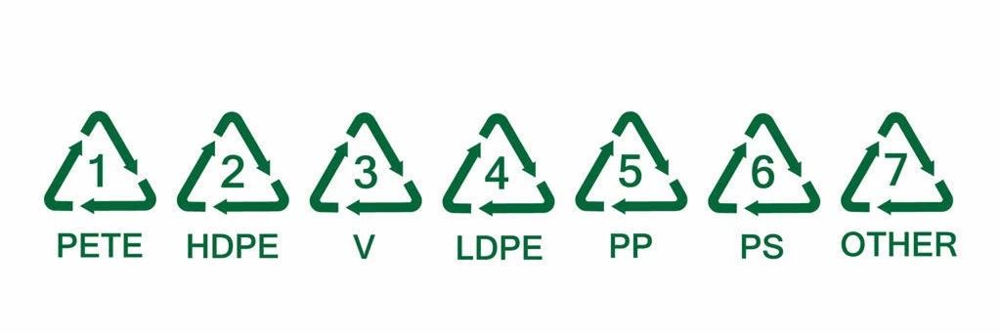

塑料容器的身份证
===========================================

你知道吗？正规的塑料容器身上都有一个三角形的符号（包含1-7的数字），这是它们的身份证，也称为“**塑料回收标识**”。赶紧来学一下吧~

塑料制品回收标识，由美国塑料行业相关机构制定。这套标识将塑料材质辨识码打在容器或包装上，从1号到7号，让民众无需费心去学习各类塑料材质的异同，就可以简单地加入回收工作的行列。每个塑料容器都有一个小小身份证 —— 一个三角形的符号，一般就在塑料容器的底部。三角形里边有 1~7 数字，每个编号代表一种塑料容器，它们的制作材料不同，使用上禁忌上也存在不同。

1号 PET
-------------------------------------------

**1号 PET（聚酯/聚对苯二甲酸乙二醇酯，Polyethylene terephthalate）**

-  常见用途：矿泉水瓶、碳酸饮料瓶，俗称 “宝特瓶”
-  注意事项：不要循环使用，不要装热水
-  使用特性：耐热至70℃，只适合装暖饮或冻饮，装高温液体、或加热易变形，会释放对人体有害的物质。由于1号塑料制品的添加剂多，使用10个月后，可能释放出致癌物 DEHP，对睾丸具有毒性。也不能放在汽车内晒太阳，不要装酒、油等物质。

2号 HDPE
-------------------------------------------

**2号 HDPE（高密度聚乙烯，High density polyethylene）**

- 常见用途：药瓶、化妆品瓶、洗护用品瓶、清洁用品瓶（容器多半不透明，手感似蜡）
- 注意事项：不要用来装饮料，不要用来做存储容器装其他物品，清洁不彻底建议不要循环使用
- 使用特性：可在小心清洁后重复使用，但这些容器通常不好清洗，残留原有的清洁用品，变成细菌的温床，最好不要循环使用。

3号 PVC
-------------------------------------------

**3号 PVC（聚氯乙烯，Polyvinyl chloride）**

- 常见用途：垃圾袋
- 注意事项：有毒，不能接触食物，氯乙烯是致肝癌、肝血管肉瘤的一种致癌物质。
- 使用特性：聚氯乙烯中的氯乙烯不仅有毒，而且在酸和油脂中极容易分解而析出毒性很大的氯化氢和氯，在聚氯乙烯中添加的增塑剂，如苯二甲酸酯类，都有毒性。还有用作稳定剂的铅、镉和有机锡，都是有毒的化学物质，毒性都较大，而且易溶于油脂。

4号 LDPE
-------------------------------------------

**4号 LDPE（低密度聚乙烯，Low density polyethylene）**

- 常见用途：保鲜膜、食品袋
- 注意事项：可以直接接触食物但是不能加热，不要进入微波炉
- 使用特性：比较安全。耐热性不强，通常，合格的 PE 保鲜膜在遇温度超过110℃ 时会出现热熔现象，会留下一些人体无法分解的塑料制剂。并且，用保鲜膜包裹食物加热，食物中的油脂很容易将保鲜膜中的有害物质溶解出来。因此，食物入微波炉，要先取下包裹着的保鲜膜。

5号 PP
-------------------------------------------

**5号 PP（聚丙烯，Polypropylene）**

- 常见用途：微波炉餐盒
- 注意事项：放入微波炉时，把盖子取下
- 使用特性：唯一可以放入微波炉的塑料盒，耐高温170℃，可在小心清洁后重复使用。需要特别注意，一些微波炉餐盒的盒体的确以5号 PP 制造，但盒盖却以1号 PE 制造，由于 PE 不能抵受高温，故不能与盒体一并放进微波炉，为保险起见，容器放入微波炉前，先把盖子取下。

6号 PS
-------------------------------------------

**6号 PS（聚苯乙烯，Polystyrene）**

- 常见用途：碗装泡面盒、外卖餐盒
- 注意事项：不能反复使用，苯乙烯有毒，可以泡着吃但不能上微波炉
- 使用特性：又耐热又耐寒，但不能放进微波炉中，以免因为温度过高而释出化学物。并且不能用于盛装强酸（柳橙汁）、强碱性物质。因此，要尽量避免用这种餐盒打包滚烫的食物。塑料聚苯乙烯虽然属于低毒物质，但是，它的成分苯乙烯和挥发成分乙苯、异丙苯都有毒，并且十分易溶于油脂中。

7号 Other
-------------------------------------------

**7号 Other（其他）或 PC（聚碳酸酯，Polycarbonate）**

- 常见用途：水壶、太空杯、奶瓶
- 注意事项：PC 遇热释放双酚A？
- 使用特性：被大量使用的一种材料，尤其多用于奶瓶中，因为含有双酚A而备受争议。香港城市大学生物及化学系副教授林汉华称，理论上，只要在制作 PC 的过程中，双酚A百分百转化为塑料结构，便表示制品完全没有双酚A，更谈不上释出。只是，若有小量双酚A没有转化成 PC 的塑料结构，则可能会释出而进入食物或饮料中。因此，小心为上，在使用此塑料容器时要格外注意。

----

.. note:: 版权声明：本文为 ZeroTogether 原创文章，遵循 CC-BY-SA-4.0 版权协议，转载请附上原文出处链接和本声明。

