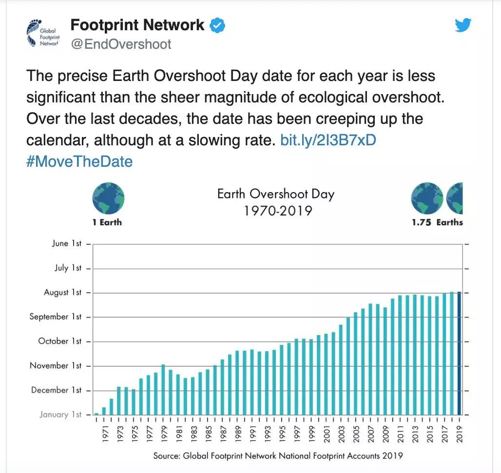
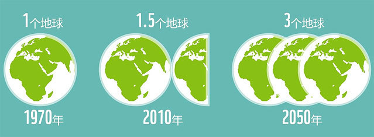
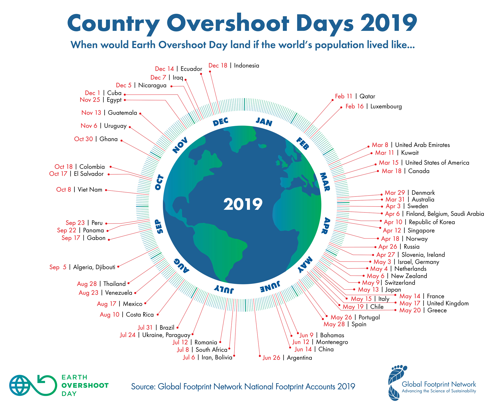
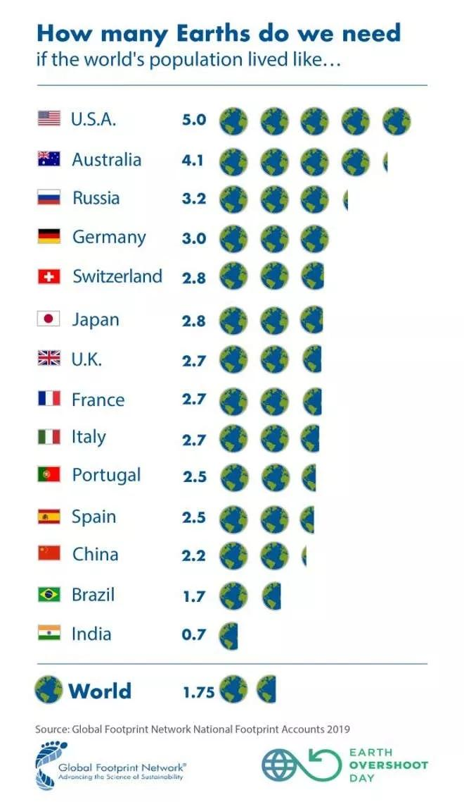
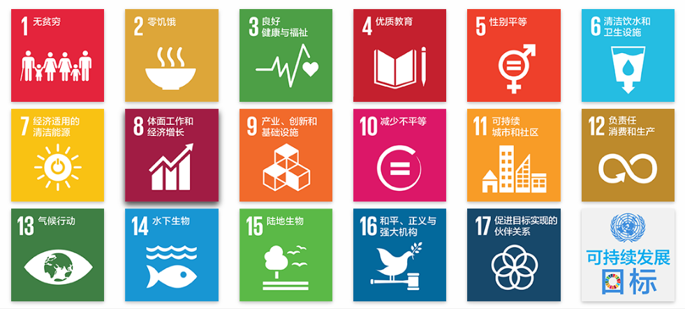
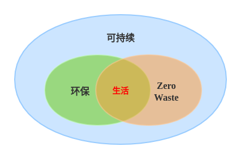

可持续的生活方式
==============================

忘了从什么时候开始，我们的生活变得越来越便利。网购、快递、外卖，足不出户便可得到我们想要的商品和食物，智能冰箱时刻等待补充食物，家里的扫地机器人在一旁默默工作，地暖、热水器也已经提前打开等待主人回家...... 作为交换，我们需要不断工作赚钱，以维持这种便利的生活。

身为一名工程师，我常常反思：我们享受996的福报，盲目追求自动化、智能化的意义到底是什么？过分追求便利却加速了人类的灭亡，它是否还有意义？

当然，我并不反对发展科技，因为科学技术是第一生产力。但我相信我们可以在原料选择、产品设计、生产制造、回收利用等各个环节做得更好。

所以我开始留心观察我的生活，记录我每天接触到的物品。我发现，我的生活不仅变得智能化，还变得塑料化了，几乎每个物品都有塑料的身影。好吧，我已经深陷其中。

我们面临什么问题
-----------------------

有一个概念叫“地球生态超载日”（Earth Overshoot Day），是指地球当天进入了本年度生态赤字状态，已经用完了地球本年度可再生的自然资源总量。这意味着该年度剩下的时间里人类将背上更加沉重的生态欠债、更多透支地球的生态产品和服务。

.. warning:: 人类本年度资源额度已用完！

根据 `全球足迹网络 <https://www.footprintnetwork.org>`_ 数据，自1970年12月29日地球首次进入“欠费”状态以来，超载日每一年都在以惊人的速度提前到来。基本上每10年，地球超载日就往前提一个月。

::

   “全球足迹网络”推特截图

- 1989年的“地球生态超载日”是10月11日；
- 1999年的“地球生态超载日”是9月29日；
- 2016年的“地球生态超载日”是8月8日；
- 2017年的“地球生态超载日”是8月1日；
- 2019年的“地球生态超载日”是7月29日；
- 受疫情影响，2020年“地球生态超载日”是8月22日，比2019年晚了三个多星期。

以2019年为例，超载日为7月29日意味着人类目前使用自然资源的速度是地球生态系统再生速度的1.75倍，相当于人类在使用1.75个地球。

如果以国家视角来看，数据更为惊人：

::

   2019年国别“生态超载日”日期图表，图片来自“全球足迹网络”

::

   图片来自“全球足迹网络”

可我们都知道，人类只有一个地球。我们在使用 1.75 倍自然资源的同时，也在不断透支地球的自然资源，森林砍伐、土壤侵蚀、生物多样性遭到破坏、大气中的二氧化碳越来越多，整个大自然正变得越来越脆弱。极端天气越来越频繁、森林火灾破坏性越来越强、城市供水越来越短缺......

全球气候变暖、臭氧层的耗损与破坏、酸雨蔓延、生物多样性减少、森林锐减、土地荒漠化、大气污染、水污染、海洋污染和危险性废物越境转移，是我们人类目前共同面临的十大全球环境问题。

可持续意味着什么
-----------------------

“可持续”的话题很大，因为它涉及人类活动的方方面面；“可持续”的话题又很小，因为它与我们每个人的行为息息相关。任何事物都不是孤立存在的，都和外界有着千丝万缕的联系，这就大大增加了“可持续”的复杂性。

联合国提出了 17 个 `可持续发展目标 <https://www.un.org/sustainabledevelopment/zh/sustainable-development-goals/>`_ ：

::

   图片来自“联合国新闻中心”

可以看到，除了环境，还包括人口、能源等方面，以及由此造成的不公平问题。这些问题是环环相扣的，只有团结起来，共同解决问题，才能实现真正的可持续发展，才能释放每个人的创造力。

从宏观的角度来看，人类可以在五个方面作出贡献：城市、能源、食物、人口以及地球生态。例如，城市设计更加高效、低碳，减少化石燃料的使用，通过再生农业和保护野生动植物等来保护自然等，发展可再生能源以实现“碳中和”，配置教育资源促进教育公平等等。

从微观的角度来看，我们每个人都可以通过一些日常行为帮助整个地球实现可持续发展。例如，参与垃圾分类回收、在家中注重节能、减少垃圾生产、多使用公共交通工具、减少不必要的消费和食物浪费等等。

环保、零废弃和可持续的关系
----------------------------

过去两百年，随着工业化和城镇化的发展，环境问题频频出现。但直到最近几十年，才被世界各国政府和公众所关注。1962年出版的《寂靜的春天》阐释了农药杀虫剂对环境的污染和破坏作用，1970年美国成立环境保护局，各州相继通过禁止生产和使用剧毒杀虫剂的法律。1972年联合国在瑞典斯德哥尔摩召开“联合国人类环境会议”，提出了著名的《`人类环境宣言 <https://legal.un.org/avl/pdf/ha/dunche/dunche_c.pdf>`_》，环境保护事业正式引起世界各国政府重视。

我们常说的环保（环境保护）就是在个人、组织或政府层面，为大自然和人类福祉而保护自然环境的行为的总称。

零废弃（Zero Waste）也称为零浪费、零垃圾。就是尽量不产生垃圾，让每件东西都可以减量、回收、重新使用、或彻底消化（腐烂），以不造成垃圾填埋场或垃圾焚烧厂的负担为目标。其核心概念是简化生活、理性消费、减少垃圾的产生，进而达到永续发展及环境保护的目的。

可以看到，环保、零废弃和可持续三者具有非常强的相关性，它们的关系如下：

::

   我自己画的，不对之处请指正 :)

可持续发展是人类长期追求的目标，涉及面广；环境保护是可持续发展中重要的一环，包括政府顶层设计和民间开展实施的各种环保行为；零废弃则是一种可持续的生活方式，更倾向于个人和群体的行动，承载着环保和可持续生活的目标。三者的交集，就是我们对健康、和谐、美好生活的追求。

还记得吗？2020年“地球生态超载日”比2019年晚了三个多星期，这说明在短时间内改变生态资源的消费趋势是可能的。不过，真正的可持续发展，应该是通过主动改变生活和资源消费方式来实现的，而不是灾难。

我们不能让任何人决定我们的未来，我们必须自己来！你准备好开始可持续的生活方式了吗？

----

.. note:: 版权声明：本文为 ZeroTogether 原创文章，遵循 CC-BY-SA-4.0 版权协议，转载请附上原文出处链接和本声明。

