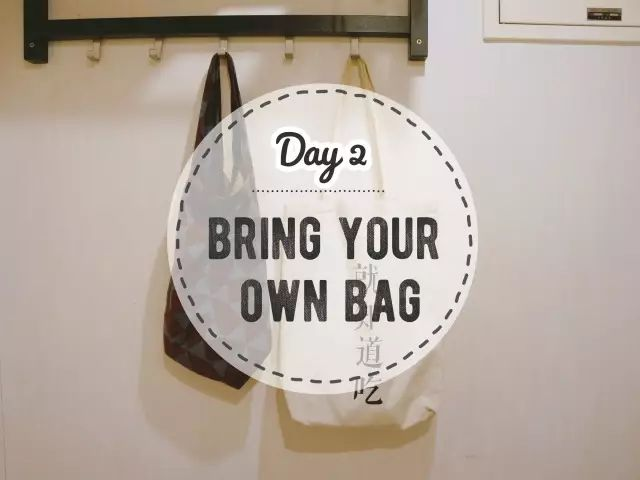
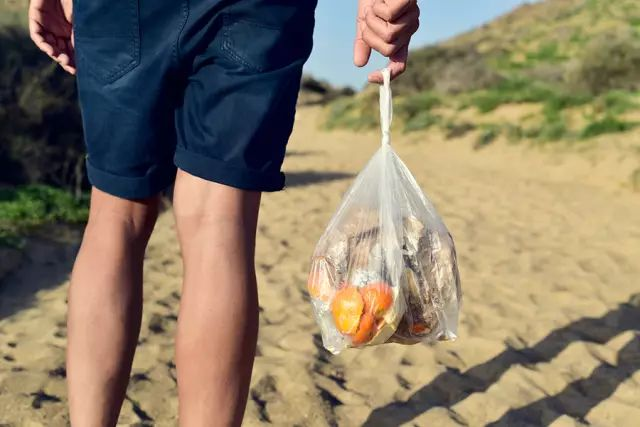
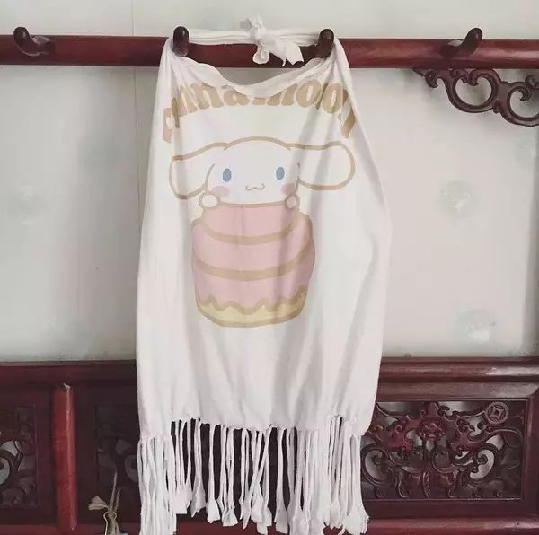
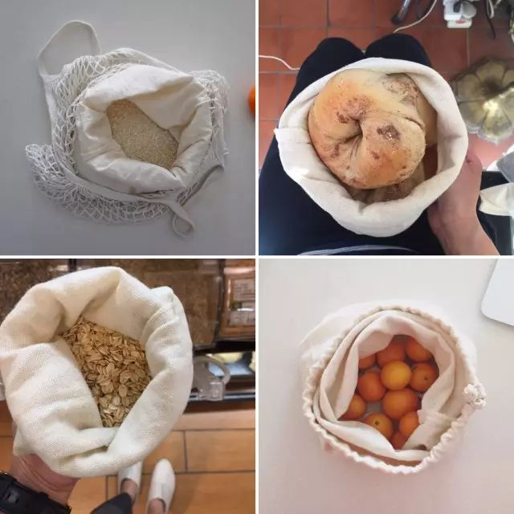
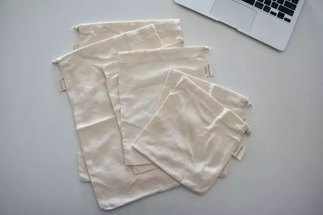
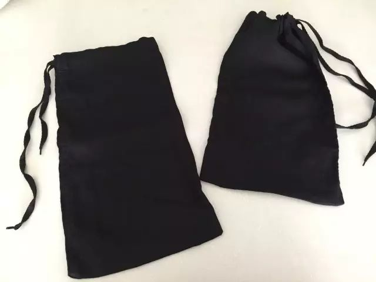
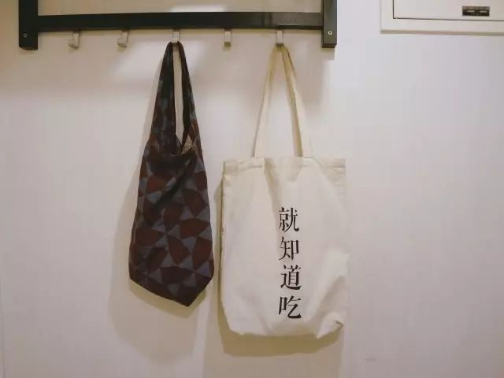
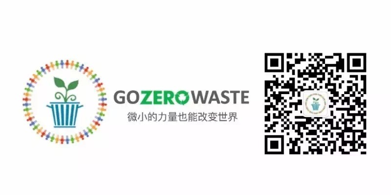

Day2 - 带上自己的购物袋
===========================================

通过 `Day1的垃圾日记 <Day01.html>`_，现在你大概已经知道垃圾桶里都有些什么了吧。在我们家，当时垃圾桶里最多的就是塑料袋：厚一点的类似超市或商场的购物袋、薄一点的像菜市场的袋子、还有更薄的装面包的小袋子......而这些袋子跟着我回家后，都几乎难逃被丢进垃圾桶的命运。

看着这些大大小小的袋子，我不禁问自己：我真的需要用这么多塑料袋吗？

Why - 为什么？
----------------

我们都知道塑料袋不好，白色污染嘛！

但究竟有多不好？

:: 

   图片来源 | PADI

**关于塑料袋你应该知道的七件事**

1. 塑料袋是用石油做的。对，石油，不可再生的石油！（要不然咧，树上长出来的吗？）为了生产塑料袋，光美国一个国家一年得用掉1200万桶油。
2. 塑料袋的平均使用时间为12分钟。
3. 绝大多数的塑料袋都不可降解。在不同的温度和湿度条件下，塑料袋需要15年-1000年才能分解，但也只是分解，分解成小到肉眼看不到的碎片和微粒，但那仍然还是塑料。
4. 全球范围内，每分钟有2百万个塑料袋正在被使用，每分钟！中国每天会用掉30亿个一次性的塑料袋（这还只是2008年的数据！）。
5. 塑料袋的回收率只有1% 。
6. 每年因塑料垃圾致死的海洋生物多达1500万。
7. 海洋中的塑料微粒被鱼吞食后，通过食物链出现在人类的餐桌上，最后进入我们体内。

How - 怎么做？
----------------

1、带上可重复使用的购物袋。这年头，谁家还没几个帆布袋呀，下次去购物前记得带上它！什么，你家真没有？那就花几分钟，用不穿的旧T恤自己动手做一个！（教程在此：`旧物改造 | 旧T-Shirt秒变环保手提袋 <../Upcycling/旧T-Shirt秒变环保手提袋.html>`_）

:: 

   图片来源 | 萱萱

2、准备一些棉布袋。作为我最推荐的zero waste神器（没有之一）， 棉布袋的用途简直多到说不完：装蔬菜、装水果、装面包、装大米、装干果、装薯片......总之，你必须拥有！

|

:: 

   可以购置一套新的? 

:: 

   或是用裤腿改一个？? 

3、把袋子放在门口，每次出门的时候都能看到

拒绝塑料袋最简单的办法就是自带购物袋。耶~又一项Zero Waste技能已解锁！

记得回来跟我分享你的购物成果哟~~

----

.. note:: 本文来自公众号「GoZeroWaste」