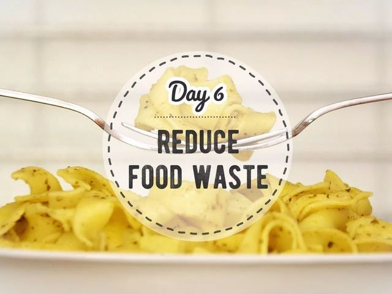
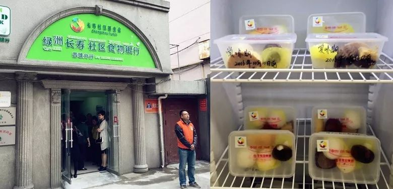
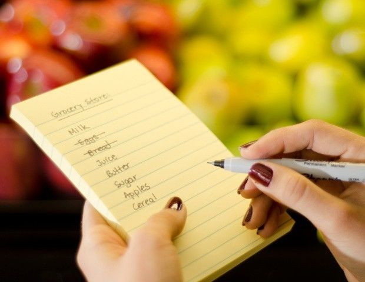
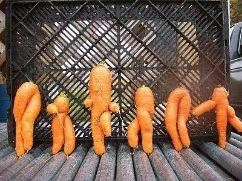
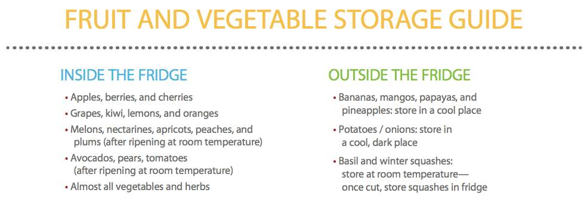
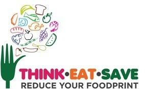

Day6 - 减少食物浪费
===========================================

今天是世界粮食日。(2017-10-16)

从小就会背“粒粒皆辛苦”的你，今晚吃了什么，吃完了吗？

当你轻轻把盘子推开，示意服务员将没吃完的食物收走时，这个地球上，**还有7.95亿人无法填饱肚子，每天有超过2万人死于饥饿。**

可与此同时，我们正在疯狂地浪费食物：

1. 每年全球生产的粮食中，有1/3会被浪费掉；
2. 每年被浪费的粮食总量多达13亿吨；给生产者造成的直接经济后果（不包括鱼和海产食品）高达7500亿美元；
3. 如果把食物浪费看作一个国家，那么它将成为全球第三大温室气体排放源（仅次于中国和美国），每年向大气排放33亿吨温室气体。

社会层面
------------------------

针于食物过剩问题，联合国粮农组织建议，最好的解决办法是 **在人类食物链内进行再利用**，即寻找二级市场或捐赠多余的食物来养活社会贫困人口。

在欧美多个城市，都有由志愿者自发组织的「食物银行」，向农场、制造商、零食商及个人募集即将被浪费的食物，再通过社区和慈善组织分享给有需要的人。

2013年9月，中国内地第一家食物银行——「绿洲公益食物银行」在上海普陀建立。2015，绿洲作为大陆唯一一家食物银行，加入了全球食物银行网络。呼叫上海的小伙伴们，不妨去试着当一回志愿者，然后来和我们分享经验哦！

::

   上海绿洲食物银行 和 分享冰箱

家庭层面
------------------------

对于个人和家庭，可以从以下几点减少食物浪费：

1. **理性购物**：根据饮食计划制定购物清单，避免冲动购买不必要的食物。

2. **不嫌弃丑果**：很多蔬果仅仅因为大小、形状或颜色不规范而被丢弃！虽然长样奇特，但其实口感和营养价值并没有差别。

3. **妥善保存食材**，延长可食用时间，并按 **“先进先出”** 的原则依次使用。对了，你知道哪些蔬果其实并不用放进冰箱吗？

4. 外出用餐时 **只点适量的菜**，并使用自带容器将剩菜剩饭打包。

5. 实在无法再次利用的食材，请进行 **堆肥**。尽量避免将食物倒入垃圾填埋场，这样会产生大量甲烷。堆肥教程 → `家庭无臭快速堆肥视频教程合集 <https://mp.weixin.qq.com/s?__biz=MjM5OTY1MTc4MA==&mid=209124563&idx=2&sn=8c93da4af35bce53d5ee8df7d57fe203&scene=21#wechat_redirect>`_

6. 更多减少食物浪费的信息，可参考联合国「**思前·食后·厉行节约**」行动网站（`www.thinkeatsave.org <https://www.thinkeatsave.org>`_），让我们一起减少食物足迹！

----

.. image:: images/gozerowaste_footer.jpg
   :align: center
   :width: 400

.. note:: 本文来自公众号「GoZeroWaste」