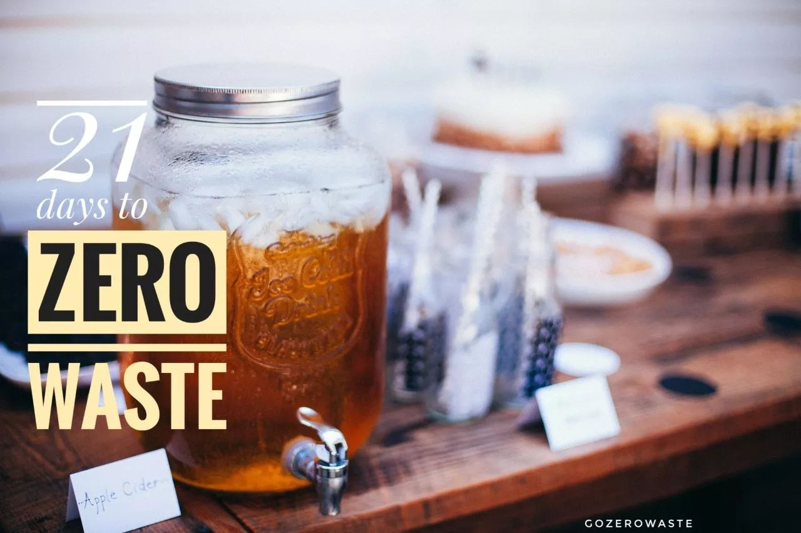
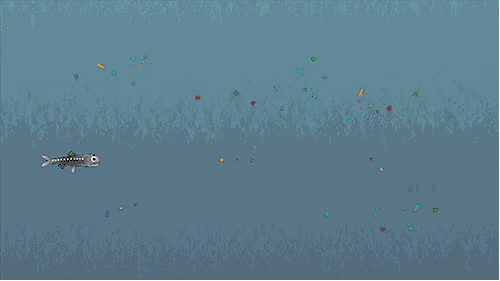
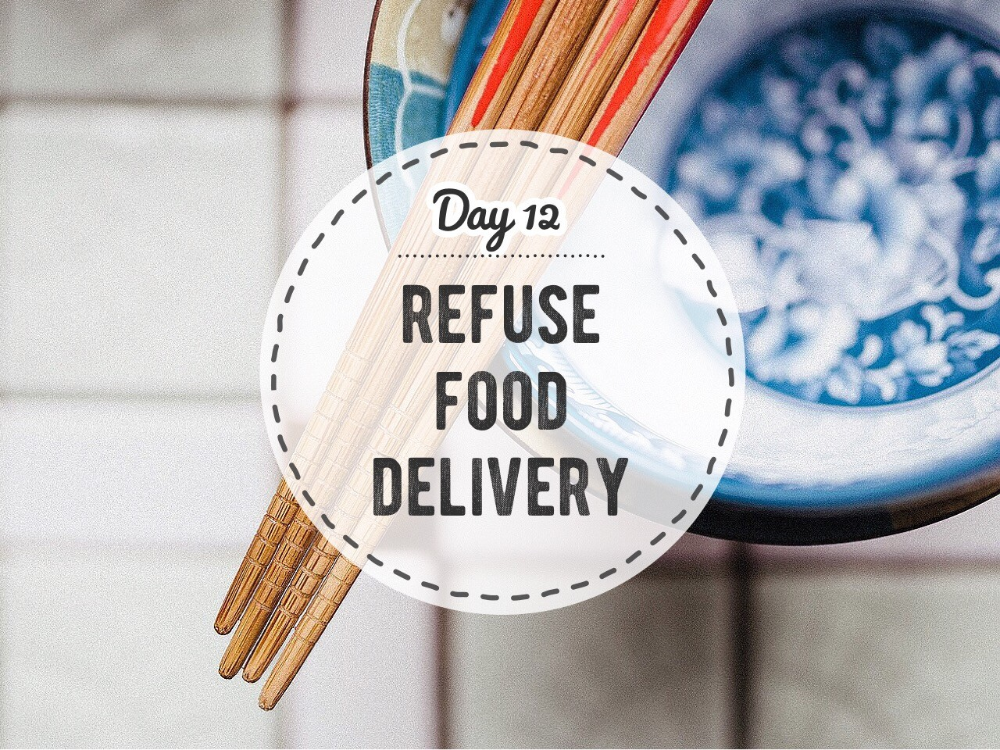
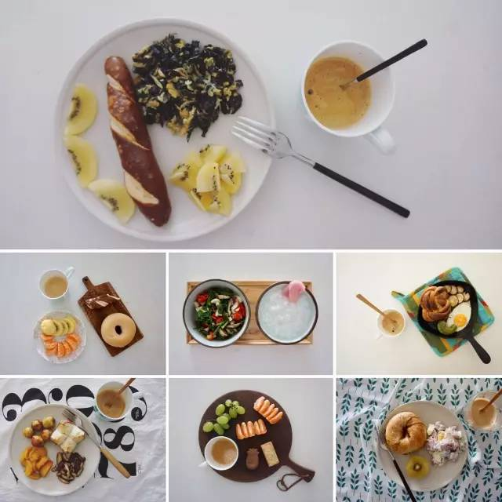
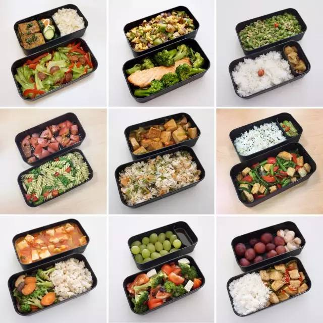
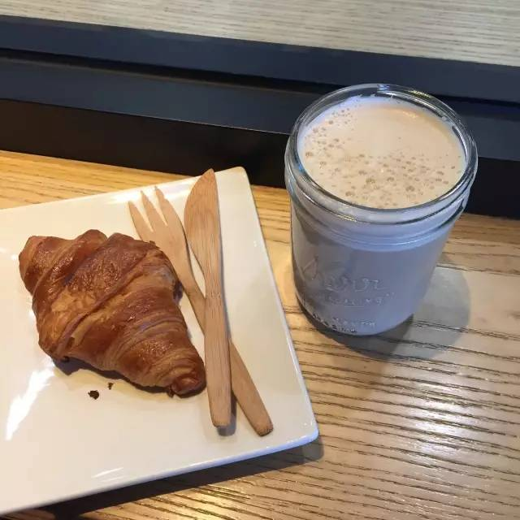

Day12 - 不叫外卖，好好吃饭
===========================================

2018年第一个工作日终于结束啦，你今天吃了什么？叫外卖了吗？

只要拥有一部手机就可以活下去的今天，“吃饭”这件事也在发生改变。到了饭点，不用顶着烈日或寒风走出公司大楼，甚至都不用从椅子上站起来，只要掏出手机，屏幕上点几下，外卖小哥就会拎着饭菜出现在你面前。你说吧，你这条命，是不是外卖给的？

只不过，在方便和省时的背后，外卖产生的塑料废弃物正在给这个地球带来非常承重的负担：据统计，平均每笔外卖订单会产生至少 3.7 个包装盒！这些一次性的饭盒、塑料袋、杯子、餐具，在我们手上只停留短短半个小时，但进入垃圾填埋场后，可能要长达 450 年的时间才能完成降解。

除了伤害海洋动物，被倾倒到海里的塑料垃圾在阳光和海水的作用下，会分解为肉眼看不到的塑料微粒，再通过食物链被我们吃进肚子里......

::

   动图来自京东公益

今天，给大家定一个小目标：**一天不叫外卖，好好吃饭！**

不过，当我们不吃外卖时，我们吃什么？

亲自下厨
------------

早起半小时，给自己做个快手早餐。午餐便当，可以在前一天晚上做饭时顺手准备好。下班回家，晚餐可以简单一点，减轻身体的负担；也可以早上出门前预定好电饭锅或电炖盅，晚上进门就能喝到热粥热汤了。

::

   我的快手早餐

::

   我的花样便当

餐厅吃饭
------------

如果你不会做饭、或是没时间做饭，你的一日三餐可以这样打开：

早餐
^^^^^^^^^^^^

**早餐：上班路上顺便买份早餐带去公司。**

不过别放松警惕，不要使用一次性的塑料袋、纸杯、吸管哦！不妨在办公室放一套备用餐具、用棉布袋购买面包、用饭盒装包子/煎饼、用自己的杯子打豆浆~

.. image:: images/Day12_006.jpg
   :align: center
   :width: 600

::

   大大的面包袋子，肯定能吃饱！

午餐
^^^^^^^^^^^^

**午餐：叫上同事一起去公司附近的餐厅吃饭**

点菜前记得和服务员确认“我不要一次性餐具”、“不要吸管”，不浪费食物。

下午茶
^^^^^^^^^^^^

**下午茶：下楼买咖啡**

带上自己的杯子（自带杯买星巴克可立减3块！），或者选择马克杯在店内享用，不要吸管，不要塑料刀叉。

::

   自带杯子和餐具

晚餐
^^^^^^^^^^^^

**晚餐：与朋友小聚**

点菜前记得和服务员确认“我不要一次性餐具”、“不要吸管”，可以带上自己的饭盒打包剩菜作为第二天的午餐便当。

----

.. image:: images/gozerowaste_footer.jpg
   :align: center
   :width: 400

.. note:: 本文来自公众号「GoZeroWaste」