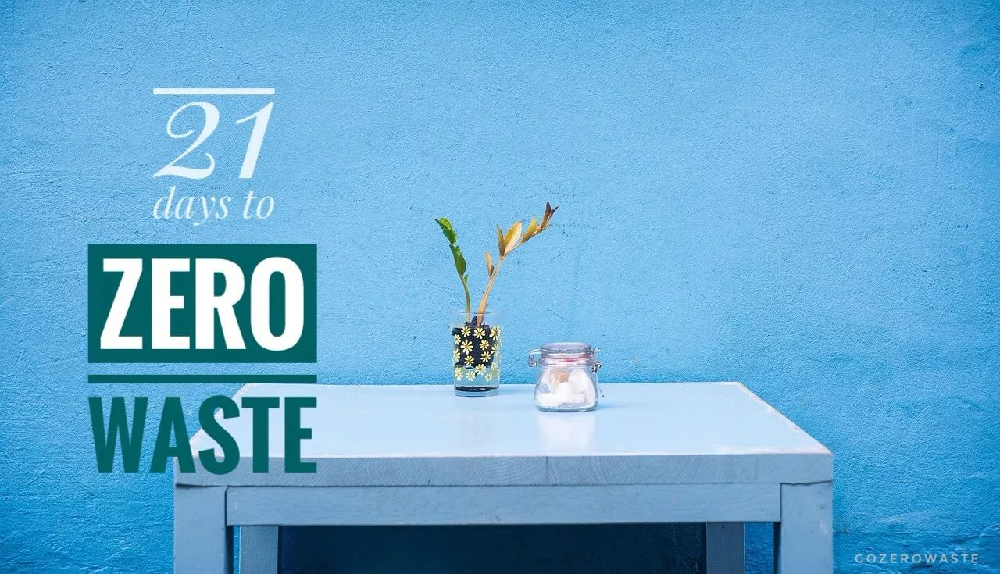
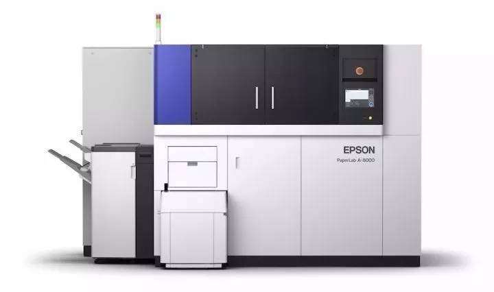
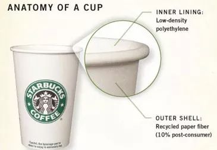
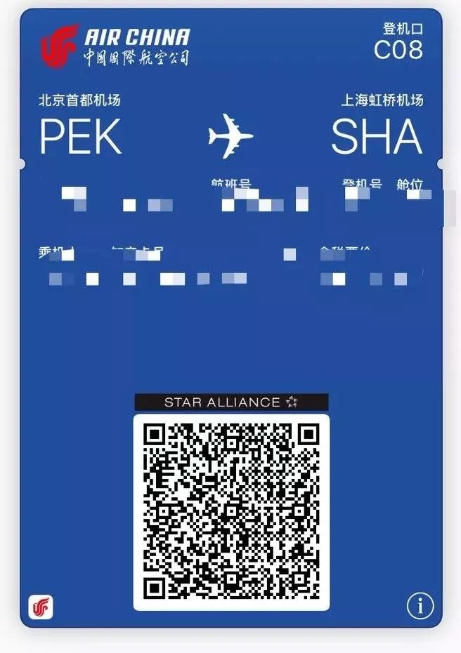
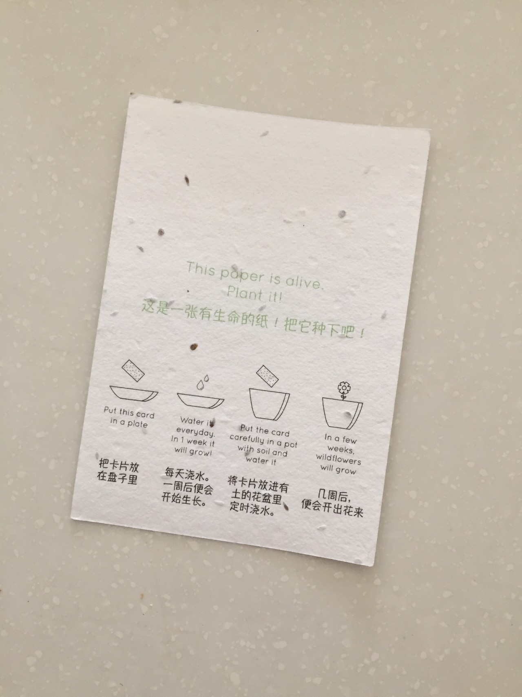
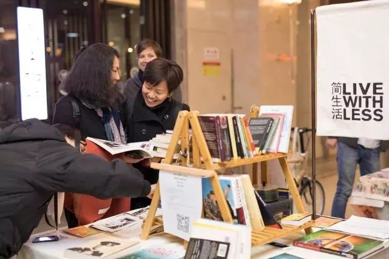

Day14 - 一张纸也不浪费
===========================================

前两天在餐厅吃饭点了杯饮料，一个不留神，端上来的杯子里赫然插着一根吸管。服务员看我满脸严肃不禁有点慌神，我赶紧解释：“哎呀忘了请你们不要给我塑料吸管了！”服务员也赶紧解释：“没事没事，这根吸管是纸的！”

在公众号后台，时不时会有读者给我留言：“看了你们的文章，我现在不用塑料袋了，买面包只用纸袋装。”也有做餐饮的朋友跑来跟我说：“我们餐厅想解决外卖包装的污染问题，所以打算把餐盒和袋子全都换成纸的。”

是不是很棒？嗯？我努力挤出一丝微笑。

纸真的比塑料环保吗？

你心中是不是也有类似的疑问？下面这个 TED 视频可能会提供一部分答案。

Leyla Acaroglu 是一位设计师和社会科学家，去年10月，我们在巴黎的 Art of Change 21 论坛上共同工作了两天，她的逻辑、创意、激情和惊人的语速令我印象深刻。其实很久之前我就看过这段演讲，后来才反应过来，原来她就是那个 Leyla！

`Leyla Acaroglu at TED2013: Paper beats plastic? <https://www.ted.com/talks/leyla_acaroglu_paper_beats_plastic_how_to_rethink_environmental_folklore>`_

Leyla 在演讲中提到一个概念 —— life cycle assessment（LCA 生命周期评估），也就是从原料开采、生产、包装运输、使用和废弃处理这五个环节全方位地进行考量。纸来自天然材料，理论上可以被降解或回收，但如果一个外卖纸袋使用一次之后被扔进垃圾桶，最终混在普通垃圾中一起进入填埋场，一是无法实现纸类可回收的功能，二是在厌氧的填埋场中降解会生成甲烷，而甲烷的温室效应是 CO2 的 25 倍。

.. image:: images/Day14_002.jpg
   :align: center

节约用纸
------------------------

因此，不能武断地一口咬定纸就比塑料好，即便是天然原料，造纸业也需要消耗大量的木材和水资源，平均来说，我国造纸工业每生产一吨纸，需耗水100立方米。纸也好，塑料也罢，zero wasters依然坚定我们的一贯立场：源头减量才是王道。

1. 这些纸，可以不用！
^^^^^^^^^^^^^^^^^^^^^^^^

- **办公用纸**：据统计，办公室的垃圾桶里，纸类占50%。那些可打可不打的文件，就别打印了呗！非打不可的使用双面打印。

.. image:: images/Day14_003.jpg
   :align: center
   :width: 400

::

   图片来自琛猫

如果你们是土豪公司，快让老板在办公室装台Paper Lab吧，把废纸变成再生纸！`办公室神器来啦！废纸秒变新纸，开启纸张的循环利用之旅~ <https://mp.weixin.qq.com/s?__biz=MzA4NDkyODcyNA==&mid=2650863623&idx=1&sn=37e43fd6446b7c2a31941549fcf4cf35&chksm=842be9bcb35c60aab0b3394e5829183b6026f5c4f9c68098c2dd0fbf7cab6950aafb551f033b&scene=21#wechat_redirect>`_

- **纸杯**：带上可以重复使用的杯子。一次性咖啡杯其实并不是纸杯，为了防止热饮渗出，所有的杯子内壁都有一层薄薄的塑料膜，详见这一篇 `慢着！放下那个杯子！ <https://mp.weixin.qq.com/s?__biz=MzI1MTQ2NDAxNg==&mid=2247483766&idx=1&sn=3d4810bb71e32dd50527b9a3bdb72885&chksm=e9f3d149de84585f5d376741828f6f3c0ebe9b3ab5125df5060fb1b59855f2aaef0901748cf2&scene=21#wechat_redirect>`_

- **纸巾**：用手帕代替，另外，在办公室和家里各放一条擦手巾

- **厨房用纸**：用抹布代替

- **购物纸袋**：自带购物袋，面包等食物装进棉布袋或饭盒

.. image:: images/Day12_006.jpg
   :align: center
   :width: 400

::

   特别推荐用宽口的袋子装面包

- **名片**：接过名片我会立即用手机拍照然后把名片还给对方，不会尴尬，简单解释一两句大家都特别支持；传单、海报也是一样

- **发票**：选择电子发票

- **登机牌**：上周飞上海，在国航APP上值机后将电子登机牌存至手机的Wallet，全程畅通

::

   各个机场操作可能不同，建议向机场工作人员确认

2. 这些纸，有更好的选择！
^^^^^^^^^^^^^^^^^^^^^^^^^^^^^^^^

- **笔记本**：作为一位（并不享受写作的）文字工作者，每次写文章之前我还是习惯在纸上列提纲，我用的是 MUJI 再生纸笔记本，钢笔落在略粗糙的原色纸面上的触感让我很是喜欢。

.. image:: images/Day14_007.jpg
   :align: center
   :width: 400

::

   图片来自MUJI官网

- **厕纸**：对比 100% 原生木浆纸，还有用秸秆、竹纤维和再生纸制成的厕纸可供选择。详见这一篇 `严肃脸：一起聊聊这件羞羞的小事 | Zero Waste Toilet Paper <https://mp.weixin.qq.com/s?__biz=MzI1MTQ2NDAxNg==&mid=2247484006&idx=1&sn=21ff4fe0e6c78433685e4c9f5075b63b&chksm=e9f3d259de845b4fa62bec2c2fd836f42e97c13a0cd9d75b306363d67249332d26a889fc6631&scene=21#wechat_redirect>`_

.. image:: images/Day14_008.jpg
   :align: center
   :width: 400

::

   再生纸制成的厕纸

- **有生命的纸**：总有一些场合纸类还是无法避免：名片、贺卡、红包、结婚请柬、年会菜单、礼物包装等等，不妨玩点创意，这种用废弃棉布制成并在生产过程中加入种子的纸，不用扔进垃圾桶，just plant it!

::

   真的会发芽！

3. 其他
^^^^^^^^^^^^^^^^^^^^^^^^

- **书籍**：爱看书怎么办？看电子书呀！还是喜欢纸质书？可以去图书馆借书，也可以购买二手书（二手交易平台：渔书/多抓鱼/孔夫子旧书网），还可以通过闲置交换把看过的书分享给别人

.. image:: images/Day14_010.jpg
   :align: center
   :width: 400

::

   巴黎 Shakespeare and company 书店门口的二手书专区

|

::

   北京F2N农夫市集上的换书角，喜欢就可以拿走

- **FSC认证**：FSC（Forest Stewardship Council 森林管理委员会）是全球最严格的森林认证体系，FSC标签表明该产品来自于负责任管理的森林。从纸巾到书籍到化妆品包装，选择FSC认证的产品，就意味着你在以实际行动帮助改善工人的健康和安全状况、保护生物多样性、保护濒危物种、甚至影响了森林政策！戳这里 `看视频 <https://mp.weixin.qq.com/s?__biz=MzA3MjExNDk0Ng==&mid=2650247426&idx=1&sn=ccb12c423d1929790acd2ce243bd29e8&chksm=8720076fb0578e799103ad930b32550dc32c078b191b8ea17efe5ec7c233bf6345260a79b7c2&scene=21#wechat_redirect>`_

.. image:: images/Day14_012.jpg
   :align: center
   :width: 400

::

   图片来自FSC官网

- **分类回收**：对废弃纸张进行简单分类（一定要做到干湿分离），交给废品站或放在垃圾桶旁边让拾荒者捡走，可以让它们循环再生

.. image:: images/Day14_013.jpg
   :align: center
   :width: 400

::

   这样的垃圾桶应该成为公司的标配！

【参考资料】

- http://www.theworldcounts.com/stories/Paper-Waste-Facts
- http://www.chinapulp.cn/qitazixun/201309/05/qt2058.html
- https://cn.fsc.org/preview.fsc201708.a-199.pdf

----

.. image:: images/gozerowaste_footer.jpg
   :align: center
   :width: 400

.. note:: 本文来自公众号「GoZeroWaste」