Day19 - 优雅地玩转一块手帕
===========================================

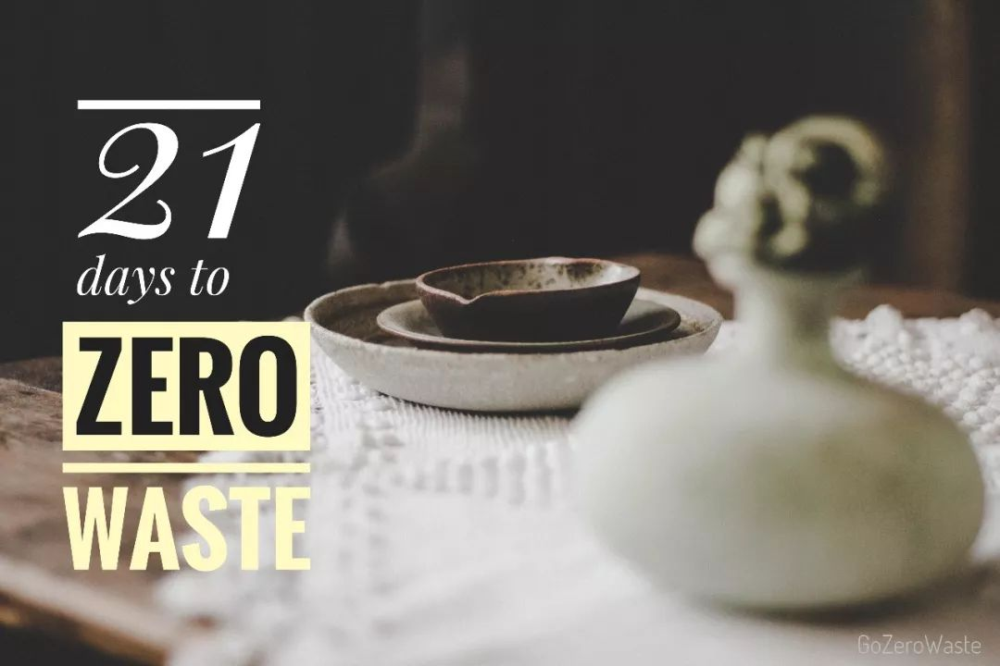

几年前，令我感到幸福和放松的其中一个方法是：逛超市的纸巾货架（当然还有薯片货架）！

从学生时代开始，我便喜欢囤各种各样的纸巾，有一个抽屉专门用来存放纸巾，喜欢的品牌推出的不同印花、不同香味、不同尺寸都恨不得集齐一套，一些不再生产的限量版甚至会珍藏着不舍得用......

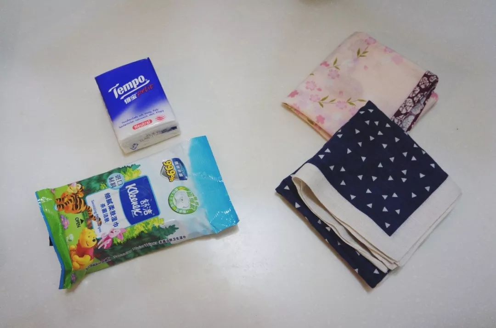

万万没想到，作为一位重度纸巾控，我居然能在开启 zero waste 生活之初便成功切换成手帕模式，完全没有痛不欲生死去活来的情节（编剧这不科学啊），轻松自然到我自己都不敢相信！非要说个因为所以，大概是我意识到，**纸巾都是用树做的，而湿纸巾压根不是纸！** 详情戳 → `湿纸巾，禁塑的下个目标？ <https://mp.weixin.qq.com/s?__biz=MzA3MDM0ODg4OA==&mid=2649933771&idx=1&sn=a36d152bd287e0b3dfeaf328478513ce&chksm=87385efcb04fd7eaba9df5ba2a864888bf9c254189a31adab038ce9055a9cbdb6f8465f468e7&scene=21#wechat_redirect>`_

现在的我，早已经离不开手帕了。今天就来和大家聊一聊，从幼儿园时代的“丢手绢”到如今重新进入我们生活的手帕君。

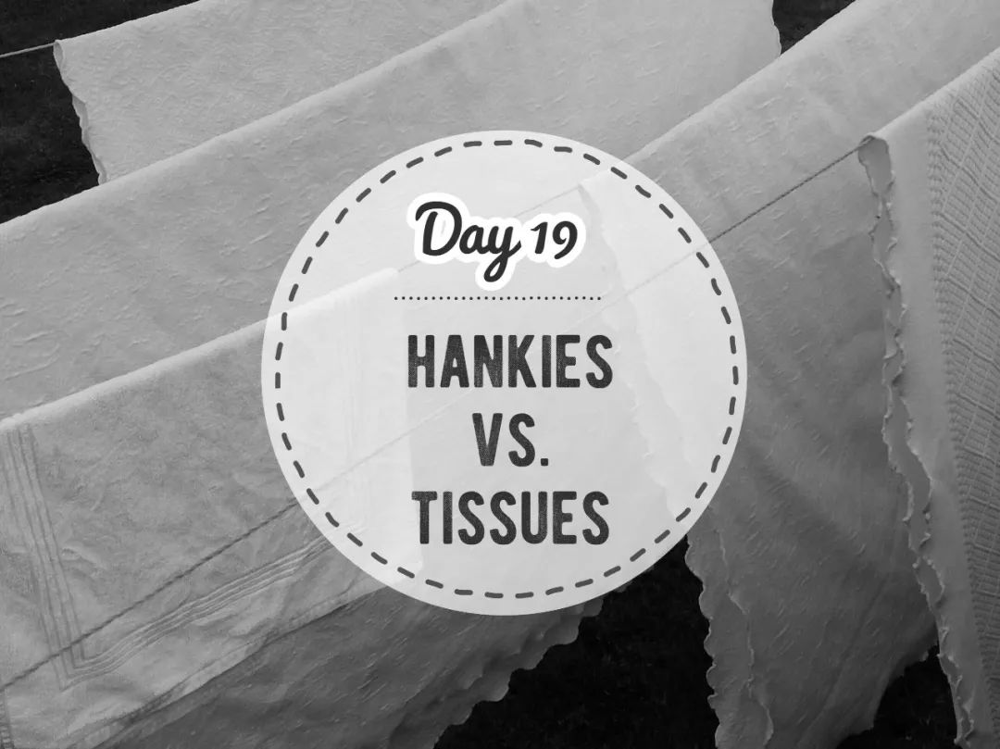

手帕的用处
------------------

吃完饭擦嘴、洗完手擦手、热了擦汗、哭了擦泪，这些只能算是手帕的基本打开方式。但只要你脑洞足够大，便可以分分钟解锁手帕的隐藏功能，比如：

随手吃零食
^^^^^^^^^^^^^^^^^^

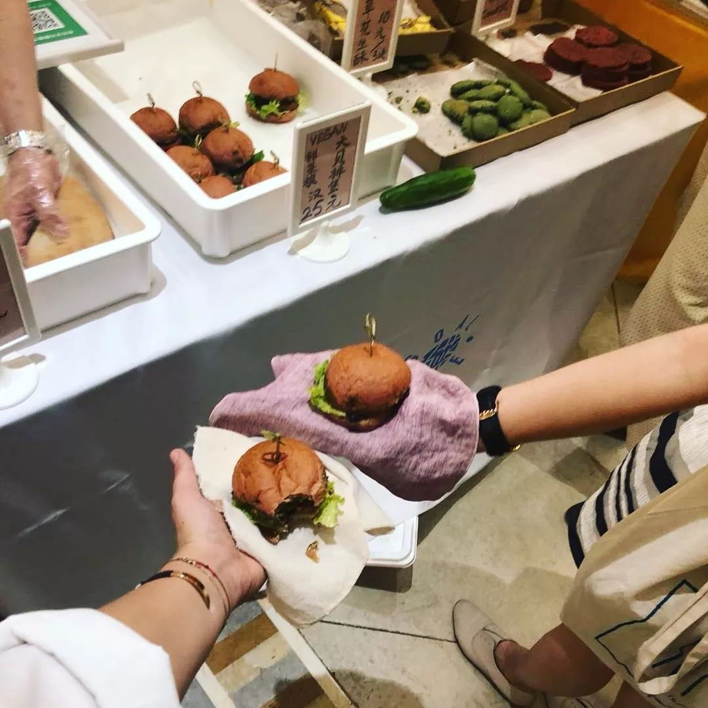

::

   我和ZeroWasteShanghai的Alizee一起吃素汉堡

随手买面包
^^^^^^^^^^^^^^^^^^

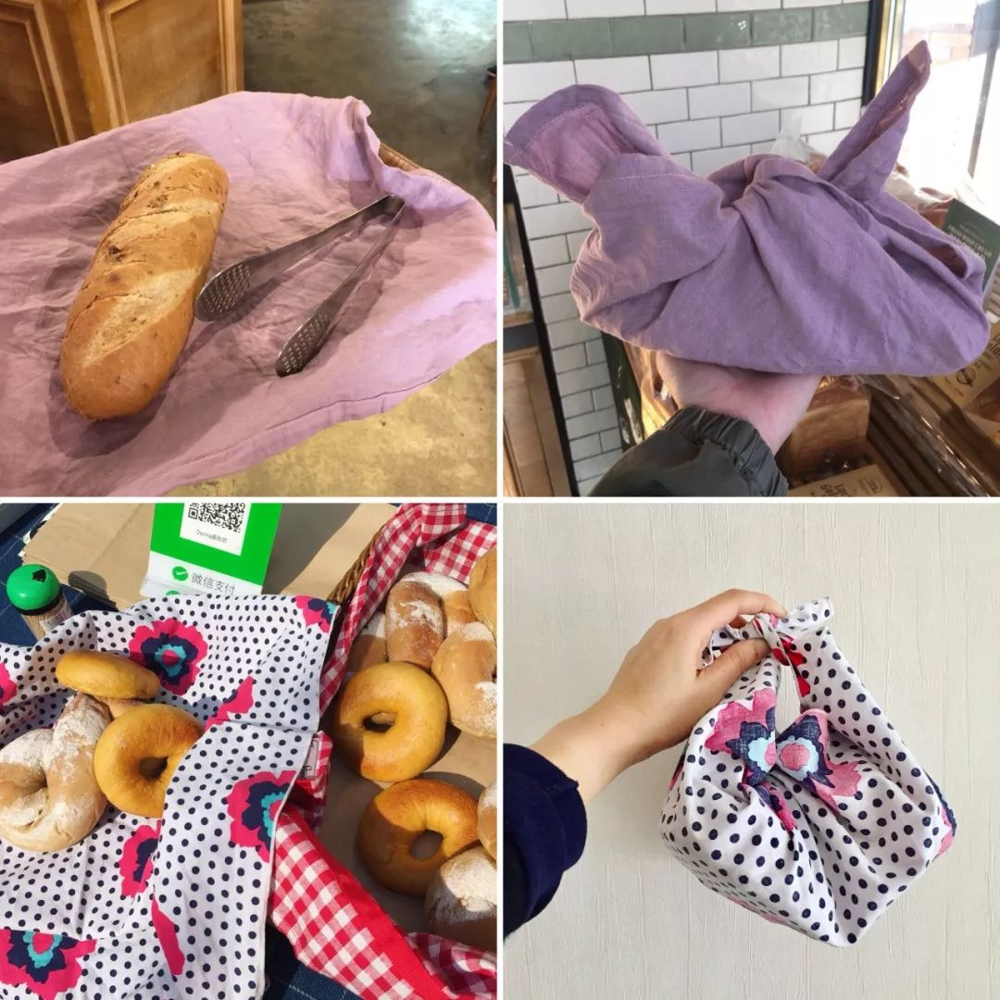

::

   买面包的尺寸更大一些

随手包餐具
^^^^^^^^^^^^^^^^^^

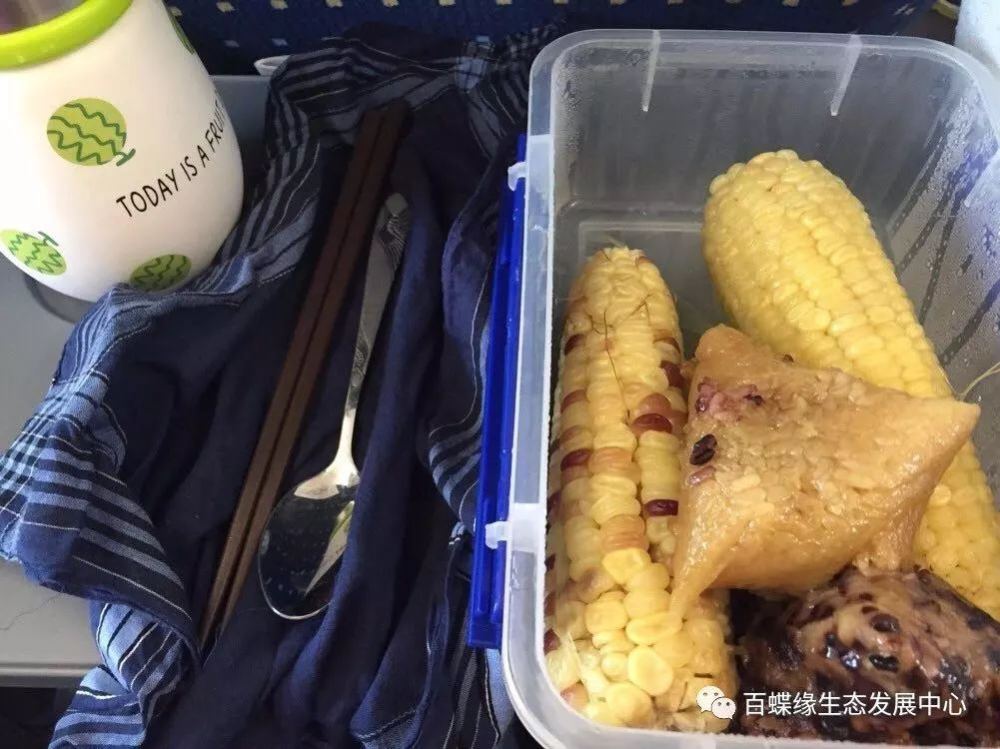

::

   图片来自南京小队长heyuan

随手送礼物
^^^^^^^^^^^^^^^^^^

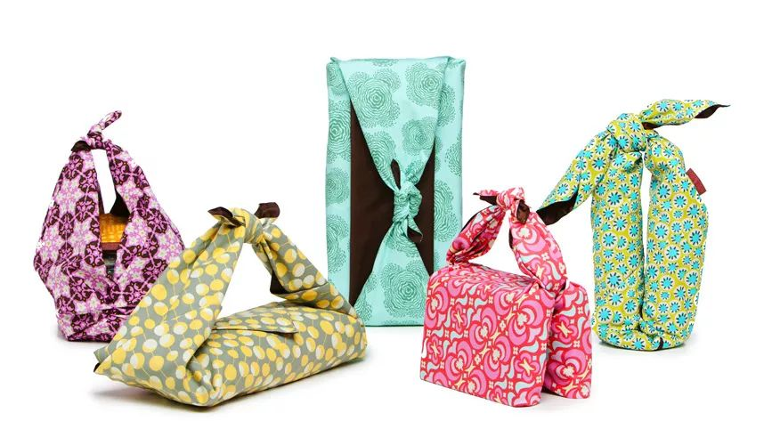

::

   图片来自网络

随手凹造型
^^^^^^^^^^^^^^^^^^

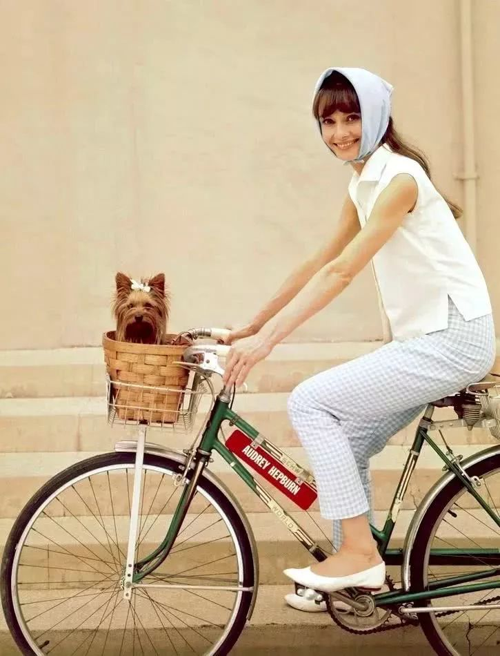

::

   图片来自网络

关于手帕的那些迷思
---------------------

洗手帕不浪费水吗？
^^^^^^^^^^^^^^^^^^

手帕真的比纸巾环保吗？每次用完都要洗岂不是更浪费水？若要评估两者的环境影响，就得从整个产品周期综合考量，而清洗只是其中的一个步骤而已。

澳洲的 Green Lifestyle 杂志做过一次数据分析，从水资源消耗、能源消耗、废弃物产生等几个角度对比一张纸巾（1g、使用1次）和一块棉手帕（15g、使用520次）的环境足迹，得出的结论是：**手帕比纸巾更环保**。

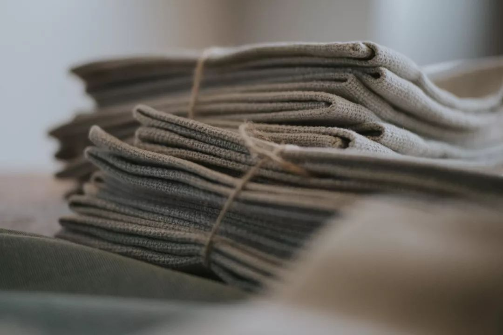

::

   图片来自网络

如何携带？
^^^^^^^^^^^^^^^^^^

下图只是示范。我一般将手帕放在包里单独的格子中。更精致的男孩女孩们或许可以再准备一个小布包作为手帕收纳？

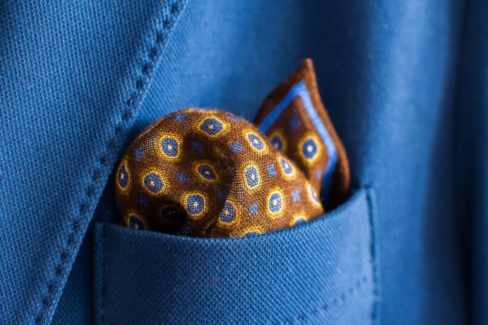

::

   图片来自网络

如何选择手帕？
^^^^^^^^^^^^^^^^^^

还是那句话，不一定非得买新的。用不上的T恤、衬衫、睡衣、被套、枕套都可以剪成合适的大小当手帕用。在材质上，建议选择纯棉、有机棉、亚麻，吸水性强，轻薄易干。

要准备几块才够？
^^^^^^^^^^^^^^^^^^

我的朋友 Lydia 会随身携带两块手帕，一块擦手一块擦嘴。而粗糙女孩的代表我本人则一般只带一块。数量见人见智，摸索出适合自己的使用习惯就好。

一周之前，我总共有4块手帕轮流使用。之所以说“之前”，是因为上周去日本旅行看到漂亮的手帕根本走不动路，一个没刹住又买了好几块。不过也因此把三位同行闺蜜也带入了手帕的坑，全程下来省了不少纸巾的使用呢~~

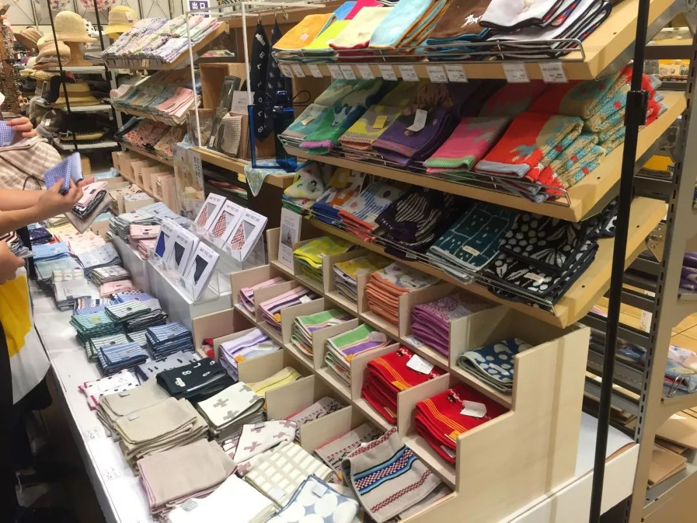

|

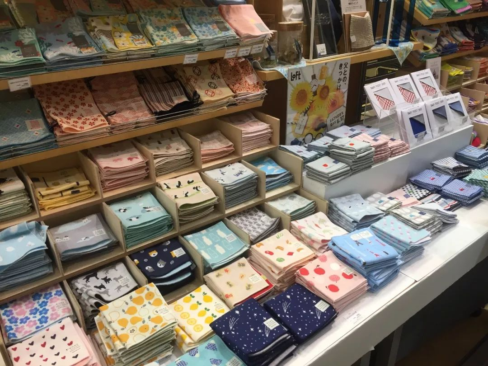

::

   图片摄于京都loft

----

.. image:: images/gozerowaste_footer.jpg
   :align: center
   :width: 400

.. note:: 本文来自公众号「GoZeroWaste」