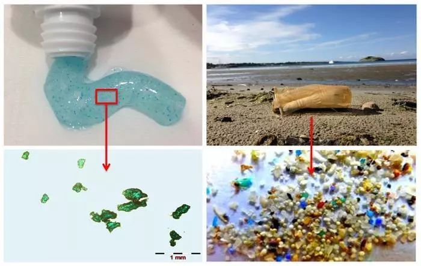

# 塑料污染

## 微塑料

**微塑料**一词近年来频频见诸媒体，逐渐引起社会各界的注意，不过许多人对它仍是知之甚少。那何为微塑料呢？初一看，或许以为是应用塑料的一种分类，其实不然，这概念主要是源自海洋生态环境研究。还得从2004年说起，那年英国科学家在《SCIENCE》杂志上发表了关于海洋水体和沉积物中塑料碎片的论文，首次提出微塑料的概念。此后，许多科研人员都投入到微塑料的研究中，并发表了许多重要的成果，使得微塑料污染引起全球的重视。2014年，首届联合国环境大会上，**海洋塑料垃圾污染**被列为 “十大紧迫环境问题之一”，并对微塑料进行特别关注。2015年召开的第二届联合国环境大会上，微塑料污染被列入环境与生态科学研究领域的第二大科学问题，成为与全球气候变化、臭氧耗竭等并列的重大全球环境问题，由此也可见微塑料污染之严重。

目前学术界对微塑料还没准确的定义，但通常认为粒径小于5毫米的塑料纤维、颗粒或者薄膜即为微塑料，实际上很多微塑料可达微米乃至纳米级，肉眼是不可见的，因此也被形象地比作**海洋中的“PM2.5”**。

> 各种微塑料（来源于report：95% of Fulmars in the North Sea Had Plastic in Their Stomachs）

那么，微塑料从何而来呢？

根据来源微塑料可分为初生微塑料和次生微塑料两大类。

**初生微塑料**是指经过河流、污水处理厂等而排入海洋环境中的塑料颗粒工业产品，如化妆品、牙膏、洗面奶等含有的微塑料颗粒或作为工业原料的塑料颗粒和树脂颗粒。如果你留意下化妆品或洗护用品成分表，里面有聚乙烯、氧化聚乙烯、聚对苯二甲酸乙二醇酯等组分，则是添加的微塑料，在日化界又称微珠。仅一支磨砂洗面奶中所含的微珠就达30万颗以上。洗衣机洗衣时也能产生大量的微塑料纤维，据估计每洗一件合成织物，可能产生1900个微塑料纤维，这些超细纤维难以过滤分离，其中一半以上会避开污水处理系统而进入河流、海洋。油漆喷涂、汽车轮胎磨损也会产生大量的微塑料颗粒。

**次生微塑料**是由大型塑料垃圾经过物理、化学和生物过程造成分裂和体积减小而成的塑料颗粒，这部分包括陆地塑料垃圾，海洋旅游、海洋渔业以及船舶运输、海上钻井平台等海上作业带入。

> 洗衣机排出废水中的塑料纤维

**微塑料**正以迅雷不及掩耳之势蚕食着我们的地球生态环境。

自从1907年贝克兰发明酚醛树脂开启塑料时代以来，人类使用塑料已有百余年的历史，塑料给人们生活带来了极大便利，但由于其难以分解处理也产生了严重的环境问题。陆地上大量的废弃塑料污染山川河流，导致“白色污染”，海洋同样是塑料污染的重灾区。据统计，每年有超过800万吨塑料被遗弃在海洋，占海洋垃圾的80%，严重威胁海洋生态系统。这些塑料垃圾时间日久会形成无数的微塑料颗粒。2014年五环流研究所（Five Gyres Institute）的Marcus Eriksen等研究指出，全球海洋中至少有5.25万亿个塑料碎片，可能重达约26.9万吨。

微塑料通常存在于表层海水、海床、沉积物和海滩，甚至出现在最偏远的极地冰川和深海沉积物中。日本东京农工大学教授高田秀重等人研究发现东京湾沉积物中的微塑料浓度远高于海水。目前除南北太平洋、北大西洋、印度洋等大洋沿海大量分布外，南极和北极都发现微塑料的踪迹。科学杂志《地球的未来》上曾刊登文章，研究发现每立方米的北极海冰中含有多达240个微塑料颗粒。可以说，微塑料已经遍布了整个海洋系统。

> 海水中的废弃塑料

**微塑料**可以随着洋流在海洋中扩散，改变海洋的生态环境，也进入了海洋生物食物链，对海洋生物造成危害。由于微塑料细小甚至肉眼难以看见，会被海洋中的底栖动物与浮游动物所误食。然后，大鱼吃小鱼，小鱼吃虾米，随着食物链层层传递，最终会进入人类食物链。非洲联合银行的数据显示，超过250种海洋生物消化系统中发现塑料制品的踪影。中科院烟台海岸带研究所的一项调查也显示，在20多种经济价值较高的常见鱼类采样中，**90%的鱼类样本中都发现了微塑料**。最新研究证实，即使深达1800米的海底深处都有海洋生物在吞噬微塑料，表明微塑料对地球环境的破坏性影响远超出想象。

不仅仅是海洋，陆地上也发现微塑料已进入食物链。今年4月墨西哥科学家埃斯佩兰萨·韦尔塔在土壤里、蚯蚓体内、母鸡粪便和胃里发现微塑料，可能源自焚烧废弃塑料掩埋后的分解，首次证实微塑料已进入陆地食物链。近日美国一家机构对全球多个城市进行了150多次自来水检测，结果显示**83%的自来水含有微塑料成分**，表明陆地水源中也受到了微塑料的侵袭。国内外也有报道在食盐、海盐、啤酒、蜂蜜等产品中检出了微塑料。也许，微塑料的污染已经无处不在了。

> 深海中巨大幼形海鞘吞食微塑料

**非但污染环境，微塑料更危害生物安全。**

微塑料部分来源于塑料制品，本身可能会释放有毒有害物质，对海洋环境造成直接危害。微塑料表面也容易吸附海洋中的重金属、持久性有机污染物，如农药、阻燃剂、多氯联苯等，随洋流运动对生态环境产生化学危害。微塑料容易被海洋生物吞噬，在海洋生物体内蓄积，危害海洋生物安全。科学研究已经证实，海洋中的微塑料污染对海洋生物的生长、发育、躲避天敌和繁殖的能力皆有不同程度的影响。此外，微塑料作为载体，可能携带外来物种及潜在病原菌危害海洋生态系统的稳定。

更令人担忧的是，微塑料会通过海洋食物链传递，最终进入人类食物链对人体健康安全造成威胁。虽然目前尚未证实微塑料对人体健康存在哪些确切的危害，不过类比PM2.5，不排除微米、纳米级的微塑料颗粒进入人体循环系统的可能，如果长期摄入微塑料，也可能会导致一些化学物质在人体集聚，显然不利于人体健康。当然，这还只是一种推测，关于微塑料对生态和人类健康影响还有待进一步深入研究。

> 污染的海滩和死亡的鱼

面对微塑料在海洋中的泛滥，如何加强监测和防控，世界各国都在积极展开行动。

如前文所述，联合国一直对塑料垃圾高度关注，从2014年开始重视微塑料的污染。2016年5月联合国环境署发布了海洋微塑料污染的全球评估报告，并敦促各沿海国家尽快加强海洋微塑料的科学研究和相关法规的制定工作。2017年6月首届联合国海洋大会，通过《我们的海洋、我们的未来：行动呼吁》文件，呼吁各国减少使用塑料、预防和显著减少塑料和微塑料等各种海洋污染。

**塑料微珠在日化产品中大量应用，也是微塑料的重要来源之一。**目前各国都纷纷对化妆品中微珠的使用实施了禁令。最早实施化妆品中微珠禁令的国家是美国，2015年12月，奥巴马签署了“无微珠水域法案”，规定从2017年7月1日起，所有制造商不得生产任何含有塑料微珠的化妆品，从2018年7月1日起禁止引进这类产品。加拿大、新西兰、韩国也出台了类似的禁令。

在欧洲，2014年12月，奥地利、比利时、卢森堡、荷兰和瑞典发表联合声明，呼吁个人护理产品禁止使用塑料微珠。2015年10月21日，欧洲化妆品及个人护理用品协会（Cosmetics Europe）建议，在2020年前停止在磨砂及清洁用的冲洗式化妆品和个人护理用品添加塑料微粒。 今年6月23日，欧盟委员会发布了关于欧盟生态标签中六种洗涤剂产品组的修订标准，所有被授予欧盟生态标签的洗涤剂将不含有塑料微珠。欧盟各国也有多项相关法案在推进中。今年9月英国发布关于化妆品等产品中禁用塑料微珠立法草案，2018年将全面禁止个护产品中使用塑料微珠。

作为化妆品生产企业，强生、宝洁、联合利华、雅诗兰黛等世界日化巨头均表示在个人护理产品中逐步淘汰塑料微珠，除联合利华已完成外，其他的预计还需一到两年时间。除了在化妆品领域限制微珠外，其次就是积极倡导使用可降解塑料减少塑料污染，至于其他从源头遏制微塑料的重大举措目前似乎还不多。

> 含微珠的护理品

**我国是世界上最大的塑料生产和消费国**，微塑料污染也对我国海洋生态系统构成了严重威胁。但国内相关的研究起步较晚，相关监测技术还不完善，目前公众对微塑料了解不够，对其危害认识不足。不过我国政府已经对微塑料污染予以重视并展开了行动。2007年起我国开始了海洋垃圾包括塑料垃圾的常规监测。2016年起，我国开始对近海微塑料进行监测，今年首次对北极、东太平洋实施了微塑料监测。

国家重点研发计划项目“海洋微塑料监测和生态环境效应评估技术研究”也已启动相关研究，投入经费1600万元。近日，“海洋垃圾和微塑料研究中心”在国家海洋环境监测中心成立，将开展与海洋垃圾和微塑料监管相关的技术、方法和管理对策研究。我国专家也在不同场合多次呼吁国家尽快出台相关法律法规，明令禁止将微珠物质添加到日化产品中。当然，相比微塑料污染问题的复杂和严重程度，以上工作还是远远不够的，仍需加大力度，采取更多的措施去应对。

**微塑料，作为海洋乃至全球环境的新兴污染源，虽然微不足道，甚至毫无踪迹，然而却在不知不觉间改变着海洋乃至全球生态环境，对环境造成了巨大的危害，也影响了生物的安全和多样性，最终对人类健康带来极大威胁。是时候正视微塑料的危害了！**还有望社会各界共同努力，减少塑料垃圾，遏制微塑料的扩散，维护海洋生物也包括人类自己的美好家园。

